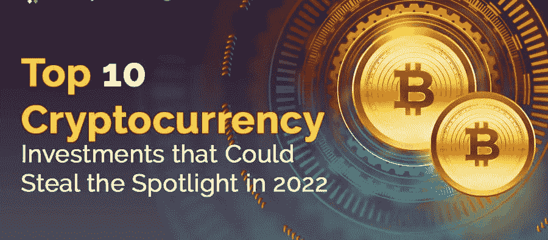

# 2022 年十大密码；像我 5 岁一样解释

> 原文：<https://medium.com/coinmonks/top-10-crypto-for-2022-explain-like-you-are-5-49cbd8d222a3?source=collection_archive---------5----------------------->

难道我们没有被去中心化、NFTs、区块链、以太坊和许多与 web3 相关的话题所吸引吗？

是的，我们总是试图在网上找到一些流行的东西。因此，我为您提供了根据市值排名的前 10 名 cryptos 硬币，并在 1 行中解释了它们的使用情况

Image credits: Analytics Insight

1-比特币

比特币是一种不受任何中央控制或银行或政府监管的数字货币。

市值:7754 亿美元

2)以太坊

以太坊**支持构建和运行智能合约和分散应用(dApps)的部署**，而不会出现任何宕机、欺诈、控制或第三方的干扰。

(用简单的术语来理解智能合约，[点击这里)](https://chaitanya-athukuri.medium.com/build-your-first-web3-0-project-explained-like-im-5-cbaa245b8fae)

市值:3980 亿美元

3)币安

币安是世界上最大的加密交易平台，币安是在 2017 年作为折扣交易费的**公用事业令牌创建的。**

市值:800 亿美元

4)系绳

Tether (USDT)是最有价值的稳定币之一，是一种加密货币，旨在**保持加密货币估值稳定**。

市值:630 亿美元

5)茄属植物

Solana 是一个**区块链平台，旨在托管分散的、可扩展的应用**。与以太坊相比，加密人员喜欢索拉纳的低燃气费。

市值:530 亿美元

6)卡尔达诺

卡达诺代币可以用来支付网络服务费用，也可以用美元进行买卖。ADA 是一个节能的过程，被认为比比特币之类的东西更加环保。

市值:420 亿美元

7) XRP

XRP 是 Ripple Labs 开发的产品的原生加密货币。其产品用于**支付结算、资产交换和汇款系统。**

人们声称银行仍在与 ripple labs 合作，这就是 XRP 仍有大量交易的原因。

市值:370 亿美元

8) Terra

Terra 是一种稳定的硬币，旨在减少比特币等加密货币固有的波动性。

市值:290 亿美元

9)波尔卡多

Polkadot 使任何类型的数据或资产(T21)都能在区块链之间转移，而不仅仅是代币。

简单地说

开发者可以将区块链与波尔卡多特系统联系起来，甚至创造出全新的区块链。

市值:260 亿美元

10)雪崩

Avalanche 本质上是一个区块链网络，允许**用户创建定制的、特定的区块链来满足他们的需求**

市值:230 亿美元

为什么我在这里分享这个？

了解您的加密环境。你投资了哪枚硬币，请给出一个你买这枚硬币的理由(往下评论)

加密货币是最不稳定的市场，在投资之前，分析并充分了解汽油费、回报和更多信息。

在[媒体](https://chaitanya-athukuri.medium.com/)和 [LinkedIn](https://www.linkedin.com/in/chaitanya-athukuri/) 上关注我，了解关于创业、金融和产品管理的见解。

我喜欢 web3 吗？

是的，我真的很喜欢探索 Web3 空间。如果你想在 startups、web3 和 PM 上聊天…在 [LinkedIn](https://www.linkedin.com/in/chaitanya-athukuri/) 或 [Twitter](https://twitter.com/ChaituAthukuri) 上给我发短信就行了

感谢您的阅读。祝你愉快

参考:Investopedia、Youtube 和 Google。

> 加入 Coinmonks [电报频道](https://t.me/coincodecap)和 [Youtube 频道](https://www.youtube.com/c/coinmonks/videos)了解加密交易和投资

# 另外，阅读

*   [Exness 回顾](https://coincodecap.com/exness-review)|[moon xbt Vs bit get Vs Bingbon](https://coincodecap.com/bingbon-vs-bitget-vs-moonxbt)
*   [如何开始通过加密贷款赚取被动收入](https://coincodecap.com/passive-income-crypto-lending)
*   [加密货币储蓄账户](/coinmonks/cryptocurrency-savings-accounts-be3bc0feffbf) | [加密交易机器人](https://coincodecap.com/best-crypto-trading-bots)
*   [BigONE 交易所评论](/coinmonks/bigone-exchange-review-64705d85a1d4) | [CEX。IO 审查](https://coincodecap.com/cex-io-review) | [交换区审查](/coinmonks/swapzone-review-crypto-exchange-data-aggregator-e0ad78e55ed7)
*   [最佳比特币保证金交易](/coinmonks/bitcoin-margin-trading-exchange-bcbfcbf7b8e3) | [比特币保证金交易](https://coincodecap.com/bityard-margin-trading)
*   [加密保证金交易交易所](/coinmonks/crypto-margin-trading-exchanges-428b1f7ad108) | [赚取比特币](/coinmonks/earn-bitcoin-6e8bd3c592d9)