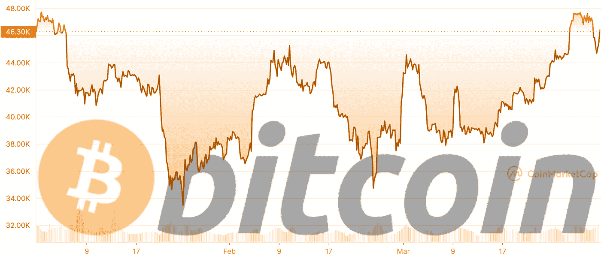
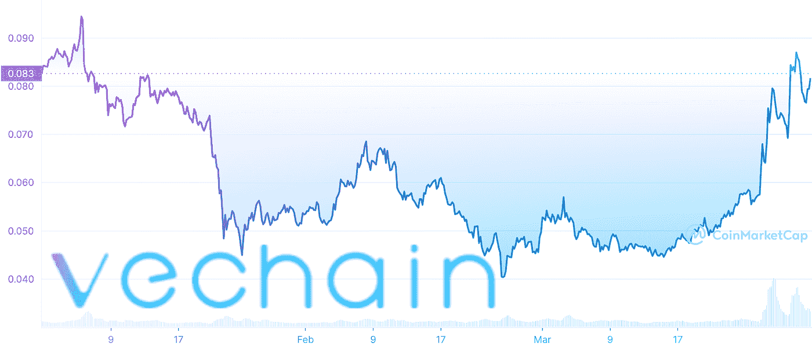
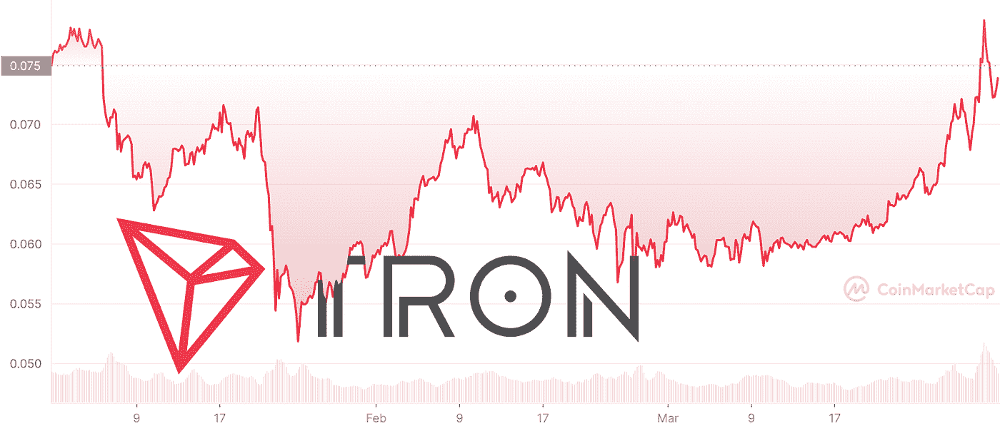
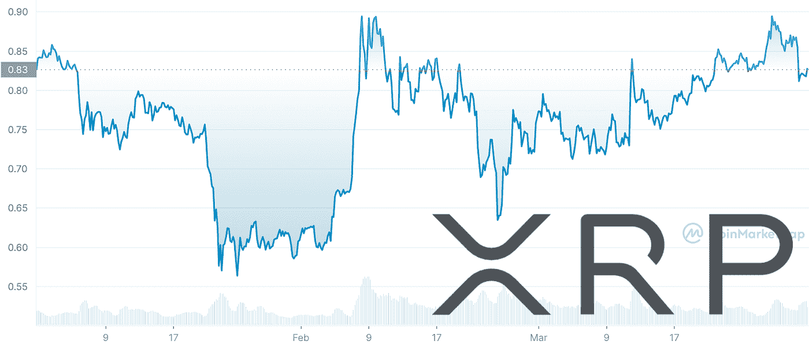
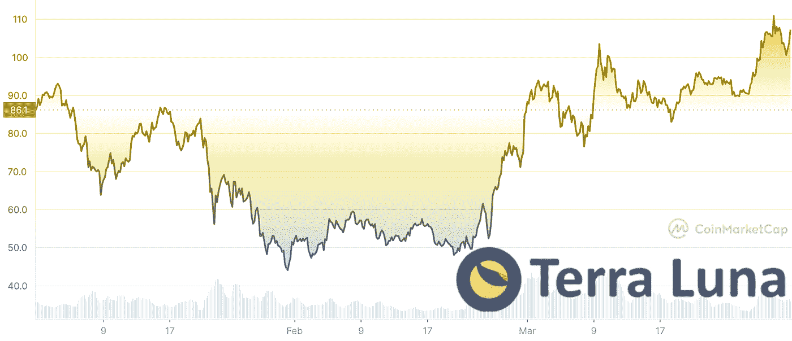
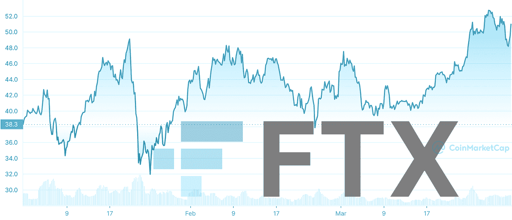
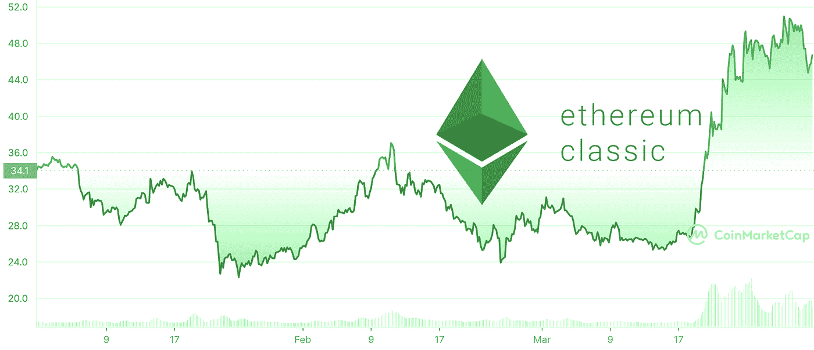
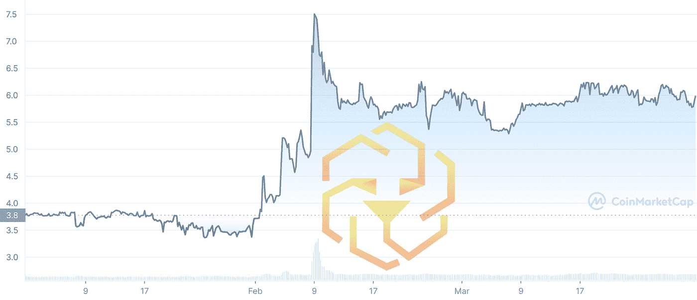
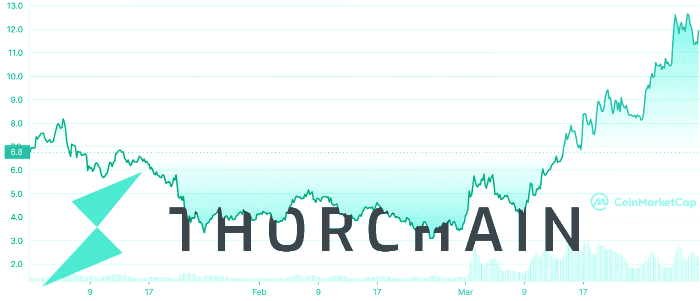
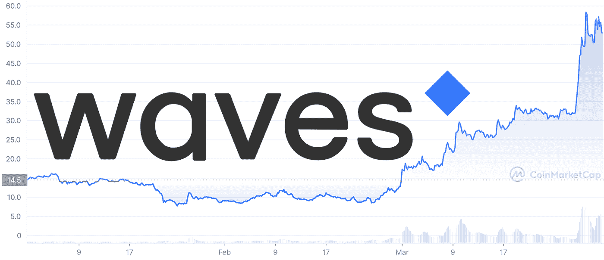

# 2022 年 Q1 十大加密货币

> 原文：<https://medium.com/coinmonks/top-10-cryptocurrencies-in-q1-2022-9780d8cd967d?source=collection_archive---------18----------------------->

2022 年 Q1 奥运会结果不如前几年乐观，但并非所有硬币都如此。熊市中有赢家，一些顶级的 altcoins 甚至跑赢了比特币。查看我们对 2022 年 Q1 顶级加密货币的性能评估。

# 关键要点

*   比特币在 2022 年 Q1 奥运会上取得了+1.43%的积极变化。然而，在该时间段内，它在十大加密货币中排名垫底；
*   BTC 被维特、TRX、XRP、露娜、FTT 等、狮子座、符文、海浪超越；
*   然而，WAVES 到目前为止在 Q2 做得并不好:这个平台被指控诈骗。名单上的其他人没有出现抛物线反弹，而是有机增长，并将继续增长。

# 2022 年 Q1 十大加密货币

## 比特币(BTC)

打开前 10 大加密货币，不出意外的是[比特币](https://changehero.io/blog/what-is-bitcoin/)。第一种加密货币以 1.43%的利润成功关闭了 Q1 2022。

3 月 31 日，比特币以 865，202，119，216 美元的市值和 45，538.68 美元的价格排名第一。

至于 2022 年 BTC 的[前景，可以在](https://changehero.io/blog/bitcoin-price-prediction-2022-2025-2030/)[比特币 2022](https://b.tc/conference/) 大会上公布一些消息。身为议长的墨西哥参议员英迪拉·肯皮斯承诺将提出一项法案，使 BTC 成为该国的法定货币。

环境影响或法律地位是否会影响 BTC 作为全球经济中加密市场代理人的地位，还有待观察。

## VeChain Thor(兽医)

至于我们排名前十的其他加密货币，所有这些替代货币的表现都优于 BTC。VeChain 离 BTC 不远，在 Q1 2022 年有 1.5%的利润。

3 月 31 日，VeChain Thor 的市值为 4，984，139，714 美元，交易价格为 0.0775 美元。

在 Q1 2022 年，VeChain 基金会提出并推出了 [VeUSD](https://coinmarketcap.com/alexandria/signals/24334) ，这是一种基于 VeChain 的与美元挂钩的稳定货币。这是他们经济数字化[计划](https://www.newsbtc.com/news/vechain-reveals-roadmap-poa-bullish-catalyzer/)中的一步，我们肯定会在 2022 年看到更多。

## 创(TRX)

在 2022 年 Q1 奥运会上，排名第八的是 [TRX](https://changehero.io/coins/trx) ，增幅为 2.44%。3 月 31 日，Tronix 的市值为 7，512，332，331 美元，交易价格为 0.07388 美元。

截至 2022 年， [Tron Network](https://changehero.io/blog/what-is-tron/) 由 TronDAO 管理，Tron Dao 是在 Tron 基金会解散和 Justin Sun 下台后成立的。该社区仍有许多可观看的内容，如盛大的黑客马拉松和 APENFT drops。

## XRP

截至 2022 年 3 月 31 日， [XRP](https://changehero.io/coins/xrp) 以 39，198，153，818 美元的市值保持在十大加密货币之列，上涨 3.29%(0.8146 美元)。

对 XRP 持有者来说，最相关的事件是与美国证券交易委员会的[法律战](https://changehero.io/blog/xrp-price-prediction-for-2022-2025-and-2030/)。这个过程中的每一次转折都反映在 XRP 的价格图表上。

最近的发展有利于 Ripple 一方:法院[命令](https://coingape.com/ripple-vs-sec-court-orders-sec-to-submit-proposed-redactions/)对 SEC 工作人员编辑的笔记进行审查。该订单预计将于 4 月 8 日前完成。

## 地球(月球)

从 Terra 的本地代币 LUNA 开始，它在 2022 年 Q1 奥运会上增值了 24.13%，我们正在进入前 10 大加密货币的收益者行列。Terra 的崛起是一个引人注目的景象。

3 月 31 日，Luna 持有 36，521，590，818 美元的市值，交易价格为 103.01 美元。在本季度收盘时，它达到了有史以来的最高价格，并继续攀升。

Terra 的 LUNA 令牌由其国库中空前数量的 BTC 支持:35，767.98 BTC。凭借这一点以及 UST 的日益普及，它可以在两种加密货币的价格之间建立一个正反馈回路。

与此同时，Terraform Labs 推出了一个[加速器](https://decrypt.co/97044/terraform-labs-longhash-ventures-terra-accelerator-program)项目，帮助更多开发者构建使用 Terra stable coins 的解决方案。

## FTX·托肯(FTT)

3 月 31 日， [FTX 代币](https://changehero.io/coins/ftt)的市值为 6711884132 美元，交易价格为 48.89 美元。与年初相比，上涨了 25.72%。

FTT 币的升值显然是由 FTX 交易所的发展推动的。交易所已经在 2022 年超级碗的广告上花费了大量金钱，该广告展示给了数百万美国人。

## 以太坊经典(等)

以太坊经典在 Q1 2022 年增长了 37.8%，仅次于前三名。3 月 31 日，以太坊经典版的市值为 6，330，883，294 美元，交易价格为 47.28 美元。

有时候，成功的秘密在于没有发明轮子:以太坊经典[在 3 月下旬因关于矿工奖励削减和实施柏林硬分叉中包括的以太坊改进建议的消息而上涨](https://changehero.io/blog/ethereum-classic-price-prediction/)。

这两个事件都已经影响了价格，但从长期来看，都有可能使这种影响持续下去。

## 狮子座

在 2022 年 Q1 奥运会上，十大加密货币中的铜奖得主是 LEO token，增幅为 53.68%。3 月 31 日，Unus Sed Leo 的市值为 5，540，960，522 美元，交易价格为 5.81 美元。

LEO tokens 帮助 Bitfinex 从 2016 年的黑客攻击中恢复过来，那么为什么它的实用工具 token 的价格在 2022 年移动呢？美国司法部(DOJ) [抓住了一对清洗被盗资金的夫妇。](https://cointelegraph.com/news/making-sense-of-the-bitfinex-bitcoin-billions)

虽然被盗的 9.4 万枚比特币现在由 DOJ 保管，但 Bitfinex 再次保证，他们仍然致力于 LEO 白皮书中的声明:80%的令牌将被回购。

## 荆棘链(符文)

Q1 十大加密货币第二名属于 THORChain，增长 70.71%。3 月 31 日，THORChain 的市值为 3，785，081，211 美元，交易价格为 11.45 美元。

三月份，合成资产交易所[推出了](https://crypto.news/thorchain-rune-new-crypto-assets-exchange-opportunities/)“无包装”比特币交易和一种新颖的抵押模型。结果，在这个模型中有着至关重要作用的符文令牌就抛物线化了，粉碎了所有的抗性。

技术[分析](https://ambcrypto.com/rune-could-be-due-for-a-heavy-retracement-thanks-to-this-top-reversal-setup/)声称 RUNE 是时候回撤了，但是需求可以通过向 mainnet 引入[路线图](https://thorchain.help/roadmap)里程碑来很好地维持。

## 志愿紧急服役妇女队

Waves 远远领先于其他十大加密货币，涨幅高达 265.27%。3 月 31 日，Waves 的市值为 5，891，805，962 美元，交易价格为 54.61 美元。

秘制酱是什么？这一切都在路线图中:Waves Labs [承诺](https://www.businesswire.com/news/home/20220331005789/en/Waves-Labs-Announces-US-Expansion-Plan-Targeting-10billion-TVL-by-End-Of-2022)通过美国的扩张获得 100 亿美元的总价值和 500 万每月活跃用户。

然而，不要抱太大希望。这场混乱导致 Waves 发行的算法稳定币中微子 USD [下跌超过 20%](https://blockworks.co/algorithmic-stablecoin-usdn-is-on-the-brink-of-failure/),随后很快就有指控称[抽水并倾倒](https://ambcrypto.com/why-did-waves-founder-reportedly-buy-5-million-cheap-ex-stablecoin-usdn/)和 USDN 是庞氏骗局。

# 如何在 ChangeHero 上购买这些硬币？

这些硬币中有吸引你的吗？你可以很容易地在 [ChangeHero](https://changehero.io/) 上找到 BTC、FTT、露娜、XRP、TRX 和兽医:

1.  在主页上选择货币、金额和兑换类型。在下一步中提供您的钱包地址并检查金额；
2.  仔细检查所提供的信息，阅读并接受使用条款和隐私政策；
3.  在一次交易中发送您要兑换的加密货币的金额。固定利率交易有 15 分钟的限制；
4.  现在，放松！我们正在做所有的工作:检查传入的交易，并在交易到达后立即进行交易；
5.  一旦兑换被处理，你的硬币就会被送到你的钱包里。如果您喜欢使用 ChangeHero，我们将很高兴听到您的反馈。

我们网站上的聊天、官方电报[群](https://t.me/ChangeHero)或通过电子邮件: [support@changehero.io](mailto:support@changehero.io) 都可以找到支持团队。

# 结论

Q1 2022 对许多加密货币都不友好，但也有赢家。值得记住的是，并不是所有的收益都是可持续的，如果它看起来好得不像是真的，就要小心了。

欢迎在我们的博客中了解更多关于这些加密货币和其他项目的信息。每日内容，在[推特](https://twitter.com/Changehero_io)、[脸书](https://www.facebook.com/Changehero.io/)、 [Reddit](https://www.reddit.com/r/ChangeHero/) 和[电报](https://t.me/CHCryptoNews)上订阅 ChangeHero。

# 常见问题解答

## 2022 年该买什么币？

在 Q1 2022 中表现最好的是比特币、VeChain、Tron、XRP、Terra、FTX 代币、以太坊经典、LEO 代币和 THORChain。这些项目中的大多数在不久的将来也有光明的前景。

## 比特币是好的投资吗 2022？

就加密投资而言，比特币永远是最安全的选择。在 2022 年 Q1 奥运会上，尽管波动很大，但它最终的价值还是超过了年初的价值。

## 2022 年下一个爆发的大加密货币是什么？

在 Q1 2022 中获得收益的大多数资产已经存在了一段时间，但 THORChain 和 FTX 代币的历史最短，没有任何过去的障碍。

> 加入 Coinmonks [电报频道](https://t.me/coincodecap)和 [Youtube 频道](https://www.youtube.com/c/coinmonks/videos)了解加密交易和投资

# 另外，阅读

*   [3 商业评论](/coinmonks/3commas-review-an-excellent-crypto-trading-bot-2020-1313a58bec92) | [Pionex 评论](https://coincodecap.com/pionex-review-exchange-with-crypto-trading-bot) | [Coinrule 评论](/coinmonks/coinrule-review-2021-a-beginner-friendly-crypto-trading-bot-daf0504848ba)
*   [莱杰 vs n 格拉夫](/coinmonks/ledger-vs-ngrave-zero-7e40f0c1d694) | [莱杰纳诺 s vs x](/coinmonks/ledger-nano-s-vs-x-battery-hardware-price-storage-59a6663fe3b0) | [币安评论](/coinmonks/binance-review-ee10d3bf3b6e)
*   [Bybit Exchange 审查](/coinmonks/bybit-exchange-review-dbd570019b71) | [Bityard 审查](https://coincodecap.com/bityard-reivew) | [Jet-Bot 审查](https://coincodecap.com/jet-bot-review)
*   [3 commas vs Cryptohopper](/coinmonks/3commas-vs-pionex-vs-cryptohopper-best-crypto-bot-6a98d2baa203)|[赚取加密利息](/coinmonks/earn-crypto-interest-b10b810fdda3)
*   最好的比特币[硬件钱包](/coinmonks/hardware-wallets-dfa1211730c6) | [BitBox02 回顾](/coinmonks/bitbox02-review-your-swiss-bitcoin-hardware-wallet-c36c88fff29)