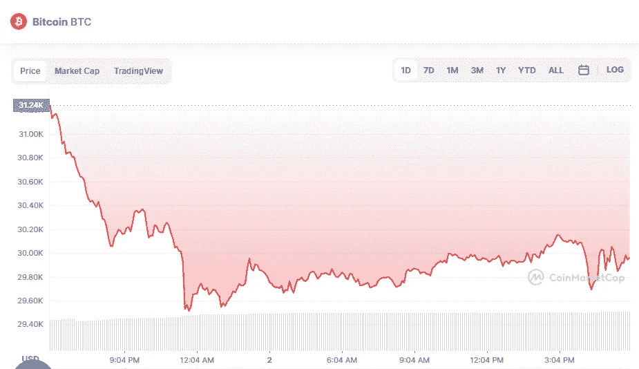

# 6 月 2 日十大加密货币价格分析

> 原文：<https://medium.com/coinmonks/top-10-cryptocurrencies-price-analyse-on-2nd-of-june-652504ad40f4?source=collection_archive---------45----------------------->

# 1.比特币(-4.02%)

# 市值 5717 亿美元

比特币目前的价格为 30.26648 美元，24 小时交易量为 42.89 亿美元。在过去的 24 小时里，比特币的使用量下降了 4.02%。目前在受欢迎程度上排名第一。

Source photo [Bitcoin price today, BTC to USD live, marketcap and chart | CoinMarketCap](https://coinmarketcap.com/currencies/bitcoin/)

# 2.乙烯利(-6.00%)