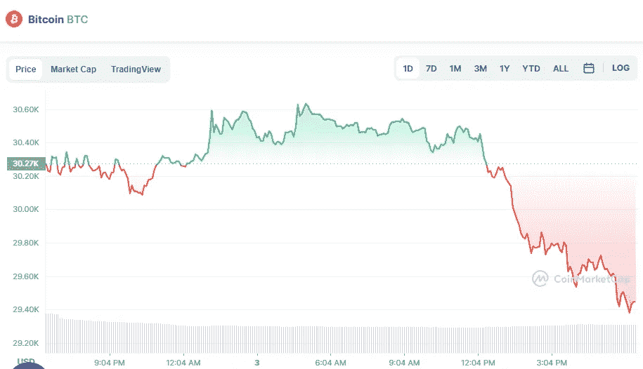

# 6 月 3 日十大加密货币价格分析

> 原文：<https://medium.com/coinmonks/top-10-cryptocurrencies-price-analyse-on-3rd-of-june-4c7aff044f3d?source=collection_archive---------35----------------------->

# 1.比特币(-2.12%)

Source photo [Bitcoin price today, BTC to USD live, marketcap and chart | CoinMarketCap](https://coinmarketcap.com/currencies/bitcoin/)

# 市值 5603 亿美元

比特币目前的价格为 29.62762 美元，24 小时交易量为 30.33 亿美元。在过去的 24 小时里，比特币的使用量下降了 2.12%。目前在受欢迎程度上排名第一。

# 2.乙烯利(-2.60%)