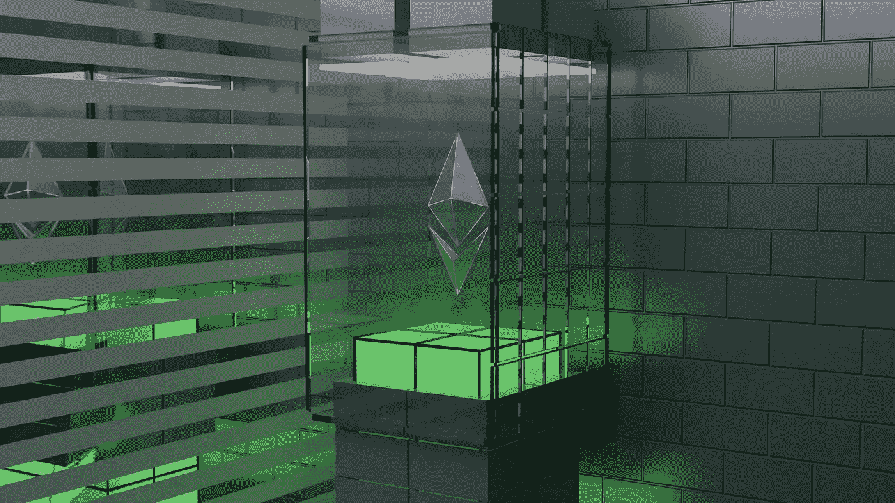

# 2022 年比以太坊更有潜力的十大加密货币

> 原文：<https://medium.com/coinmonks/top-10-cryptocurrencies-with-better-potential-than-ethereum-in-2022-3fff5a36714e?source=collection_archive---------35----------------------->

Source photo Unsplash.com

2022 年，这些加密货币有可能跑赢以太坊。加密货币越来越受欢迎，现已被纳入普通投资者的投资组合，包括机构投资者。以太坊是受欢迎程度爆炸式增长的加密货币之一。这完全是由于以太坊在智能合约领域的先锋声誉，它已经…