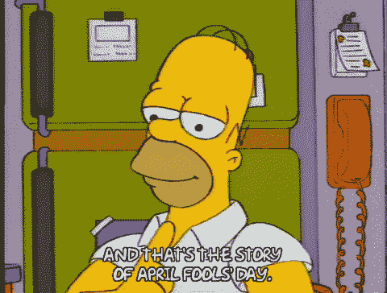
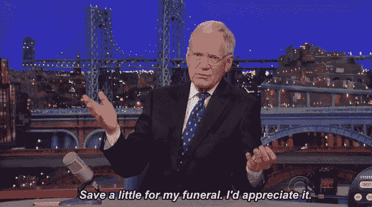

# 2022 年 4 月在比特币基地购买的十大密码

> 原文：<https://medium.com/coinmonks/top-10-cryptos-to-buy-on-coinbase-in-april-2022-8ab5e96b1e56?source=collection_archive---------21----------------------->

***新投资者的平衡加密组合***

正如我在 3 月 31 日写的那样，整个加密市场在经历了上周的爆发后已经下滑，这是进行常规投资的绝佳时机。通常，美元成本平均法的目的是使用一种“设置好就忘了”的投资方法，这种方法通常比玩猜谜游戏赚得更多——“市场中的时间胜过市场时机，”俗话说。

但是，当市场抛出一个销售，不妨利用折扣。这是比特币基地现有的 10 种硬币，我觉得它们既有长期的持久力，又有 2022 年 4 月的短期盈利能力。

***编辑:*** *我猜是愚人节吧。我的笔记本电脑出卖了我，所以当我把它拿出来的时候，蘸酱已经做好了。哦，这并不能改变下面的任何事情。*

“为什么是比特币基地？”，有些人会问。“它们之所以可怕，是因为(原因)。”也许是这样，但对于许多密码领域的新手来说，这是第一站。它对用户友好，没有油费、流动性问题，也不需要在不同的网络上维护钱包。事实上，我在比特币基地身上还有资金。

将来我可能会做其他的交换，但事实上，大部分硬币都是一样的。

我没有先令比特币基地，我发誓。我不是高高在上——他们只是不付我钱，我在这里试图做一件搜索引擎优化的事情。([这里](https://twitter.com/HODL4GoodTweets)就是我有空的地方。我工作廉价。)

(也是为了记录:我在某个时候拥有所有这些硬币，现在拥有其中的大部分，并且当你读这篇文章的时候可能会拥有其中的一些。不足以说明问题。)

不出所料，最大的两枚硬币位于顶部两个位置。每枚硬币旁边是我在 100 美元头寸中分配的金额。但是，我不是理财顾问，不知道您的具体投资需求。

1.以太坊(eth)——25 美元
三月:⬆️ 11.2%

[在世界第二大加密公司即将从工作证明协议转向更环保的利益证明系统之前，其发展势头仍在继续。一些分析师甚至认为，这一变化可能会导致人们期待已久的比特币市值“跳水”。至少，它应该帮助 ETH 与新的第一层“以太坊杀手”区块链竞争，后者正在蚕食他们在智能合同网络中压倒性的市场份额。](/coinmonks/eth-urge-or-scourge-951d139e363a?source=your_stories_page----------------------------------------)

ETH 为 4 月份及以后提供了巨大的上升空间，因为这种硬币的安全性如此之大，它开始从被称为替代硬币转向被称为比特币的百事可乐。比特币基地用户也可以选择持有他们的 ETH，锁定它直到合并，以换取 3.68%的 APY(尽管这一比例最近有所降低，令一些用户懊恼不已)。

2.[比特币](https://www.coinbase.com/price/bitcoin)(BTC)——15 美元
三月:⬆️ 5.3%

以太坊 maxis 谈论一场关于 flippening 的大游戏，因为 ETH 继续将自己与比特币区分开来，但 BTC 仍然以两倍的市值排名第一。国王密码仍然是搅拌饮料的稻草，因为外部菲亚特倾向于在进入替代硬币之前先流向 BTC。

[这又是一个比特币的季节](https://www.blockchaincenter.net/altcoin-season-index/)，尽管它在 3 月份的涨幅不像这个列表中的其他一些 alt 那样令人瞠目结舌(更不用说 [Zilliqa](https://www.coindesk.com/markets/2022/03/31/zilliqas-zil-quadruples-on-optimism-around-start-of-metaverse-service-metapolis/) ，遗憾的是它在比特币基地上不可用)。比特币拥有迄今为止最安全的地板，因为它有两个而不是一个鲸鱼准备购买每一次下跌。

那么为什么不是第一呢？在某种程度上，如果你把它加起来，它是平的，由于。。。

3.包装好的月神币 3 月:⬆️ 17.25%

比特币基地没有直接提供 Terra 生态系统的皇冠上的宝石，但它提供了下一个最好的东西:以太坊网络上的一个令牌，旨在模仿 LUNA 的价格行为。

Terra 的全明星 DeFi play，Anchor Protocol，[在其收益率上有所下降，但似乎不太可能打破](https://forum.anchorprotocol.com/t/dynamic-anchor-earn-rate/3042)。随着平衡的建立，联合创始人 Do Kwon 已经开始用价值 100 亿美元的比特币支持他的 [stablecoins](https://twitter.com/stablekwon/status/1503296630396645376?ref_src=twsrc%5Etfw%7Ctwcamp%5Etweetembed%7Ctwterm%5E1503296630396645376%7Ctwgr%5E%7Ctwcon%5Es1_&ref_url=https%3A%2F%2Fcdn.embedly.com%2Fwidgets%2Fmedia.html%3Ftype%3Dtext2Fhtmlkey%3Da19fcc184b9711e1b4764040d3dc5c07schema%3Dtwitterurl%3Dhttps3A%2F%2Ftwitter.com%2Fstablekwon%2Fstatus%2F1503296630396645376image%3Dhttps3A%2F%2Fi.embed.ly%2F1%2Fimage3Furl3Dhttps253A252F252Fabs.twimg.com252Ferrors252Flogo46x38.png26key3Da19fcc184b9711e1b4764040d3dc5c07) 和[垃圾话](https://twitter.com/stablekwon/status/1502226320989700097?ref_src=twsrc%5Etfw%7Ctwcamp%5Etweetembed%7Ctwterm%5E1502226320989700097%7Ctwgr%5E%7Ctwcon%5Es1_&ref_url=https%3A%2F%2Fcdn.embedly.com%2Fwidgets%2Fmedia.html%3Ftype%3Dtext2Fhtmlkey%3Da19fcc184b9711e1b4764040d3dc5c07schema%3Dtwitterurl%3Dhttps3A%2F%2Ftwitter.com%2Fstablekwon%2Fstatus%2F1502226320989700097image%3Dhttps3A%2F%2Fi.embed.ly%2F1%2Fimage3Furl3Dhttps253A252F252Fabs.twimg.com252Ferrors252Flogo46x38.png26key3Da19fcc184b9711e1b4764040d3dc5c07)。

随着泰拉与美元挂钩的稳定货币 UST 在比特币标准下变得更加安全，用户将继续涌向他们的生态系统。Terra 独特的记号组学将 LUNA 烧成薄荷 UST。因此，尽管 LUNA 在 3 月份创下了历史新高，但由于流通中的代币减少，它仍可能走高。(想象一下:一个让你赚钱的供应链问题！)

BTC ➡️乌斯季➡️卢纳➡️ WLUNA 增益列车不是一个快车，但这条线仍然很容易跟随。

4.[多边形](https://www.coinbase.com/price/polygon)(matic)——8 美元
三月:⬆️1.8%

尽管以太坊的升级承诺了一切，但一个短期的补救措施是降低汽油费。出于这个原因，像 MATIC 这样的基于以太网的第二层解决方案至少在中期内有着良好的投资前景。

但是 Polygon 正在努力成为一个独立的主要玩家，将[风险投资加入游戏空间](https://captainaltcoin.com/play-to-earn-p2e-games-on-polygon/)以配合其[蓬勃发展的 NFT 目录](https://coinmooner.com/nft/nft-on-polygon)。该网络最近还推出了 [Polygon ID](https://twitter.com/0xPolygon/status/1508841855210852353) ，这是一种零知识身份证明，旨在提供验证状态而不泄露个人数据。

MATIC 的中等三月数字不符合名单上的其他一些硬币。但在去年 11 月大部分市场见顶的地方，Polygon 的 ATH 在圣诞节后就出现了，其下跌一直持续到 3 月。在 31 日熊市抬头之前，MATIC 在后半个月上涨了 30%以上。

5.宇宙(原子)——8 美元
三月:⬇️ 9%

因为以太坊在站稳脚跟之前无法根除它的竞争对手，未来很可能会属于那些优先考虑他们最好的功能的区块链。如果发生这种情况，那么一个简单的玩法将是一个链之间具有互操作性的网络。几个高调的黑客已经利用了网络之间的桥梁，所以对安全的需求是显而易见的。

Cosmos 和 Polkadot 都在这个领域运营——事实上，[他们最近完成了他们网络之间的桥梁](https://smartliquidity.info/2022/01/24/cosmos-and-polkadot-will-be-connected-through-astar-network-and-octopus-network/#:~:text=The%20Astar%20core%20team%20and%20Octopus%20team%20have,bridge%20with%20Secret%20Network%2C%20a%20Cosmos%20SDK-based%20blockchain.)。我也喜欢波尔卡多特，而不是一个小小的黄色小东西，所以如果你倾向于那个方向，请不要感到难过。但 DOT 在 3 月份的涨幅超过了 12 %, ATOM 只有 12%。。。下降了 9%？等等，这不可能。。。*支票票据*。。。啊，Cosmos 在本月初在 FTX 提供现货市场时价格猛涨，然后回落。比特币基地用户可以在 ATOM 上享受美味的 5% APY，而无需锁定代币。

6.三月:⬆️ 4.8%

电子游戏是如此巨大的摇钱树，以至于成年人通过诱导其他人看他们玩游戏来打造整个职业生涯，让杰夫·贝索斯变得更加富有。但是，作为非职业玩家为新游戏支付 70 美元的交换，他们只能获得赢得现实世界中不存在的奖杯或在数字开放世界中玩游戏的满足感。

如果这些听起来或多或少分别像 NFTs 和元宇宙的定义，那么，加拉同意。他们有十几款游戏正在开发中，所有这些游戏都将允许玩家赚取 NFT 或庆典代币，这比 Twitch 影响力更容易赚钱。

他们还希望从以太坊迁移到他们自己的区块链，解决汽油费和拥堵问题，并有可能允许其他游戏应用程序建立在他们的网络上。

7.卡达诺(cardano)(ada)——8 美元
三月:⬆️ 17.5%

我明白了。卡尔达诺似乎永远都是光说不做，就在你认为它不能再低的时候，它继续令人失望。我应该知道:去年 9 月，当 ADA 在 2.50 美元的水平时，我是一只熊，然后在 1.50 美元和 1.25 美元和 1.00 美元以下买入，并在我脸上挂着鸡蛋退出了所有这些头寸——以防你认为我认为我是一个密码专家。(还有，用户名“CryptoSavant”被取了。)上个月，当它处于 0.82 美元时，我开玩笑说，在我反转看涨之前，它只需再回调 80 美分。

我差点无意中把 78 叫做底部。当我沉浸在自我满足中的时候？)，有信心的买家[在不到两周的时间里赶上了 60%的涨幅](https://www.securities.io/cardano-monthly-analysis-march-2022/)。

学者。

对阿达来说，牛市总是一个长期的游戏。Cardano 的开发人员更喜欢缓慢而稳定的方法，而不是“快速移动，打破沙漏”。他们正在非洲进行最大的投资，那里的 web3 基础设施可以为被 web2 遗忘的人口服务，就像手机让他们跨越了固定电话服务的时代一样。

所以你把一颗橡子扔进草地，50 年后回来，也许它是一棵橡树。诀窍是等待短期赶上。当[gray Investments 提供了一个名为以太坊](https://www.cryptoglobe.com/latest/2022/03/grayscales-new-fund-includes-cardano-ada-and-solana-sol-as-top-holdings/)的智能合约层 1 的 ETF 篮子，并给了 Cardano 最大的一块馅饼时，它可能终于开始了。

如果你只是无法让自己再次相信卡尔达诺:相信我，我理解。我也喜欢阿尔格兰德赶上更性感的硬币索拉纳和雪崩。但比特币基地将给予 ADA 股东 3.75%的 APY，以等待长期投资，接近微薄的 ALGO 股息的十倍。

8. [Synthetix 网络令牌](https://www.coinbase.com/price/synthetix-network-token)(snx)——8 美元
3 月:⬆️ 64.7%

SNX 是三月份的合法小吃，我可能会忍不住离开餐桌。但是由于像比特币基地这样的集中交易所将别无选择，只能遵守加拿大和欧洲的“了解你的硬币”法律，精明的投资者将把他们的生意带到分散的交易所，那里大约有 2300 万。

Synthetix 的不同之处在于，它们提供了一个去中心化的市场，用户可以创建合成资产，而不必拥有该资产。正如比特币基地用户可以购买 WLUNA 并从 LUNA 的登月中获益一样，Synthetix 用户可以创建不同密码(或外汇)的“T7”合成器，并利用价格波动。

所以，是的，你可以在 CEX 上买一个代币。我不知道如何解释这种讽刺，但每当我在 MTV 上看到暴力反抗机器的视频时，我也感到困惑。

9.三月份:⬆️ 4.9%

你听说过 DentaCoin 吗？这是一个真正的秘密，旨在用于牙科行业。每个人都需要牙齿保健，对吗？

一分钱可以买到 800 个。(不过，不是在比特币基地。扫兴，对吧？)

另一方面，power ledger[的目标是颠覆能源行业 T13，因为能源行业有更多的钱。传统的能源网络已经过时，区块链将对其进行彻底改革，就像改革金融和游戏一样。任何在屋顶安装太阳能电池板的人都可以向点对点网络贡献能量。随着可再生能源组件变得越来越便宜(税收优惠增加)，获取能源可以成为一种被动的收入流。POWR 代币是一种购买系统的方式，而不必在你的后院安装风力涡轮机。](https://www.powerledger.io/)

10.三月份:⬆️ 52.8%

Zcash 是比特币的镜像，有一个重大改进，至少对除了欧盟好事者和伊丽莎白·沃伦以外的所有人来说:完全隐私。是的，这意味着俄罗斯寡头、贩毒集团和洗钱者可以利用它来隐藏他们的非法活动。但是你知道吗？在那之前，他们使用的是传统的美国现金，没有人会因此来评判美元。

隐私对坏人来说很重要。但是好人也戴面具。有些人需要隐藏起来，比如乌克兰自由战士、告密者和侮辱贾达·萍克特·史密斯头发的人。对于许多交易来说，这显然是个好主意——为什么一家网店要有我的钱包地址，并搜索我过去的所有交易，以便他们能发现我对吸血鬼色情文学的秘密爱好？

自从俄国入侵乌克兰后，ZEC 的地位就一落千丈，而且过去还被火炬手们所熟知。但这种叙事不会消失，它在比特币基地也没有其他方式。

好吧，我在推荐信上写了我的名字。我正式成为一个喋喋不休的密码专家。

文呢？

> 加入 Coinmonks [电报频道](https://t.me/coincodecap)和 [Youtube 频道](https://www.youtube.com/c/coinmonks/videos)了解加密交易和投资

# 另外，阅读

*   [3 商业评论](/coinmonks/3commas-review-an-excellent-crypto-trading-bot-2020-1313a58bec92) | [Pionex 评论](https://coincodecap.com/pionex-review-exchange-with-crypto-trading-bot) | [Coinrule 评论](/coinmonks/coinrule-review-2021-a-beginner-friendly-crypto-trading-bot-daf0504848ba)
*   [莱杰 vs n rave](/coinmonks/ledger-vs-ngrave-zero-7e40f0c1d694)|[莱杰 nano s vs x](/coinmonks/ledger-nano-s-vs-x-battery-hardware-price-storage-59a6663fe3b0) | [币安评论](/coinmonks/binance-review-ee10d3bf3b6e)
*   [Bybit Exchange 审查](/coinmonks/bybit-exchange-review-dbd570019b71) | [Bityard 审查](https://coincodecap.com/bityard-reivew) | [Jet-Bot 审查](https://coincodecap.com/jet-bot-review)
*   [3 commas vs Cryptohopper](/coinmonks/3commas-vs-pionex-vs-cryptohopper-best-crypto-bot-6a98d2baa203)|[赚取加密利息](/coinmonks/earn-crypto-interest-b10b810fdda3)
*   最好的比特币[硬件钱包](/coinmonks/hardware-wallets-dfa1211730c6) | [BitBox02 回顾](/coinmonks/bitbox02-review-your-swiss-bitcoin-hardware-wallet-c36c88fff29)