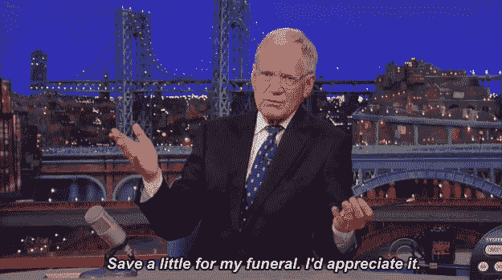

# 2022 年 6 月在比特币基地购买的十大密码

> 原文：<https://medium.com/coinmonks/top-10-cryptos-to-buy-on-coinbase-in-june-2022-eba4f017c11?source=collection_archive---------12----------------------->

***抱吸***

已经离开圈子一个月左右了。。。[我错过了什么吗？！](/coinmonks/moonfall-721d5406b57)

Terra 生态系统的毁灭被比作安然公司和雷曼兄弟公司，但它对该行业的重要性要大得多。Terrasphere 的峰值接近 600 亿美元，占 crypto 跨越事件视界时总市值的 4.5%。尽管安然公司(680 亿美元)破产时规模更大，但这在整个能源/商品市场上只是昙花一现。虽然雷曼兄弟(480 亿美元)规模较小，但次贷危机摧毁了 10 万亿美元的价值。

与此同时，一个已经遭受重创的加密市场，大多耸耸肩，增加了另一根稻草。

在将我的名字从 HODL4Good 临时改为 REKT4Bad 后，我想起从前比特币是 3 万美元，我一个也不拥有。然后是 70，000 美元，我希望我能买更多。现在又变成了 3 万美元。。。什么，我应该生气吗？

你的投资时间越长，你就应该对熊市越有热情，因为你可以以极低的价格购买顶层公寓资产。

尽管马特·达蒙试图向你兜售什么(现在回想起来，我们应该已经看到了这一点)，财富还是青睐勇敢的 T21。把它吸起来，然后蘸一蘸。下一秒如果真到了那一步。

(此外，如果出于某种原因，你还没有利用比特币基地免费赠送的近 200 美元的加密软件，这似乎是一个比去年 11 月更好的时机。)

每枚硬币旁边是我在 100 美元头寸中分配的金额。但是，我不是理财顾问，不知道您的具体投资需求。

我也郑重声明:我在某个时候拥有过所有这些硬币，现在拥有其中的大部分，而且当你读到这篇文章的时候，可能还会拥有其中的一些。不足以说明问题。

1.[比特币](https://www.coinbase.com/price/bitcoin)(BTC)——50 美元
五月:⬇️ 16.4%

快乐的[比特币披萨日](https://coinpedia.org/interesting-crypto-stories/bitcoin-pizza-day/)！你是怎么度过的？

我买了 BTC 和披萨。

然后我想到，虽然我没有用一堆将来某一天会价值数十亿美元的比特币去换一个糟糕的订单[棒约翰的](https://nypost.com/2021/05/24/bitcoin-pizza-guy-who-squandered-365m-has-no-regrets/)，但我犯了一个比他小得多的错误。

通过选择购买一个 10 美元的比萨饼而不是更多的比特币，净效果就好像我卖了 10 美元的 BTC 去买比萨饼一样。

如果你和我一样相信，比特币将不可避免地价值 100 万美元或更多，那么我就在这块馅饼上花了有朝一日会变成 300 美元的钱。我应该吃锯末，喝池塘水，把我所有的杂货钱都投入到 sat 考试中。(我妻子会把这句话刻在我的墓碑上。)

比特币[比小屋](https://knowyourmeme.com/memes/out-pizza-the-hut)更受欢迎。

2.以太坊(eth)——30 美元五月:⬇️ 26.4%

在 4 月份推迟了大肆宣传的合并的某些方面后，世界第二大加密货币背后的大脑在 5 月份回到了正轨。以太坊上个月完成了两个[影子分叉](https://www.coindesk.com/layer2/2022/05/11/merge-testing-on-ethereum-what-is-it-and-why-does-it-matter/)——为他们的永久支点进行测试运行，以验证利害关系协议。联合创始人维塔利克·布特林很有信心在八月的《T21》中亮相。

与此同时，ETH 正受到市场的冲击。就安全港而言，加密投资者只关注比特币。5 月份，乙醚对国王加密公司的价值损失了 15%以上。

这种趋势可能会持续到 6 月，或者宣传机器可能会开始积聚不可阻挡的势头。如果你属于后一种阵营——或者你只是想要一个激进的打法来控制你的内在优势——继续翻转这两个百分比，变成 50/30 ETH/BTC。

3.索拉纳五月:⬇️ 48.8%

我不能告诉你在过去的 35 年中谁赢得了美国小姐，我当然也不能告诉你亚军，但我知道每年在他们宣布第二名之前，他们都会庄严地吟诵，如果因为任何原因，即将成为美国小姐的人不能履行她的职责，她将继承桂冠。

这有什么价值吗？问问 Suzette Charles，她于 1984 年继温妮莎·威廉姆斯(没错，[温妮莎·威廉姆斯](https://www.history.com/this-day-in-history/miss-america-resigns))因裸照丑闻辞职后步入歌坛(她担任这一头衔的时间和脊椎节奏曲鼓手的时间差不多)。

以太坊将很快进行合并——如果出于任何原因，它不能履行#1 智能合约平台的职责，继承人将默认为索拉纳。

虽然一些交易商准备将 SOL 视为 BTC 和 ETH 三巨头中的第三个成员，但在今年 5 月发生的第七次[停运之后( ***编辑*** :以及 6 月 1 日的第八次](https://investorplace.com/2022/05/solana-outage-leads-to-weekend-sol-crypto-losses/))，应该很清楚 Solana 还没有准备好黄金时间。( [Solana maxis 大概 30 分钟就知道了。](https://www.theblockcrypto.com/post/149112/solanas-blockchain-clock-loses-track-of-time-now-running-30-minutes-behind))

即使在不断遭受打击后，它的市值/总价值锁定比仍高于以太。要么 SOL 被高估，要么 ETH 被低估(或者两者都有)。

但它仍然是非 ETH 包的领导者，这是有价值的。我想是六块钱。

4.5 月份:⬇️ 30.1%

早起的鸟儿有虫吃，但第二只老鼠会得到奶酪。

虽然露娜活得快，死得早，但阿达仍在继续悄悄地努力实现它的长期目标。六月的[瓦西里硬叉](https://finbold.com/cardano-to-vastly-increase-transaction-throughput-as-vasil-hardfork-gets-scheduled-for-june/)呈现了一个[可泵的机会](https://www.fxstreet.com/cryptocurrencies/news/cardano-whales-enter-buying-spree-before-the-vasil-hard-fork-202205230919)，但是卡尔达诺的吸引力一直是 loooooong 游戏。比特币基地用户继续等待 2.60%的 APY。

5.五月:⬇️ 35.8%

说到稳扎稳打。阿尔格兰德听起来可能像“失败者”，但他们只是继续突突前进。如果有什么能比这更好地描述 ALGO 的话，我想不出了:2022 年世界杯与 crypto.com 签署了一项[赞助协议，这是 CRO 继续努力向世界投放体育相关广告的一部分](https://crypto.news/crypto-com-official-sponsor-2022-fifa-world-cup-qatar/#:~:text=FIFA%20has%20announced%20that%20Crypto.com%2C%20a%20cryptocurrency%20trading,Asia%2C%20Crypto.com%20serves%20more%20than%2010%20million%20customers.)。但是在五月，国际足联签署了一份“技术合作协议”，使得阿尔格兰德成为了这项赛事的“区块链官方支持的钱包解决方案”

(如果你正在美国阅读这篇文章，可能需要注意的是，许多最知名的国际足球俱乐部都有自己的球迷代币。)

哦，对了，比特币基地把 ALGO 的 APY 提高到了 5.75%。

6.制造商 5 月份:⬇️ 16.6%

尽管我一直认为——现在仍然认为——权道在毁掉卢娜的过程中并不是坏人，但他确实犯了一个经典的错误，值得一个邦德反派去犯:他透露了他的秘密计划，即[购买一大笔比特币](/coinmonks/bitcoins-going-to-the-moon-2ab759ce4c5f)和[通过强行把它挤出曲线战争](https://dappradar.com/blog/is-terra-trying-to-kill-maker-daos-dai-stablecoin)来打破 Maker 的稳定币戴。

说真的，他把那个[放到了推特](https://twitter.com/stablekwon/status/1503296630396645376)上。他甚至没有把它藏在一个标有[秘密计划](https://www.stakingrewards.com/journal/do-or-dai-the-dai-ust-cold-war-turns-hot/)的马尼拉文件夹里。

原来是有人积蓄了的一大笔钱，准备对付戴，暗算他。

(事后看来，这一切都太明显了。)

这是一种长篇大论的说法，说制造者最有可能的威胁已经消除。由于我们主要关注的是能够度过加密冬天的硬币，DeFi O.G .符合这一要求。事实上，MKR 甚至在 5 月份对比特币升值，这使其进入了一个非常短的名单。

7.[沙盒](https://www.coinbase.com/price/the-sandbox)(沙)——$ 2
五月:⬇️ 38.9%

嗯。。。你知道桑德公司在比特币基地上市了吗？他们做到了，[5 月 26 日](/sandbox-game/sand-is-now-listed-on-coinbase-the-largest-u-s-crypto-exchange-3cfae42ada68#:~:text=SAND%20is%20now%20listed%20on%20Coinbase%2C%20the%20largest,SAND%2C%20The%20Sandbox%20utility%20token%2C%20to%20their%20listings.)，之后基本持平。

这就是最近市场环境有多糟糕:它否定了“比特币基地效应”

如果你对元宇宙的长期投资持怀疑态度，花两个小时听听劳尔·帕尔和笔名为 Punk6529 的人对它的分析。

6529 的[开放元宇宙](https://6529.io/)比“《我的世界》”式的沙盒开放概念更高尚一点，但话又说回来，史努比狗狗并没有在 OM 中发布可玩的 NFT。(还没有。)

8.五月:⬇️ 44.44%

不，我没有说错。带 G 的 Gitcoin 是 web3 希望建立的开源互联网的标志。(从技术上讲，它与流行的开源编码巨头 GitHub 没有关系，但它们共享一个前缀，比如说，Wikipedia 和 WikiHow。)

尽管 HODLing 是一个快速而肮脏的财富创造俚语，但开发商们正忙于构建 web3 在未来几十年所依赖的结构。

9.五月:⬇️ 29%

随着工业时代继续让位于信息时代，货币最终将从实物——美元、黄金、石油——变成数据和迷因。(对，迷因。再听一遍 Punk6529 的采访。)

GameStop 很可能会成为未来的文化试金石，就像婴儿潮一代花数百美元购买破旧的缅甸刮脸标志一样。[他们选择 Loopring 作为他们的区块链，重塑他们的网络 3 公司](https://support.blockchain.gamestop.com/hc/en-us/articles/4408960430099-What-is-Loopring-)。

LRC 也有其他投资论文。他们是[第二层](https://ethereum.org/en/layer-2/)，他们的[零知识积累](https://ethereum.org/en/developers/docs/scaling/zk-rollups/)将堵塞的、通常昂贵的以太坊网络转变为更快、更便宜的解决方案。给玩家力量。

10.宇宙(原子)——1 美元
五月:⬇️ 48%

好吧，我们去翻垃圾箱，希望能找到一颗宝石。

经过上个月几乎减半后，Cosmos 从其历史高点下跌了近 80%，现在交易价格低于 10 美元，而它曾经敲过 45 美元的大门。

它能一路回来吗？当然可以。[我在](/coinmonks/top-10-cryptos-to-buy-on-coinbase-in-april-2022-8ab5e96b1e56)之前已经在这个空间吹捧过 ATOM 了(忽略我一路上写的关于 LUNA 的所有东西，包括尤其是短语“增益列车”)。

但是，如果“替代硬币在一个秘密的冬天里损失了 95%”的传统智慧成立，ATOM 仍然可能下跌。而不是像不幸的投资者认为的那样，只有 15%。

违反直觉的数学可能需要再看一眼，但这是真的:在开始下降 80%后，要达到 95%，你必须进一步下降。(克里斯·伯恩斯克和乔丹“@科比”费什在最近一集的《被解放的》播客中简洁地解释了这一点，这是一个不错的建议。)

诚然，这远不如那些以 100 美元买入 LUNA 并一路下跌的人所经历的无情的算术可怕，在这些算术中，他们损失了 99%，然后*又损失了 99%*，然后 ***又损失了 99%***，直到比特币基地上周[幸运地退出](https://www.thecoinrepublic.com/2022/05/14/coinbase-plans-to-suspend-trading-of-wrapped-luna-and-terrausd-following-luna-crash/)。(或者，以一种听起来更糟糕的方式，w̶e̶在六个不同的时间里损失了 90%。)

因此，如果你愿意经历 75%/4 倍的风险/回报，那很好，但只能用你真的愿意拿出来放在后院点火的钱来做。

否则，你可能会像我和所有其他 LUNA 持有者、雷曼雇员和 17 世纪的郁金香购买者一样。

🌷🌷🌷

在 Twitter 上关注我。进入游戏。一如既往，

(Worldwide Pants)

> 加入 Coinmonks [电报频道](https://t.me/coincodecap)和 [Youtube 频道](https://www.youtube.com/c/coinmonks/videos)了解加密交易和投资

# 另外，阅读

*   [币安 vs FTX](https://coincodecap.com/binance-vs-ftx) | [最佳(SOL)索拉纳钱包](https://coincodecap.com/solana-wallets)
*   [比诺莫评论](https://coincodecap.com/binomo-review) | [斯多葛派 vs 3Commas vs TradeSanta](https://coincodecap.com/stoic-vs-3commas-vs-tradesanta)
*   [Capital.com 评论](https://coincodecap.com/capital-com-review) | [香港的加密借贷平台](https://coincodecap.com/crypto-lending-hong-kong)
*   [如何在 Uniswap 上交换加密？](https://coincodecap.com/swap-crypto-on-uniswap) | [A-Ads 评论](https://coincodecap.com/a-ads-review)
*   [WazirX vs coin dcx vs bit bns](/coinmonks/wazirx-vs-coindcx-vs-bitbns-149f4f19a2f1)|[block fi vs coin loan vs Nexo](/coinmonks/blockfi-vs-coinloan-vs-nexo-cb624635230d)
*   [本地比特币审核](/coinmonks/localbitcoins-review-6cc001c6ed56) | [加密货币储蓄账户](https://coincodecap.com/cryptocurrency-savings-accounts)
*   [什么是保证金交易](https://coincodecap.com/margin-trading) | [美元成本平均法](https://coincodecap.com/dca)