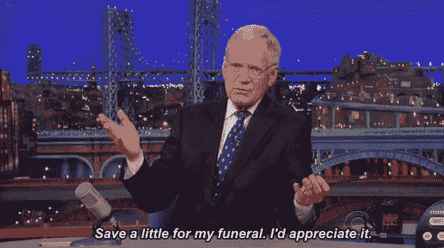

# 2022 年 5 月在比特币基地购买的十大密码

> 原文：<https://medium.com/coinmonks/top-10-cryptos-to-buy-on-coinbase-in-may-2022-e99e3b033e2f?source=collection_archive---------15----------------------->

***不紧不慢用了一把才一撮 YOLO***

嗯，这是一个吉祥的首次亮相。

我终于把我的名字给一些电话，他们津津有味。

但我有一个无懈可击的借口。

Like I give a squat about losing 30%. Great, now I’m down to 70 cents. (GIPHY/Warner Bros.)

我真的不在乎短期。

走吧。我会说“HODL”是我的中间名，但在这个空间里，它更像是我的第一个名字。

我并不是为了在任何一个月甚至一年中赚钱而进入 crypto。如果一代人的财富是你的目标，那就用一代人的时间来实现它。你为你的投资组合暂时下跌所付出的代价完全被以更低价格买入的机会所抵消。

这就是美元成本平均法(DCA)的精髓，在固定的时间间隔买入，抓住跳跃和下跌。如果你想最大限度地利用优势，你可以把你 5 月份的投资分成两份——如果你在 1 号和 15 号拿到钱，这很容易。

加密投资者可以预计市场将持续波动，直到 5 月 4 日(T4)周三(T5)，届时美联储将开会决定是否(实际上，多少)现在加息，然后给出未来的指导。

Pictured: Jerome Powell. (GIPHY/20th Century Fox)

事情是这样的:*也没有人知道之后会发生什么*。美联储可能加息，迫使市场破位。或者，市场可能会在接下来的两周内暴跌近 30%，就像 3 月份那样。或者，美联储可能会看到[衰退即将来临](https://www.forbes.com/sites/jonathanponciano/2022/04/28/us-economy-shrank-14-last-quarter-in-worst-showing-since-covid-recession-new-gdp-estimate-shows/?sh=231592d54277)并加息 25 个基点，或者干脆不加息(我可以很放心地说，这种情况不会发生)。

DCA 不赢的唯一方式是市场在宣布之前和之后都上涨，这是不太可能的。

但梅的名单是为贝尔加载的。如果美联储迫使经济下滑，下面几乎所有的硬币都将足够坚挺，能够存活下来，但如果市场逆转为牛市，它们也有可能繁荣发展。(是的，我说的是“几乎所有。”得找点乐子。)每枚硬币旁边是我在 100 美元头寸中会分配多少。但是，我不是理财顾问，不知道您的具体投资需求。

我也郑重声明:我在某个时候拥有过所有这些硬币，现在拥有其中的大部分，而且当你读到这篇文章的时候，可能还会拥有其中的一些。不足以说明问题。

1.比特币:4 月份:⬇️ 14.7%

在不太遥远的未来，你的孙辈将会完全震惊于比特币在 2022 年一整年的价格可能都低于 5 万美元，并会奇怪你为什么不多买一些。

尤其是在比特币最终开发出一个不仅仅是“为书呆子赚钱”的用例之后它也成为了另一个国家[的法定货币](https://www.cnbc.com/2022/04/28/central-african-republic-adopts-bitcoin-as-legal-tender.html)，虽然彼得·希夫不会被打动，但多米诺骨牌仍在继续倒下。

事实上，如果你想把整个月的分配投入比特币，我会祝福的。国王加密像冠军一样有弹性——它只在大多数替代硬币崩溃时抖动。[在过去的 90 天里，前 50 名中只有 13 名的表现优于普通大众。事实上，它甚至比 4 月份的纳斯达克(Nasdaq)更难守住底线。如果我们真的进入了一个熊市，甚至是一个隐秘的冬天，霍德林 BTC 是一个长期的赢家。](https://www.blockchaincenter.net/en/altcoin-season-index/)

2.以太坊(eth)——25 美元 4 月份:⬇️ 14.6%

当谈到稳定性时，比特币世界中唯一的硬币就是以太坊。。。酪

四月，一个以太坊开发者宣布，由于延迟，他们正在将备受期待的合并推回利益相关协议。

错过截止日期在加密社区是一个即时的危险信号，因为它是一个[地毯拉](https://fortune.com/2022/03/02/crypto-scam-rug-pull-what-is-it/)的警示标志之一——一个像去年[“乌贼游戏”](https://www.wired.com/story/squid-game-coin-crypto-scam/)启发的令牌一样的骗局硬币。

现在，没有人认为 ETH 是一个骗子，而“密码王子”当然有了一些回旋的余地。以太坊在做的事情，基本上是没人做过的，当然也没有规模化。想象一艘潜艇在水下行驶并被追逐时，从柴油推进切换到核能推进，你开始理解以太坊试图完成的事情的复杂性。

也就是说，我们别无选择，只能降低 ETH 在年底前成为能够产生两位数年回报率的 [ESG 友好型投资债券的可能性，并加大它需要很长时间或跌跌撞撞走出大门或完全是一场灾难或根本不会发生的可能性。](https://cryptohayes.medium.com/five-ducking-digits-cd92a7ab72ce)

3.[包装好的月神令牌](https://www.coinbase.com/price/wrapped-luna-token)(wluna)——12 美元
四月:⬇️ 20.6%

哦。

[上个月，我认为 LUNA 可能会继续创下历史新高，我完全正确:它在 4 月 5 日上午达到 119.54 美元的峰值，如果我足够聪明地套现，我会在四天多一点的时间里获得略低于 20%的回报。](/coinmonks/top-10-cryptos-to-buy-on-coinbase-in-april-2022-8ab5e96b1e56)

然后。。。哦。

“Moonfall” gets an even more terrible sequel.

但是——对任何投资者来说都是著名的最后一句话——看涨的理由和当时一样充分。事实上，更强大的是:疯狂之王道权正试图利用他的稳定货币，迫使另一个与美元挂钩的货币戴退出所谓的“曲线战争”

对于这次讨论来说，这是什么以及如何发生的细节有点令人生厌，但足以说明 Do 想喝戴的奶昔。

Man, fighting in crypto is harsh. Do Kwon looks like hell in this GIF. (GIPHY/Paramount Pictures)

如果你认为一个*会有血*引用就过头了，[我向你发誓不是](https://www.stakingrewards.com/journal/do-or-dai-the-dai-ust-cold-war-turns-hot/)。

Terraform Labs 和 Luna Foundation Guard 也购买了价值 2 亿美元的雪崩代币。这一购买表面上是为了支撑 UST，但与 LFG 已经拥有的比特币堡垒相比，这一数额就相形见绌了。

更有可能的原因是 Do 方面更多的讨价还价。作为交易的一部分，UST 或多或少会成为雪崩的区块链的首选。随着第一层竞争对手 [NEAR 和 TRON 推出他们自己的 stablecoin 协议](https://cryptoslate.com/after-usts-success-a-new-race-for-l1-stablecoins-is-here/)，如果要阻止 AVAX 做同样的事情需要 2 亿美元，那这钱花得值。

请记住，卢娜被烧毁，使 UST，使其更加稀缺和更有价值。WLUNA 在技术上不是 LUNA，但它模仿 LUNA 的价格动作。

4.索拉纳四月:⬇️ 27.8%

以太坊的损失是另一个 layer-1s 的收获，索拉纳在喂食槽第一个排队。它得到了主流的曝光，索拉纳·NFT 的项目 Okay Bears 成为了第一个在 OpenSea 上排名第一的非以太坊项目。

“I Don’t Care Bears” would have made more sense to me, but that’s why they’re slinging six-figure jpegs and I’m writing free articles on Medium. (Instagram)

大多数替代硬币在熊市时都会崩溃，但索拉纳已经从去年的峰值下跌了近三分之二。在所有不被命名为比特币或以太坊的密码中，索拉纳是第一个也是最大的一个，当公牛回来时，他会咆哮着回来。

5.雪崩 4 月份:⬇️ 36.4%

“Avalanche 仍然是一个不断增长的生态系统[—它在很大程度上是由对 AVAX 令牌的忠诚度推动的，用户对与 AVAX 保持一致的资产有很强的亲和力。”——](https://www.fxstreet.com/cryptocurrencies/news/avalanche-price-targets-100-after-terra-buys-200-million-in-avax-202204080918)[跆拳道](https://www.bloomberg.com/news/articles/2022-04-07/terra-expands-stablecoin-reserve-beyond-bitcoin-with-avalanche)

6. [BNB 网络币](https://www.coinbase.com/price/bnb)(bnb)——5 美元
4 月:⬇️ 7.77%

你必须非常富有才能烧掉将近 7 . 42 亿美元。赵昌鹏就是那么有钱，而这正是币安的网络所做的，[让 180 万 BNB 币退出流通](https://cryptopotato.com/binance-burns-another-740m-worth-of-bnb-cz-says-it-proves-deflationary-mechanism/)。

不，我不明白为什么 BNB 的硬币能在比特币基地买到，而范顿却不能。只是要小心你如何祝他们"[好运](https://www.coindesk.com/business/2022/04/20/binance-unveils-quickly-abandons-swastika-like-twitter-emoji/)"

IYKYK. (GIPHY/Broadway Video)

好吧，这是这个月分配的 90%，我很无聊。让我们用剩下的代币来玩玩吧。你不需要购买它们中的任何一个——如果你认为我满脑子都是比特币，就把它们投入比特币。或者，如果你认为 Jerome Powell 会拖累市场，你可以等到 FOMC 会议后再购买这些硬币，但这些硬币特别动荡。闭上眼睛按下“购买”可能是最好的策略。

LFGW. (GIPHY/Comedy Central)

7.凯伯网络公司(kyber network)(knc)——3 美元
4 月份:⬆️ 47.7%

我真的很想把 Kyber 放在四月的名单中，但我没有，因为原因和看看它做了什么。KNC 对我来说是一个巨大的赢家，因为我投资组合中的其他股票都大幅下跌，年初至今涨幅高达 254%。

KNC 是多链交易和流动性中心 [Kyber Network](https://kyber.network/) 的治理令牌。投资者可以将他们没有使用的硬币放入 Kyber 的流动性池中。当其他交易者使用 Kyber 的分散交易来交换硬币时，流动性池的成员赚取费用，然后将其中一部分返还给 KNC 的持有者。

KNC 现在已经是一段时间的吐槽彗星了。我的建议是，如果你想暂停你的午餐，就关掉通知之星。

IT’S A TRAP!

8.四月:⬆️ 47.7%

嘿！你大概有 1200 美元，想减肥吗？为此，你可以买一个像样的 Peloton，甚至连半个 Tonal 都买不到——或者你可以买一个最热门的 NFT 系列，同时变得富有和健康。

Seriously, who would pay three grand to experience all of the sweat of the gym combined with all of the fun of a Zoom meeting?

STEPN 是一个销售运动鞋 NFT 的应用程序，这是一个如此简单而又有利可图的想法，耐克应该为没有率先实现这一想法而自责。最便宜的鞋子价格(截至本文撰写时)略低于 14 索尔，约合 1244 美元(这应该会让耐克嫉妒)。但是 NFT 并不仅仅因为它们是充满活力的踢球方式而受到重视。

Ooh, and so realistic and stylish. I always wanted a jpeg of a cartoon shoe that looks like a Bill Cosby sweater.

每双鞋还能让持有者在步行(或慢跑或跑步)时赢得 GMT 和 GST 代币，这被称为“移动赢取”但是在商品及服务税无限供应的地方，GMT 已经跑了一吨。它刚刚在 27 日到达交易所，所以如果你想等待“[比特币基地效应](https://www.coindesk.com/markets/2021/04/07/coinbase-effect-means-average-91-token-price-gain-in-5-days-messari-says/)冷却下来，那就继续吧。

9.四月:⬆️ 37.7%

[3 月下旬，我写道](/coinmonks/ape-in-b23ab4ed81a4)我长期看好 ApeCoin，高达 10 倍——但想等最初的持有者抛售，价格稳定下来。然而，无聊的猿们没有等待，他们在元宇宙开始了土地销售，花费了足够多的钱，以至于许多持有者不得不购买更多的土地——他们这样做了，引发了 FOMO。Apeverse 将成为炫耀性财富的聚集地，这意味着它是你想要投资的地方。

Ape 仍然面临出售压力，因为每个拥有 NFT 无聊 APE 游艇俱乐部的人都有权拥有一群 APE。他们中的许多人会在硬币达到新高时套现。但是购买土地会将代币锁定一年，使其立即停止供应。

宇迦实验室比任何人都更了解这个新市场的脉搏。我想等待更大的买入，但在某些时候，飞机起飞了，你只需要抓住起落架和 HODL，以防它再也不会变得这么低。

You end up one of two ways.

但是如果你认为那是胡说八道。。。

10.四月:⬇️ 3.5%

是啊。我也不敢相信。

一方面，我讨厌 Dogecoin 的存在。区块链技术将重塑世界，彻底改变我们做几乎所有事情的方式，但还有一个愚蠢的废话，不知何故，仍然在十大不稳定的硬币市值中。这就好像是苹果公司制造了 iPhone、iPad 和 iTurd。(如果我听起来很痛苦，因为当 DOGE 从它的 ATH 上掉下来的时候我被烧了，我是，但是我回到了 SHIB。)

我再次拥有 DOGE 的原因只有一个——他刚刚买了 Twitter。

看，埃隆·马斯克使用密码的微交易来实现他的愿望[消除愚蠢的 Twitter 机器人](https://time.com/6171726/elon-musk-fake-followers/)的可能性有多大，这些机器人的名字像@HODL5Good，并试图欺骗你的种子短语？(我其实没有什么模仿者。得到一些是我的中期人生目标之一。)埃隆把 Twitter 变成一个全面的 web3 社交网络的几率有多大？他只是劫持 Dogecoin 来做这件事而不是从头开始创造 Tweetcoin 的可能性有多大？

或许是强力球头奖的 1 英镑？我同意。为什么不呢？

就其自身价值而言，Dogecoin 与它的兄弟相比是一个[远远未被充分利用的密码](https://www.cryptomiso.com/#DOGE)，尽管它可能会一直保持这种状态，但为什么一些特立独行的程序员不会在 Doge 上创造一些奇妙的东西，以期吸引世界首富的注意，最终卖给他呢？

听着，DOGE 是个笑话。但是如果你有国王的耳朵，不管多少贵族认为你只不过是一个愚蠢的小丑，你都是在皇家法院。

沃洛德梅尔·泽伦斯基也曾是个笑话。现在他是这个星球上最受尊敬的人之一。

much analogy. very insight. wow

在 Twitter 上关注我。进入游戏。一如既往，

(Worldwide Pants)

> 加入 Coinmonks [电报频道](https://t.me/coincodecap)和 [Youtube 频道](https://www.youtube.com/c/coinmonks/videos)了解加密交易和投资

# 另外，阅读

*   [Fold App 审核](https://coincodecap.com/fold-app-review) | [Kucoin 交易机器人](/coinmonks/kucoin-trading-bot-automate-your-trades-8cf0ca2138e0) | [Probit 审核](https://coincodecap.com/probit-review)
*   [如何匿名购买比特币](https://coincodecap.com/buy-bitcoin-anonymously) | [比特币现金钱包](https://coincodecap.com/bitcoin-cash-wallets)
*   [币安 vs FTX](https://coincodecap.com/binance-vs-ftx) | [最佳(SOL)索拉纳钱包](https://coincodecap.com/solana-wallets)
*   [比诺莫评论](https://coincodecap.com/binomo-review) | [斯多葛派 vs 3Commas vs TradeSanta](https://coincodecap.com/stoic-vs-3commas-vs-tradesanta)
*   【Capital.com】|[港加密借贷平台](https://coincodecap.com/crypto-lending-hong-kong)