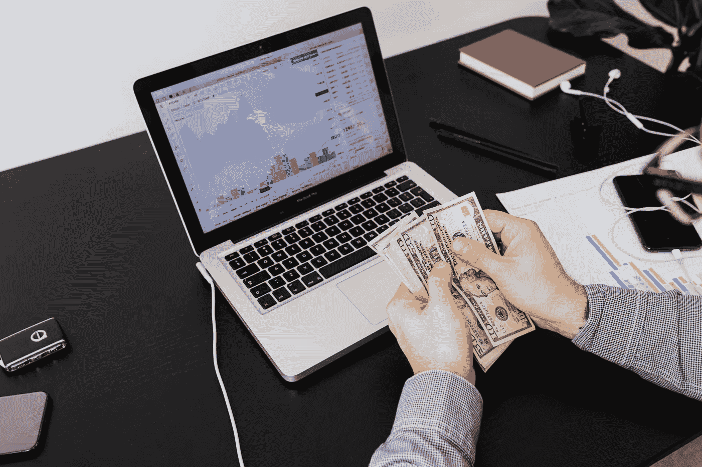

# 2022 年 3 月购买和持有的十大最环保加密货币

> 原文：<https://medium.com/coinmonks/top-10-greenest-cryptocurrencies-to-buy-and-hold-in-march-2022-486ed7c7bf46?source=collection_archive---------69----------------------->

Photo by [Karolina Grabowska](https://www.pexels.com/@karolina-grabowska?utm_content=attributionCopyText&utm_medium=referral&utm_source=pexels) from [Pexels](https://www.pexels.com/photo/a-person-holding-bank-notes-5717754/?utm_content=attributionCopyText&utm_medium=referral&utm_source=pexels)

# 随着投资者转向更可持续的贸易类型，以下是十大最环保的加密货币。

最近有一系列关于加密货币对环境影响的令人不安的披露。加密货币有可能改变全球银行业和经济的面貌。然而，由于加密货币对环境的负面影响，一些投资者对参与加密市场犹豫不决。据报道，比特币挖矿业务整体上有碳影响。加密货币对环境的影响包括大量的能源使用和电子垃圾。然而，并非所有的加密货币都具有相同的资源模型。投资者越来越倾向于选择更环保的交易。本文列出了 2022 年 3 月购买和持有的十大最环保的加密货币。

## 太阳能币

SolarCoin 是一种全球性的分散式加密货币。然而，它不同于任何其他加密货币。SolarCoin 作为最好、最可靠的长期加密货币之一，产生了重大影响。SolarCoin 是一种加密货币，旨在为太阳能产生的每兆瓦小时创造一个 SolarCoin。

## 阿尔格兰德

阿尔格兰德公司在 2021 年 4 月宣布其区块链是碳中和的。致力于帮助企业改善环境证书的组织 Climate Trade 已经与这种加密货币合作。

## 比特格林

BitGreen 是为了应对比特币对环境的负面影响而形成的。这是一个完全由社区运营的计划，采用低能耗的工作验证方法。该公司成立于 2017 年，并建立了一个非营利组织来监督和管理 BitGreen 倡议。

## 芡欧鼠尾草

BitTorrent 的布拉姆·科恩设计了 Chia，可以使用亚马逊网络服务的云计算基础设施进行挖掘。它通过提供可下载的软件来利用用户的桌面，允许他们通过在自己的计算机上操作分散平台来获得 Chia 令牌。

## 主要的

恒星发展基金会(Stellar Development Foundation)负责 2014 年启动的 Stellar Stellar。它是 PayPal 等交易程序的强大替代品，因为它允许更快、更具成本效益的交易方式。Stellar 是生态友好的，并采用了优于利害关系证明算法的共识程序。

## Tronix

Tronix，TRON 货币，是预先开采的，可以在币安和其他交易所交易。TRON 的未来意图包括用它来构建分散的游戏平台。TRON 的分散治理建立在超级代表(SR)和超级代表合作伙伴的双层架构上，每个人都负责成为 SR 和为 SR 投票。

## 极微小

IOTA 是一种不使用区块链的加密货币。相反，这种加密依赖于一种称为有向无环图(DAG)的基于加密的验证机制。这允许事务和验证实时并行运行。

## 卡尔达诺

Cardano 采用了一种共识过程，即货币参与者获得令牌以加入网络，这自然比比特币更节能。据 Cardano 的创造者称，这有助于节省大量能源，他声称加密货币网络仅使用 6 GWh。

## 毫微；纤（10 的负九次方）

Nano 采用节能的块格技术。尽管 block-lattice 仍然使用工作证明技术，但它超越了区块链，为每个网络成员构建了一个帐户链。Nano 平台采用了一种被称为开放式代表投票(ORV)的技术，即账户持有人投票选举一名代表，然后该代表以安全的方式确认大宗交易。

## 德夫维奥

据 DEVVIO 的创造者称，DEVVIO 网络消耗的能量是比特币的百万分之一，排放的环境气体也少得多。它的目标是降低能源消耗，成为一种“更绿色”的加密货币。创作者致力于将 DEVITO 建设成为一个区块链生态系统，能够支持在环境和可持续发展领域工作的利益相关者之间的多方合作和信任，这证明了这一点。

> 加入 Coinmonks [电报频道](https://t.me/coincodecap)和 [Youtube 频道](https://www.youtube.com/c/coinmonks/videos)了解加密交易和投资

# 另外，阅读

*   [Unocoin 评论](https://coincodecap.com/unocoin-review) | [最佳加密赌注硬币](https://coincodecap.com/best-crypto-staking-coins)
*   [如何使用 MetaMask Wallet 获得 KCC 地址？](https://coincodecap.com/kcc-address-metamask)
*   [如何获得自己的。XYZ 领域？](https://coincodecap.com/xyz-domain)
*   [最佳加密交换平台](https://coincodecap.com/best-crypto-swap-platforms) | [最佳加密交易所](https://coincodecap.com/crypto-exchange)
*   [购买比特币印度](/coinmonks/buy-bitcoin-in-india-feb50ddfef94) | [Pionex 评论](/coinmonks/pionex-review-exchange-with-crypto-trading-bot-1e459d0191ea) | [加密交易机器人](/coinmonks/crypto-trading-bot-c2ffce8acb2a)
*   [n rave 零点回顾](/coinmonks/ngrave-zero-review-c465cf8307fc) | [Phemex 回顾](/coinmonks/phemex-review-4cfba0b49e28) | [PrimeXBT 回顾](/coinmonks/primexbt-review-88e0815be858)