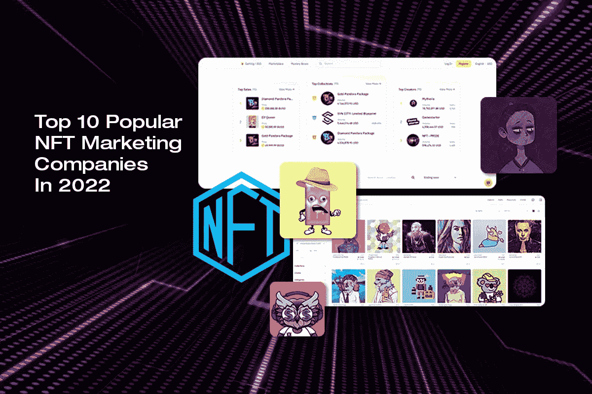
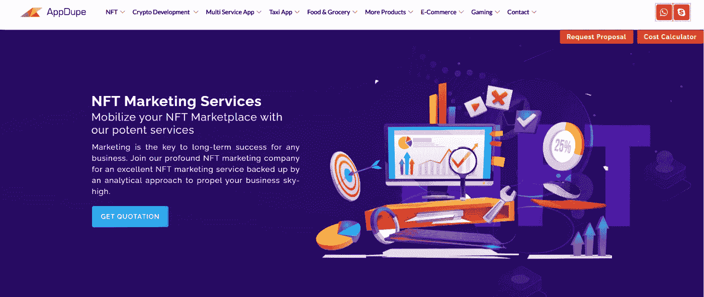
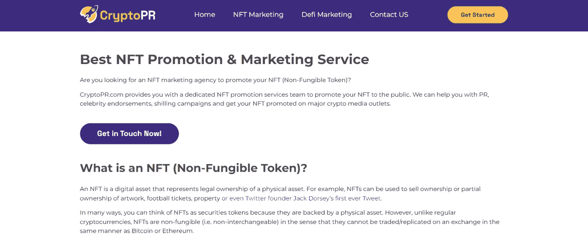
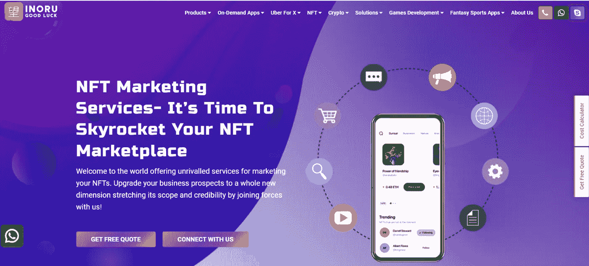
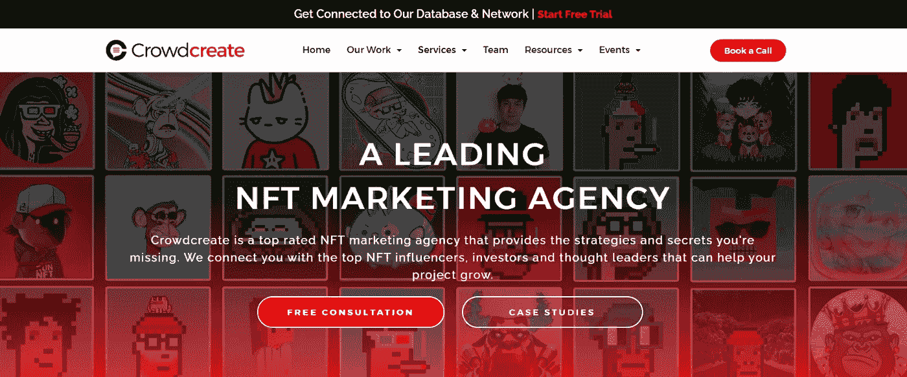
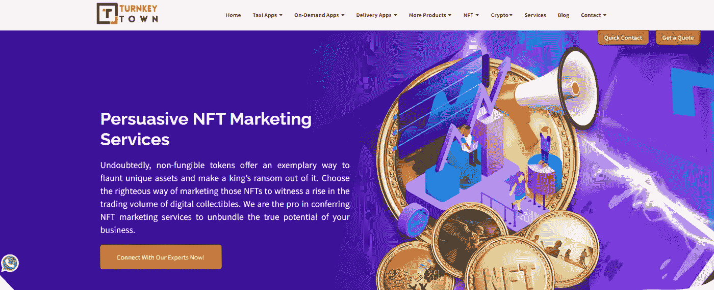
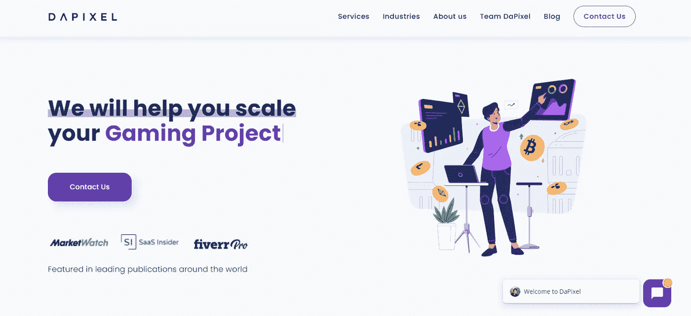
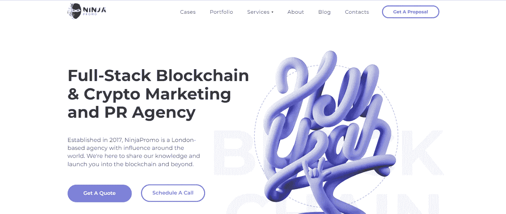
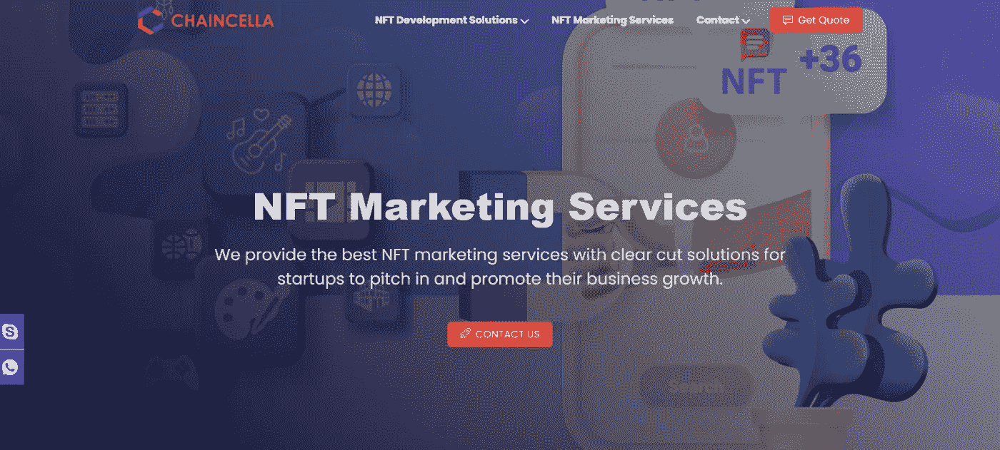
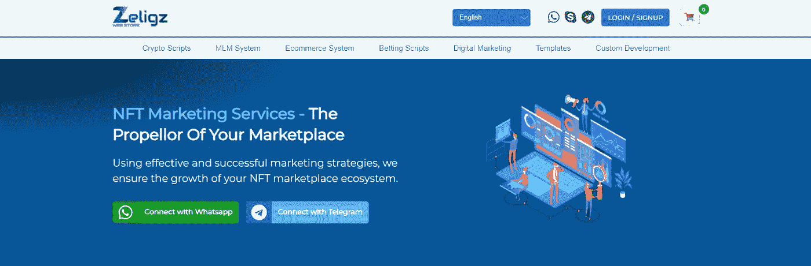

# 2022 年十大受欢迎的 NFT 营销公司

> 原文：<https://medium.com/coinmonks/top-10-popular-nft-marketing-companies-in-2022-5e3a3c287ca8?source=collection_archive---------5----------------------->

NFT Marketing

在这个 NFTs 的时代，创作者将他们的 NFTs 卖给合适的潜在买家是高度竞争的。创作者可能会带来独特的 NFT 收藏，但请记住他们在这场竞赛中并不孤独，因为有成千上万的艺术家可以提出类似的 NFT 创作。他们在众多竞争者中的独特地位决定了他们的成功。只有当人们知道你的 NFTs，他们才会有兴趣购买你的数字收藏品。

然而，这是一个共同的规则，所有企业选择最佳的营销策略，以促进自己在市场上。同样的，非专利技术公司也应该选择正确的 NFT 营销策略，向大量的人推销他们的非专利技术。NFT 营销机构来帮助推广这些 NFT。你想知道 NFT 最好的营销公司是哪家吗？然后继续阅读这个博客，了解全球顶尖的 NFT 营销机构。

# 什么是 NFT 营销，为什么它对创作者来说是精确的？

不可替换的代币是提供给独特和稀有的数字收藏品的数字表示或认证。非功能性翻译应该是原创和独特的。这些 NFT 被铸造成限量版以支持稀缺性。只有当非正规金融工具稀缺时，这些代币的价值才会大幅上升。一旦创作者完成了数字收藏的创作，就应该从推广这些收藏来吸引买家开始。

任何企业的核心成功都在于其营销策略。作为创作者，你也应该选择你杰出的 NFT 营销策略来营销你的数字作品。NFT 营销机构依靠营销背景的专家的智慧运作。他们会列出能产生巨大效果的突出的营销策略。他们预期的营销策略包括内容营销、社交媒体营销、公关营销、影响者营销、搜索引擎优化、NFT 上市、品牌搜索和电子邮件营销。通过接近最好的 NFT 营销机构，你也可以用同样的方式营销你的 NFTs。

# 市场上十大 NFT 营销服务提供商

NFT 营销是你可以为你的 NFTs 迈出的一大步。但是这一步会对你的 NFT 下降产生巨大的影响。当这种营销是如此重要，你是在一个位置，在选择正确的 NFT 营销机构做出明智的选择。为了帮助你，这里有一份最好的 NFT 营销公司的名单，可以为你的 NFT 营销提供完美的解决方案。

## [AppDupe](https://www.appdupe.com/nft-marketing-services)

在 NFTs 的世界里，你绝不能错过听说这家排名第一的公司，它一直积极地为创作者提供顶级的 NFT 营销服务。他们提供广泛的营销服务来推广 NFT 和数字收藏品。凭借强大的专家团队，他们开发出最先进的营销策略来接触目标受众。他们旨在增加网站流量和转化率，以提升你的 NFT 业务。作为一家领先的 NFT 营销机构，他们采用各种各样的活动，可以帮助您直接接触到您的目标受众。在确定最佳 NFT 营销公司的同时，这个名字也应该留在你的脑海中。

## [CryptoPR](https://cryptopr.com/nft-marketing/)

CryptoPR 是下一个最好的 NFT 营销机构，为营销 NFTs 提供完美的支持。他们有一个精通营销策略的专家团队。他们通过各种渠道提供广泛的服务，如公关、名人代言、筹款活动和社交媒体推广。他们会制定计划，为你的 NFT 系列带来流量。此外，他们将建立一个捷径，以达到你的目标受众在任何时间。

## [伊诺鲁](https://www.inoru.com/nft-marketing-services)

INORU 是提升您业务的最佳目的地。他们提供的营销工具将为你创造一个向目标受众推广 NFT 系列的空间。仅仅在 NFT 的市场如 Rarible 和 OpenSea 上列出 NFT 是不够的。你必须在人们中间为你的 NFT 系列制造宣传。INORU 将实施有效的营销策略，将您的 NFTs 传达给正确的受众。通过与他们携手，你可以扬帆起航你的 NFT 收藏。

## [众筹](https://crowdcreate.us/nft-marketing-agency/)

寻找最好的 NFT 营销公司？那么 Crowdcreate 绝对应该在你的清单上。当你向他们推销你的 NFTs 时，他们会分享他们的想法和策略来经营。从创建网站到影响者营销，他们有一系列的想法来提升你在 NFT 的投资。

## [交钥匙城](https://www.turnkeytown.com/nft-marketing-services)

TurnkeyTown 是一家领先的 NFT 营销机构，它遵循生产的原则来推广 NFTs。你可以通过清楚地陈述你的需求和目标受众来接近他们。他们的增长战略将涵盖有机营销、公共关系、影响者营销和社交媒体营销的完整包。他们还通过利用 Discord 和 Telegraph 等社交媒体平台与目标受众互动来扩大支持。

## [达像素](https://dapixel.io/)

Dapixel 遵循一个强有力的战略，他们将首先了解业务需求。随后，他们将绘制一个布局图，以促进您的业务。他们遵循从理解目标开始的四步流程。只有理解了目标，你才能向别人宣传你的意识形态。了解目标后，了解竞争对手是很重要的。这有助于他们了解什么有效，什么无效。通过这种方式，他们将制定战略并推出您的 NFTs。

## [NinjaPromo](https://ninjapromo.io/blockchain-fintech-marketing)

NinjaPromo 是一家 B2B NFT 营销服务提供商。他们的 NFT 营销服务将列出各种营销策略，包括内容营销、社交媒体营销、影响者营销和电子邮件营销。他们还参与说服有影响力的人推广你的 NFT 系列。

## [月球战略](https://lunarstrategy.com/nft/)

这是一家领先的加密营销机构，专注于现代技术，以促进更高水平的 NFT 收藏。它还创造了通过向人们出售非功能性食物来帮助企业获得高额利润的记录。在现在这个时代，在互联网平台上创造一个强大的存在是非常重要的。月球战略非常重视这一点，并在 NFT 空间创造了一个强大的商业名称。他们的先进策略将让你向全球的广大观众推销你的 NFTs。

## [切恩塞拉](https://www.chaincella.com/nft-marketing-service)

它是区块链开发公司的先驱之一。随着更多的经验和专业知识在区块链技术，他们带头促进 NFT 数码收藏品和公司在 NFT 的风险。根据业务需求，他们在推广您的 NFTs 方面提供支持。他们直截了当的方法将有助于提高 NFT 市场的知名度。他们的顶级营销理念包括专注于社交媒体广告、公关、内容营销、与有影响力的人建立互动会话以及电子邮件营销。在最终确定 NFT 营销公司时，该公司应该在您的列表上。

## [Zelig 网络商店](https://www.zeligzwebstore.com/nft-marketing)

如果使用有效和成功的营销策略是一门艺术，那么 Zeligz 网上商店就是其中的毕加索。他们了解 NFTs 是加密业务的巨大收入来源的细微差别。了解这一点，制定最佳的促销策略来推销你的 NFT 系列。他们有一个很棒的专家团队，在有效制定营销策略方面经验丰富。

# 包裹

现在，我们正处于一个非常重要的时刻，即营销服务以吸引大量的人。这个博客会让你大开眼界，找到最好的 NFT 营销公司来推广你的业务。赶快开始推广你的 NFTs 吧。

> 加入 Coinmonks [电报频道](https://t.me/coincodecap)和 [Youtube 频道](https://www.youtube.com/c/coinmonks/videos)了解加密交易和投资

# 另外，阅读

*   [3 商业评论](/coinmonks/3commas-review-an-excellent-crypto-trading-bot-2020-1313a58bec92) | [Pionex 评论](https://coincodecap.com/pionex-review-exchange-with-crypto-trading-bot) | [Coinrule 评论](/coinmonks/coinrule-review-2021-a-beginner-friendly-crypto-trading-bot-daf0504848ba)
*   [莱杰 vs n rave](/coinmonks/ledger-vs-ngrave-zero-7e40f0c1d694)|[莱杰 nano s vs x](/coinmonks/ledger-nano-s-vs-x-battery-hardware-price-storage-59a6663fe3b0) | [币安评论](/coinmonks/binance-review-ee10d3bf3b6e)
*   [Bybit Exchange 审查](/coinmonks/bybit-exchange-review-dbd570019b71) | [Bityard 审查](https://coincodecap.com/bityard-reivew) | [Jet-Bot 审查](https://coincodecap.com/jet-bot-review)
*   [3 commas vs crypto hopper](/coinmonks/3commas-vs-pionex-vs-cryptohopper-best-crypto-bot-6a98d2baa203)|[赚取加密利息](/coinmonks/earn-crypto-interest-b10b810fdda3)
*   最好的比特币[硬件钱包](/coinmonks/hardware-wallets-dfa1211730c6) | [BitBox02 回顾](/coinmonks/bitbox02-review-your-swiss-bitcoin-hardware-wallet-c36c88fff29)
*   [BlockFi vs 摄氏度](/coinmonks/blockfi-vs-celsius-vs-hodlnaut-8a1cc8c26630) | [Hodlnaut 审核](/coinmonks/hodlnaut-review-best-way-to-hodl-is-to-earn-interest-on-your-bitcoin-6658a8c19edf) | [KuCoin 审核](https://coincodecap.com/kucoin-review)