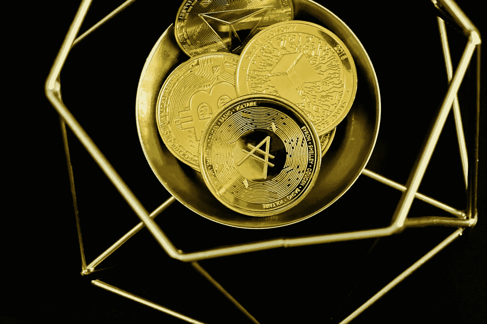
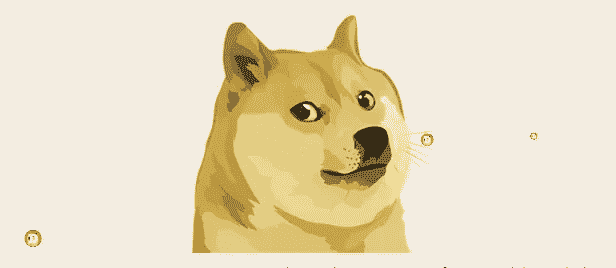
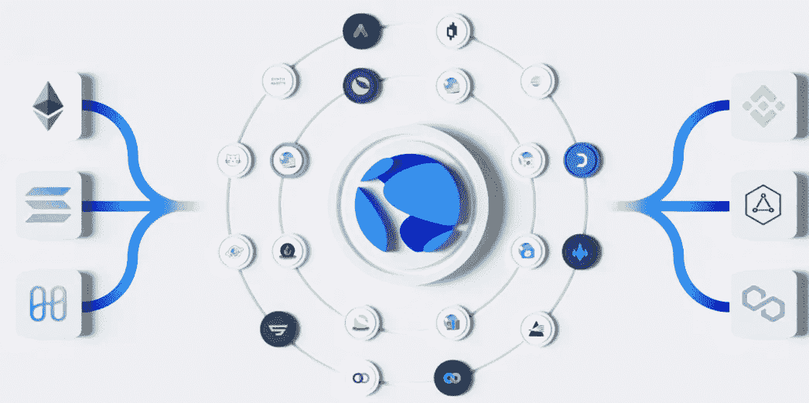
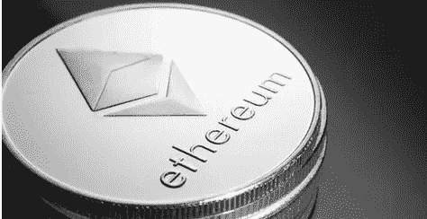

# 2022 年十大热门替代币

> 原文：<https://medium.com/coinmonks/top-10-trending-altcoins-to-buy-now-2022-2d8eaebdc5a3?source=collection_archive---------19----------------------->

显然，比特币是全球交易量最大的加密货币投资资产，因为它非常有利可图，回报率很高。替代币[简称:替代币]它们类似于比特币，但通常以不同的共识机制为特征，包括智能合约和分散金融的风险敞口，使其具有价值。,

在本指南中；我们将深入探讨这些替代硬币的前景，帮助你在投资前更好地分析替代硬币

# 卡尔达诺

Cardano 旨在为加密货币“提供一个更加平衡和可持续的生态系统”。确保业主可以参与网络运营，智能合同的可用性，以区块链。预计这种加密货币将在 2022 年底达到 3 美元，2024 年达到 5 美元。因此，投资者可以预期在价格自然上涨之前购买这种资产 [Cardano](https://cardano.org/) 以拥有类似以太坊和 Solana 的最可靠技术而闻名。

# Dogecoin

Dogecoin (DOGE)是基于流行的“DOGE”互联网迷因，其标志上有一只柴犬。开源数字货币是由来自俄勒冈州波特兰市的比利·马库斯和来自澳大利亚悉尼的杰克逊·帕尔默创造的  ，于 2013 年 12 月从莱特币分叉而来。

今天 Dogecoin 价格为 0.138887 美元，24 小时交易量为 1，897，899，135 美元。Dogecoin 是最有趣的硬币之一，尤其是埃隆·马斯克每次都在 Twitter 上引领话题。特斯拉老板最终收购了 twitter，现在处于他的控制之下。

# 猿

ApeCoin 创建于 2022 年。它确实是一种新的加密货币，由 Bored Ape Yacht Club (BAYC)发行，具有很大的名人影响力，产品结构类似于特斯拉，生态系统将为 ApeCoin 释放更多的效用，Ape coin 目前的估值约为 150 亿美元。APE 已经在比特币基地全球公司(NASDAQ: COIN)、双子星、Crypto.com 和 Webull 等主要交易所上市交易。总体而言，鉴于 ApeCoin 于 2022 年 3 月 17 日空投，短期内的价格预测将非常困难，因为市场结构清晰，加密市场波动巨大

# 莫内罗

作为最早解决区块链公众隐私缺失的硬币之一， [Monero](https://www.getmonero.org/) 最大限度地利用了其在隐私利基的权力空间，取得了广泛的网络效应，并使点对点交易快速、安全、不可追踪。尽管市场资本总额很低，但加密投资者预计价格会大幅上涨。

Monero 可以显著提高加密货币的价格，并在未来大幅升值；这是因为加密投资者群体中的大量采用。

# 月神

Terra network 是一种加密货币，不同于比特币，但在功能上类似于以太坊、Cardano 和 Solana，并且也使用智能合约

有些人可能会感到惊讶，Terra networks 的 LUNA 加密货币是去年表现最好的投资，在 3 月初， [LUNA](https://www.terra.money/) 的交易价格不到 90 美元，但却突破了 106.14 美元的历史新高。专家预测，Terra (LUNA)的价格将随着有利可图的回报而继续增长。

# 柴犬

这更像是一个享受以太坊生态系统高级功能的社区 altcoin。[柴犬](https://www.shibatoken.com/)是最有前景的加密货币，也是该榜单上众所周知的资产之一。柴犬是一种硬币，在众多的社会支持下已经有了很多发展。最近，柴犬有了显著的增长。这本身就表明了这是一项多么好的投资。因此，加密投资者可以在这种加密货币到达月球之前购买它，并在数字钱包中赚取利润。

# 索拉纳

Solana 是第三代无许可、去中心化和可编程的基于区块链的平台。Solana 使用加密安全功能验证两次交易之间的时间间隔，这意味着它在处理交易时保持安全，而无需等待全球共识。

这种替代硬币混合了利害关系证明和历史证明机制。凭借这一点，它设法为投资者带来了巨额回报。 [Solana](https://solana.com/) 已经在多个领域超越了其他 altcoins 去中心化金融(DeFi)、去中心化应用(DApps)和智能合约，仅举几例。

# 波尔卡多特

Polkadot 是一种加密货币，其价值在一段时间内取得了令人印象深刻的增长，在当今的加密货币市场中占据着令人印象深刻的地位。按市值计算，Polkadot 是第 12 大加密货币，按日交易量计算，它是第 13 大加密货币。凭借其无缝连接所有异构区块链网络的能力，Polkadot 无疑吸引了眼球。

因为在波尔卡多特生态系统上有许多正在建造的项目，包括 Acala、Moonbeam、Edgeware 和离心机。

# 以太坊

以太坊是仅次于比特币(BTC)的第二大加密货币，在过去几年里，它一直在稳步增长。以太坊的核心是一个智能合约平台，允许开发者构建从分散金融(DeFi)应用到不可替代的代币(NFT)市场的一切。元宇宙非常依赖这些类型的分散应用，因为以太坊协议是这个领域最大的参与者之一，它有可能成为整个元宇宙的主干。

# 沙箱(沙子)

沙盒是一个虚拟世界，玩家可以使用平台的实用令牌 SAND 在以太坊区块链建立、拥有和货币化他们的游戏体验。沙子是区块链 plat-to-earn 元宇宙沙盒的硬币，也是 ERC-20 的代币。主要目标是连接现实世界和虚拟世界，更确切地说是游戏世界

2021 年 3 月显示沙子仍在增长。3 月 28 日，该硬币达到了 0.9327 美元的月度高点，月底达到 0.8293 美元，几乎是月度涨幅的四倍。据我所知，sand 是最好的投资，因为使用 sand 构建游戏的玩家拥有他们 100%的创作，这使得它成为一个分散的自治组织(道的)

> 加入 Coinmonks [电报频道](https://t.me/coincodecap)和 [Youtube 频道](https://www.youtube.com/c/coinmonks/videos)了解加密交易和投资

# 另外，阅读

*   [Bookmap 评论](https://coincodecap.com/bookmap-review-2021-best-trading-software) | [美国 5 大最佳加密交易所](https://coincodecap.com/crypto-exchange-usa)
*   最佳加密[硬件钱包](/coinmonks/hardware-wallets-dfa1211730c6) | [Bitbns 评论](/coinmonks/bitbns-review-38256a07e161)
*   [新加坡十大最佳加密交易所](https://coincodecap.com/crypto-exchange-in-singapore) | [购买 AXS](https://coincodecap.com/buy-axs-token)
*   [红狗赌场评论](https://coincodecap.com/red-dog-casino-review) | [Swyftx 评论](https://coincodecap.com/swyftx-review) | [CoinGate 评论](https://coincodecap.com/coingate-review)
*   [投资印度的最佳密码](https://coincodecap.com/best-crypto-to-invest-in-india-in-2021)|[WazirX P2P](https://coincodecap.com/wazirx-p2p)|[Hi Dollar Review](https://coincodecap.com/hi-dollar-review)