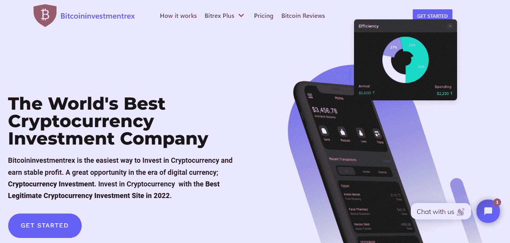
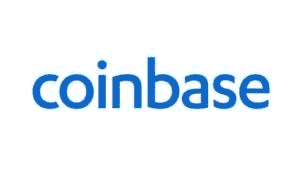
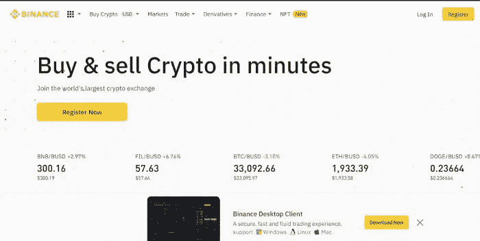
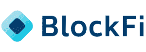
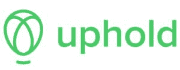
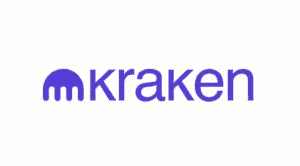
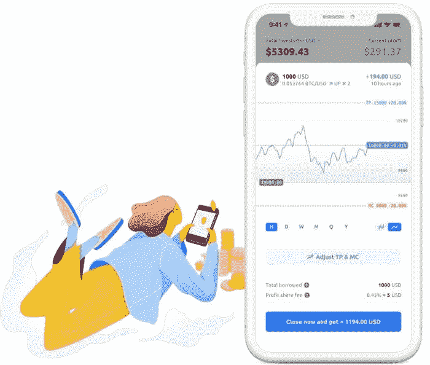
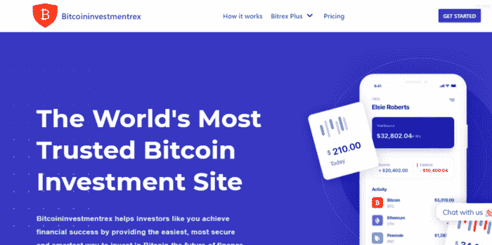

# 2022 年测试和评估的 11 大最佳密码货币交易所和平台

> 原文：<https://medium.com/coinmonks/top-11-best-cryptocurrency-exchanges-platforms-tested-and-reviewed-for-2022-a09052e7f6f9?source=collection_archive---------32----------------------->

# 2022 年测试和评估的 11 大最佳密码货币交易所和平台

# 2022 年测试和评估的 11 大最佳密码货币交易所和平台

# 受信任的比特币投资网站|最佳加密交易所

前 11 大最佳密码货币交易所和平台:投资密码货币有风险，但利润极高。但作为一个寻求开始投资密码货币的密码货币初学者，您一定很想了解十大最佳密码货币投资公司。

**编辑评选的 11 大最佳密码交换:**

*   **整体最佳:** [**比特币投资 rex**](https://bitcoininvestmentrex.com/)
*   **最适合交易:币安**
*   **最佳计息方式:BlockFi**
*   **奥币最佳选择:坚持**

# 11 大比特币和密码货币投资网站

[**1。Bitcoininvestmentrex.com**](https://bitcoininvestmentrex.com/)

**2 .航海家**

**3 .BlockFi**

**4。坚持**

**5。北海巨妖**

**6。eToro**

**7。比特币 IRA**

**8。Crypto.com**

**9 .币安**

**10。Hodlnaut**

**11。比特币基地**

# 最佳密码交换和投资平台

这是我们列出的 11 个最佳密码货币交易所和投资或交易平台。

密码货币交易所和平台是代表密码货币投资标准的精选交易所和平台之一。

如今，每个人似乎都想要密码货币，因为它往往会风靡一时。

如果您正在寻找最好的密码交易所，让您在 2022 年参与比特币方面最好的密码货币交易，那么您来对地方了。

作为一名密码货币初学者，尤其是如果你一直在做一些研究，有数百个平台可以让你在线购买、出售和交易比特币，但是，其中哪一个实际上值得使用？

要考虑的因素很多，比如费用、银行方法、支持的货币、易用性、社区、支持、全球可用性、许可等，您很难选择可信密码货币投资平台。

这就是为什么今天在这篇文章中，我们回顾了市场上一些最好的加密交易所和投资平台，这样你就可以做出明智的决定，投资比特币。让我们潜水吧。

# 2022 年排名和评审的 11 家最佳加密货币投资公司

# [1。bitcoinvestmentrex—最佳整体加密投资平台](https://bitcoininvestmentrex.com/)

在这个列表的顶部，我们有 Bitcoininvestmentrex，这是迄今为止最受欢迎和最好的加密货币投资公司之一，因为你可以使用美元直接投资比特币和加密，每天赚取比特币利润，并且是最具成本效益和最安全的。

Bitcoininvestmentrex 为所有投资者提供免提加密投资，在平台上投资时，您不必担心是专家还是初学者，其过程简单概括就是让您的加密为您工作，而您则从您的加密货币投资组合中赚取加密利润。

此外，世界各地的加密投资者通过 Bitcoininvestmentrex 发现并开始他们的加密和比特币投资之旅。

作为全球 11 大最佳加密货币交易所和投资公司之一，Bitcoininvestmentrex 一直被评为最佳加密货币投资平台之一，这要归功于我们卓越的服务、低廉的费用、多样化的资金选择以及严格的安全标准。我们一直处于比特币投资革命的最前沿。

Bitcoininvestmentrex 另一个值得一提的是，它实际上并不收取任何隐藏的平台费用。

如果你想加入一个加密投资平台，Bitcoininvestmentrex 可能会是一个很好的选择。该平台不仅易于使用，而且开户只需几分钟。

您可以使用比特币(BTC)、以太坊(ETH)、比特币现金(BCH)向您的账户添加资金。一旦您完成了开户流程，Bitcoininvestmentrex 还将通过被动方式为您提供最佳加密货币交易平台的选项，而这是通过比特币投资计划功能完成的，该功能为平台上的成功投资者提供了出色的 ROI。

**bitcoinvestmentrex 费用**

Bitcoinnvestmentrex 最吸引人的一点是，除了全球数百万用户可以使用它之外，它是免佣金的。

这意味着你可以投资你选择的数字货币，而不需要支付任何隐藏的费用。

无存款费用，无佣金费用，无税费。

# 2.比特币基地——最佳比特币交易所

谈到比特币基地，这是一个在加密货币生态系统中非常受欢迎的平台，因为这也是一个完全受监管的加密货币交易所。

它成为首选的主要原因是因为它最初是一个只能交易比特币的平台，随着时间的推移，用户也可以交易其他加密货币，这就解释了为什么它会出现在这个列表的高端。它拥有超过 5600 万用户，这是相当令人印象深刻的，并提供其他服务和功能。

更具体地说，它提供了一项名为比特币基地专业版的服务，该服务有一个直观的用户界面，提供实时订单和图表工具。

当你创建一个账户时，过程很简单，你可以浏览和查看上千的资产。其中一些是完全可交易的，而新的则是为了分析而加入的。

这里值得注意的一件事是，每当你使用借记卡存款时，比特币基地都会收取 3.99%的费用，这比你在 eToro 上看到的 0.5%要高得多。

比特币基地的交易佣金也很贵，所有买卖订单的佣金都是 1.49%。

您还可以设置一些安全控制。例如，你可以在所有取款请求上设置一个 48-house 时间锁，并自动阻止非注册设备 IP 地址的账户登录。你还可以访问一个移动应用程序，它本身也是一个比特币钱包，这增加了它的便利性。

**比特币基地费用**

贸易总额

10 美元以上至 25 美元——1.49 美元

10 美元以上至 25 美元——1.49 美元

10 美元以上至 25 美元——1.49 美元

交易佣金— 1.49%

使用借记卡的 3.99%比特币基地存款费

# 3.币安—有许多加密货币对的流行交易所

币安是上述公司中最新的一家，成立于 2017 年。它最初起源于中国，并在除美国之外的全球范围内推出

美国居民不得不满足于币安。由于特定的法规，美国于 2019 年在 Stemberg 推出。

该平台试图根据监管机构设定的所有预设参数进行操作。除了作为一个交易所，它还有自己的区块链和加密货币，使其成为一个完整的生态系统。

在币安，你有机会通过他们被称为信托钱包的在线钱包交易 300 多种加密货币。注册过程很简单，该平台在 PC 和移动设备上都运行良好。

币安平台还配备了适合任何专业人士需求的工具和功能。它有图表阅读工具、技术指标，以及将您的 API 连接到第三方提供商的能力。

它没有获得《公平竞争法》的许可，但它在安全和客户关怀方面享有盛誉。它有 SAFU(用户安全资产基金)，这是一个应急基金，以应对潜在的外部黑客攻击。

**币安费用**

币安的费用结构相对平坦 **0.1%的现货交易费。**

# 4.“旅行者”号

Voyager 是一个受欢迎的加密投资平台，因为它是首批公开交易的交易所之一。它们由应用驱动，提供免佣金的交易结构。

Voyager 支持大多数主要的加密货币，拥有坚实的支持和参与，并支付有竞争力的资产利率。

**优点**

*   非常易于使用的基于应用程序的界面
*   免佣金交易结构
*   航海家号提供稳定的利率

**缺点**

*   缓慢提款(可能需要 1 天以上)
*   尚未在纽约上市

# 5.BlockFi

BlockFi 是一个加密货币投资平台，允许你贷款并赚取利息。此外，除了出售你的硬币和代币，你还可以用你持有的东西来借款。

如果你只是想持有代币，你也可以让代币为你赚取利息。

**优点**

*   没有佣金和费用
*   基于美国并受监管
*   赚取高额存款利息

**缺点**

*   不支持许多代币和硬币
*   有限的免费提款

# 6.支持

supported 为交易多种资产提供了一个简单的解决方案——开立一个账户，交易多种资产，而无需返回现金。如果你曾经交易过密码，你会知道很多硬币和代币只能成对交易，所以你总是会回到 BTC 或瑞士联邦理工学院。但在坚持上，你可以直接交易多项资产。

另外,“坚持”是少数几个允许你交易 XRP、总督等的交易所之一。

**优点**

*   简单透明的定价结构
*   许多加密令牌，甚至一些股票，包括像 XRP 这样的热门股票
*   桌面和移动应用程序

**缺点**

*   不像列表中的一些那样容易使用
*   一些关于客户服务质量差的报道

# 7.北海巨妖

北海巨妖是加密交易平台之一，他们有很好的硬币和代币可供交易和投资。他们也允许保证金交易。然而，这是一个真正的交换，不像这个列表中的一些顶级平台那样容易使用。

北海巨妖是这个名单上少数几个允许你交易金币和其他更有风险的代币的平台之一。

注意:相对于国际客户，北海巨妖向美国客户提供有限的硬币和代币。

**优点**

*   运行时间最长的密码交易所之一
*   高度的安全性和信任
*   各种密码和代币交易

**缺点**

*   较难使用的平台之一
*   2FA 的难度
*   一些关于客户服务质量差的报道

# 8.eToro

eToro 已经在英国和整个欧洲存在了一段时间，但他们现在允许美国的交易商。他们提供各种各样的数字资产在他们的平台上买卖，更好的是，他们有一个练习交易账户，所以你可以在实际使用真正的资金之前尝试一下。

**优点**

*   交易加密的全局选项
*   复制其他交易者投资组合的能力
*   最低起点

**缺点**

*   在美国选择有限
*   仅在 41 个州提供
*   不像这个列表中的其他平台支持那么多的代币和硬币

# 9.比特币个人退休账户

比特币 IRA 和这里的其他平台有点不一样。与大多数交易所和钱包不同，你基本上只是在兑换货币，并且要为你的收益缴税(在这里了解加密货币的税收是如何工作的)。

也就是说，比特币个人退休账户结合了加密钱包和交易所的优点，同时也是一个个人退休账户。这意味着你在账户中的收益是免税的或延税的。

**优点**

*   投资您个人退休帐户中的加密货币
*   在你的个人退休帐户中赚取加密利息的能力
*   高安全性选项

**缺点**

*   高额费用
*   高最小值
*   不像这个列表中的其他平台支持那么多的代币和硬币

# 10.Crypto.com

Crypto.com 是发展最快的加密交易所之一。它的总部设在香港，但为美国的客户提供大量支持。

现在，你可以获得全球 90 多种代币和硬币，如果你在美国，可以获得 50 种代币和硬币。另外，他们的加密储蓄账户提供稳定的利率。

唯一的主要缺点是，目前它只是基于应用程序，没有桌面平台。

**优点**

*   大量支持的硬币和代币
*   支付加密储蓄的周利息
*   你可以得到一张与你的账户关联的借记卡

**缺点**

*   复杂的费用结构
*   无桌面支持，仅基于应用
*   有限的客户支持

# 11.霍德瑙特

Hodlnaut 是一个专注于比特币和几种稳定币的储蓄和借贷平台。

如果你正在寻找加密货币交易的替代品，请查看 Hodlnaut。

**优点**

*   对持有的资产支付高额利息
*   没有最低余额要求
*   存款 1，000 美元可免费获得 20 美元

**缺点**

*   仅支持、ETH、戴、和
*   支持总部设在新加坡，响应速度可能较慢

# 加密交换是如何工作的？

显然，你可能想知道到底是什么让加密交换成为最好的交换。

具体来说，你正在寻找一家加密货币交易所或加密货币投资公司，可以为你提供数字货币行业提供的一切，在这种情况下，特别是最大、最具主导地位的加密货币比特币的投资和交易。

然而，根据你最终选择的提供商，交易所可以提供经纪、投资和交易服务。理想情况下，加密货币平台/交易所需要为你提供投资、购买或出售你选择的数字货币的手段，在这种情况下，就是比特币(BTC)。

让我们来看一个例子，这样您就可以对它的工作原理有更多的了解。

您居住在英国、美国、加拿大、迪拜，希望从为您的投资计划提供资金的比特币钱包中投资比特币。

完美，这是迄今为止最流行的方法之一，它简单、快捷，是你进行投资的理想方式。

因此，当你最终通过比特币平台完成这笔交易时，例如[bitcoinvestmentrex](https://bitcoininvestmentrex.com/)，你将直接从你最终选择的提供商那里投资硬币。

这意味着您将不必在英镑和加密货币之间进行任何额外的兑换。

请记住，有专门从事交易服务的比特币交易所。

这意味着你将有机会交易加密货币对，就像你可能在传统外汇经纪人那里做的那样。总结一下，你需要推测加密货币对的未来，比如 BTC/瑞士联邦理工学院或 BTC/英镑。

加密货币投资公司将为你提供的另一件事是将一种数字货币换成另一种数字货币的机会。

你可能持有以太坊，想把它换成另一种货币，在这种情况下，就是比特币。

好吧，最好的交易所将允许你这样做，你甚至不必为了这样做而离开你的家。

# 了解加密货币投资

当你考虑投资加密货币时，你可能会考虑购买并持有一枚或多枚加密硬币。

直接购买加密货币可能是增加投资组合中加密风险的最常见方式，但在投资加密货币时，您有几个不同的选择:

*   **直接购买加密货币:**您可以选择直接购买并存储一种或多种加密货币。您的选择范围从以太坊和比特币等最成熟的数字货币到新发行的虚拟未知硬币。
*   **投资加密货币公司:**你可以投资部分或全部专注于加密货币的公司。你的选择包括加密货币采矿公司、采矿硬件制造商、支持加密货币的 Robinhood Markets，Inc. (HOOD)和 PayPal Holdings，Inc. (PYPL)等公司，以及其他许多不同程度的加密暴露。你也可以投资像 MicroStrategy Incorporated (MSTR)这样的公司，它们的资产负债表上持有大量加密货币。
*   **投资专注于加密货币的基金:**如果你不想在单个加密货币公司中进行选择，那么你可以决定投资专注于加密货币的基金。除了一系列加密货币投资信托基金之外，您还可以选择交易所交易基金(ETF)，如指数基金和期货基金。一些专注于加密的基金直接投资于加密货币，而其他基金则投资于专注于加密的公司或期货合约等衍生证券。
*   **投资加密货币个人退休账户:**如果你想投资加密货币，并获得个人退休账户(IRA)提供的税收优惠，那么你可以考虑投资加密货币个人退休账户。使用 crypto IRA 提供商的服务还可以为您的加密货币资产提供更安全的存储。
*   **成为加密挖掘者或验证者:**也许投资加密货币最直接的方式是挖掘它或在加密网络中充当验证者。加密货币挖掘者和验证者在加密中获得奖励，他们可以将其作为投资或兑换成另一种货币。
*   **投资 bitcoinvestmentrex:**这是作为初学者或专家投资加密货币最有效、最便捷的方式。Bitcoininvestmentrex 上的加密货币投资使您可以轻松安全地投资加密，并凭借 Bitcoininvestmentrex 团队的信任、信誉和高专业知识赚取稳定的比特币和加密利润。

# 加密货币投资如何工作:加密初学者指南

如果你想直接投资加密货币，那么你可以使用加密货币交易所。以下是如何通过加密货币投资公司“Bitcoininvestmentrex.com”投资加密货币:

*   选择你想使用的[加密货币投资公司](https://bitcoininvestmentrex.com/)。你最好的选择是一家声誉好、知名度高的 Bitcoininvestmentrex.com，它有专门的客户支持来帮助你入职。
*   在[加密货币平台](http://bitcoininvestmentrex.com/)建立账户。您需要提供接收比特币的地址，并验证您的交易 id，以完成注册过程。
*   用法定货币为你的比特币钱包账户注资。在投资任何加密投资计划之前，您需要向您的比特币钱包账户注入另一种货币，如美元。
*   决定你想在 Bitcoininvestmentrex.com 投资哪个[加密货币投资计划](http://bitcoininvestmentrex.com/bitcoin-investment-plan)。你可以选择投资一种或多种加密货币。[研究你的选择](http://bitcoininvestmentrex.com/best-bitcoin-investment-plan/)帮助你做出决定。
*   为您选择的加密货币计划下投资订单。按照 Bitcoininvestmentrex 要求的步骤提交并完成您的投资表单。
*   将您的加密货币存储在数字钱包中。您的投资计划完成后，您的利润会自动转移到您的接收比特币地址。

# 如何投资加密货币:安全投资加密货币的小贴士

如果我们看看 CoinMarketCap 等网站提供给我们的统计数据，我们可以了解到，在撰写本文时，有超过 380 个平台/交易所目前活跃在加密货币领域。

请记住，可能还有成百上千的人没有被添加到这个列表中。

这意味着这将是一个很难解决的问题，找到并挑选最好的比特币投资平台或加密交易所，特别是如果你是一个加密货币初学者，并且不知道你在寻找什么或根本不知道要寻找什么。

在这种情况下，让我们更深入地了解比特币投资平台和加密交易所的世界，并了解在你开始考虑交易所选项之前，你需要考虑的最重要的因素是什么。

# 1.安全和法规

如果我们看看不受监管的加密货币交易所的历史，我们可以看到，在过去几年中，比特币投资平台和加密交易所的数字资产被盗数十亿英镑。到目前为止，这是新来者在即将进入市场时必须面对的最重要的因素之一，也是为什么有些人一开始会对进入这个行业持怀疑态度。

然而，确实存在按顺序行事的加密货币交易所，我们指的是那些完全可信并且按照所有网络安全标准都是安全的交易所。

该领域的领导者是 Bitcoininvestmentrex.com，因为他们是最值得信赖的加密货币投资平台。

当您将资金放在受监管、可信且安全的加密货币交易所或平台上时，您的资金会受到更大的保护。

每次你决定将你的资金放在不受监管的加密货币上，你都在将你的资金置于风险之中。当您根据自己的特定需求选择最佳加密货币平台或交易所时，请记住这一点。

# 2.秘密投资策略

一些最好的加密货币交易所和平台将提供多种服务。

您需要检查您最终选择的提供商是否能提供您想要访问的选项。

# 3.投资/购买/出售密码

那里最好的加密货币交易所将为你提供直接投资/购买/出售加密货币**[**的机会。**](https://mobile.twitter.com/investmentrex)**

**这意味着你可以用日常支付方式投资它们。**

**当交易完成时，你甚至可以选择通过他们自己的原生数字钱包将你的硬币保留在平台上，或者将它们提取到你的私人钱包中。**

# **4.投资多个加密**

**应该有一个投资不同加密货币的选择，而不仅仅是比特币，比如 Bitcoininvestmentrex 允许投资者用比特币(BTC)、以太坊(ETH)和比特币现金(BCH)进行存款。**

**这一特性为投资者在加密货币策略中将其他加密货币作为投资工具提供了极大的便利。**

# **5.自动取款，费用低**

**有几个英国加密货币交易平台将允许您在成功交易或实现投资回报后，享受自动取款和低费用的数字货币。**

**最好的比特币平台，比如这个例子中的 bitcoinvestmentrex，将让你享受数字货币的自动提取，在 bitcoinvestmentrex 上存款的零费用。**

**你需要从一开始就意识到的是，加密货币交易所是一项业务，因此，它们的目的是赚钱。**

**在这种情况下，他们收取费用以及佣金。然而，这些会有很大的不同。以下是你需要记住的。**

****加密平台/交易所收取的一些费用****

****存款费用:**投资者在加密货币交易所开立账户时，最关心的一件事就是存款费用。**

**如果你想在网上投资、购买、出售或交易加密货币，你将需要在某一点上进行存款，以便它成为进入那个世界的门户。很多时候，当使用借记卡或信用卡时，加密交换可能会发生很大变化，因为加密货币相关交易涉及的感知风险很高。**

**在这种情况下，这可以从 2%到 3.99%不等，取决于你最终选择的交易所。**

**然而，当您使用 Bitcoininvestmentrex.com 时，有一个更具成本效益的选择，因为该提供商在接受您的投资存款时收取零存款费。只是一些你应该记住的事情。**

**投资交易佣金:我们接下来要讨论的是投资交易佣金。**

**当你看不同的平台和交易所时，这也会有很大的不同。**

**这笔佣金与您投资、购买、出售或交易加密货币时必须支付的费用有关，是交易所赚钱的主要方式之一。**

**它是按你的交易规模的百分比收取的，范围从 0.10%到更高。**

**然而，Bitcoininvestmentrex 更进一步，在投资和交易加密货币方面 100%免佣金。**

**具体来说，Bitcoininvestmentrex 在投资和交易费用方面很有竞争力，因为它的费用是最低的。**

**Bitcoininvestmentrex 是一个很好的选择，因为你可以以 100%免佣金的方式投资、购买、出售或交易加密。**

# **加密货币投资、交易工具和功能**

**有两种类型的交易者。有些交易者会不断交易，着眼于短期收益，从事大量活动。还有一些交易者，他们会到选择的交易所来一次，购买比特币，并持有几年。**

**如果你是一个阶梯用户，这可能对你来说不是太有用，但是，如果你对加密货币投资很认真，你需要有合适的工具和功能来帮助你获得成功。**

**[best crypto currency platform](https://bitcoininvestmentrex.com/)提供的工具可以增强您的加密投资体验，以下是您需要留意和了解的内容。**

# **部分所有权**

**在加密货币行业的交易中，部分所有权起着至关重要的作用。数字货币是高度投机的资产类别，你不会想花超过 4 万美元买一个 BTC。**

**你可以使用支持部分所有权的比特币交易所。这实质上意味着你可以购买一个数字货币单位的一小部分。假设一家加密货币交易所的最低存款额为 200 美元，比如 Bitcoininvestmentrex，你可以立即用这 200 美元购买一小部分 BTC，而不是需要 4 万美元。**

# **自动化投资和交易**

**加密货币仍然相当新，因此，许多人可能不明白它们在英国是如何工作的。这使得投资或交易加密货币的过程令人生畏，这就是为什么提供自动化投资和交易服务的加密交易所/平台受到青睐。**

**值得信赖的加密货币投资平台 Bitcoininvestmentrex 将允许您使用最成功的投资者或交易商实施的相同的 [**加密货币投资策略**](https://bitcoininvestmentrex.com/best-bitcoin-investment-plan/) 进行投资。如果你没有经验，只是想让你的密码为你工作，而你赚取稳定的加密利润，这种方法非常有效。**

# **客户服务**

**在寻找最佳比特币投资平台或加密交易所时，客户服务发挥着重要作用。**

**在这些交流中，事情很少出错，然而，当它们出错时，或者仅仅是当你在那里提供的各种过程中需要一些帮助时，你想知道有一个经验丰富的团队支持你。**

**如果有问题的提供商为您提供标准时间甚至 24/7 的实时聊天支持功能，那对您来说是非常方便的。**

**这是因为您可以与客户代理实时交谈，而无需等待电子邮件回复。**

**这就是 Bitcoininvestmentrex 成为最好的加密货币投资公司的原因，因为它有专门的客户服务，有一个 24/7 实时聊天的人类助理，可以随时向您提供快速的解决方案和响应。**

# **如何投资比特币并赚钱——新手比特币投资指南**

**你现在将一步一步地学习如何在加密货币投资平台上入门，以及如何投资比特币并赚钱，这应该只需要几分钟。**

**本演练将解释如何使用 [**可信加密货币平台**](https://bitcoininvestmentrex.com/)bitcoinvestmentrex 开户、存款和进行首次投资。**

**请注意，这个过程与几乎所有其他加密货币平台都非常相似，只有微小的差异，所以一旦你掌握了这个，你应该很容易在其他任何地方实现它。**

# **第一步:在 Bitcoininvestmentrex 开设比特币投资账户**

****

**您需要采取的第一步是创建一个帐户。在网站上找到一个写着“立即开始”的按钮。请注意，Bitcoininvestmentrex 会在创建帐户、处理存款和进行投资之前要求您提供个人信息。**

**[**在 Bitcoininvestmentrex 这里注册投资加密，0%佣金>**](https://bitcoininvestmentrex.com/best-bitcoin-investment-plan/)**

**访问该网站，点击“[立即开始](https://bitcoininvestmentrex.com/best-bitcoin-investment-plan/)”或“[立即投资](https://bitcoininvestmentrex.com/best-bitcoin-investment-plan/)”，您需要输入您的名字、电子邮件地址和电话号码。您可能还需要提供您的交易 id 号，并选择您的投资计划的 rexcode。请确保提供您的交易 id。大概就是这样，要完成账户，你可能需要验证你的投资账户，这很容易由你的账户主管处理。**

# **第二步:存款**

**Bitcoininvestmentrex 接受比特币、以太坊和比特币现金进行存款，这使投资者可以自由选择比特币以外的替代产品作为加密货币投资策略中的投资工具。**

# **第三步:确认你的账户**

**在确认您的投资存款和设置您的加密钱包后，您的帐户信息将发送到您的电子邮件中。**

# **第四步:自动提取利润**

**一旦你的投资到期，你的利润会自动发送到你的比特币钱包。**

# **最佳加密货币投资平台**

**Bitcoininvestmentrex.com 是最好的加密货币投资平台，让您轻松投资比特币和加密，安全赚取加密利润。它面向全球投资者。**

**在这一点上，你很有可能已经决定使用哪个加密货币平台来投资和交易比特币。**

**如果你得出的结论是交易比特币的收益大于风险，Bitcoininvestmentrex 很可能是最好的加密货币平台，通过它你可以投资比特币(BTC)以及加密货币。**

**Bitcoininvestmentrex 非常有吸引力，因为它通过提供多达 3 种加密货币对比特币(BTC)、以太坊(ETH)和比特币现金(BCH)供主动和被动投资选择，为投资者提供安全可靠的投资。**

**此外，你喜欢你的利润复合，无佣金投资，零隐藏费用。**

# **结论**

**总而言之，很难找到一个完美的加密货币平台来满足你的所有特定需求。不过，好的一面是，英国居民可以访问数百个比特币投资平台。**

**你需要记住和记住的事实是，他们中的大多数在没有信任和信誉的情况下运营，所以你必须进行广泛的研究，然后检查围绕支持的市场、费用以及可用的支付方法的指标。**

**在审查了很多提供商后，我们发现今天您可以注册和使用的 [**最佳加密货币投资平台**](https://bitcoininvestmentrex.com/) 是 Bitcoininvestmentrex，这是由于该平台提供免佣金选项，支持多种加密货币，在编写时为 3 种，并允许您免费存入资金。**

## **[今天开始在 Bitcoininvestmentrex 投资加密](https://bitcoininvestmentrex.com/best-bitcoin-investment-plan/)**

****所提供的信息并不旨在用作任何投资决策的唯一依据，也不应被理解为旨在满足任何特定投资者投资需求的建议。所提供的任何内容均不构成财务、税务、法律或会计建议，也不构成量身定制的投资建议。此信息仅用于教育目的。****

> **加入 Coinmonks [电报频道](https://t.me/coincodecap)和 [Youtube 频道](https://www.youtube.com/c/coinmonks/videos)了解加密交易和投资**

# **另外，阅读**

*   **[如何在印度购买比特币？](/coinmonks/buy-bitcoin-in-india-feb50ddfef94) | [瓦济克斯评论](/coinmonks/wazirx-review-5c811b074f5b)**
*   **[隐翅虫替代品](/coinmonks/cryptohopper-alternatives-d67287b16d27) | [HitBTC 审查](/coinmonks/hitbtc-review-c5143c5d53c2)**
*   **[CBET 评论](https://coincodecap.com/cbet-casino-review) | [库科恩 vs 比特币基地](https://coincodecap.com/kucoin-vs-coinbase)**
*   **[Fold App 审核](https://coincodecap.com/fold-app-review) | [Kucoin 交易机器人](/coinmonks/kucoin-trading-bot-automate-your-trades-8cf0ca2138e0) | [Probit 审核](https://coincodecap.com/probit-review)**
*   **[如何匿名购买比特币](https://coincodecap.com/buy-bitcoin-anonymously) | [比特币现金钱包](https://coincodecap.com/bitcoin-cash-wallets)**
*   **[币安 vs FTX](https://coincodecap.com/binance-vs-ftx) | [最佳(SOL)索拉纳钱包](https://coincodecap.com/solana-wallets)**
*   **[比诺莫评论](https://coincodecap.com/binomo-review) | [斯多葛派 vs 3Commas vs TradeSanta](https://coincodecap.com/stoic-vs-3commas-vs-tradesanta)**
*   **[Capital.com 评论](https://coincodecap.com/capital-com-review) | [香港的加密借贷平台](https://coincodecap.com/crypto-lending-hong-kong)**
*   **[如何在 Uniswap 上交换加密？](https://coincodecap.com/swap-crypto-on-uniswap) | [A-Ads 评论](https://coincodecap.com/a-ads-review)**
*   **[WazirX vs CoinDCX vs bit bns](/coinmonks/wazirx-vs-coindcx-vs-bitbns-149f4f19a2f1)|[block fi vs coin loan vs Nexo](/coinmonks/blockfi-vs-coinloan-vs-nexo-cb624635230d)**