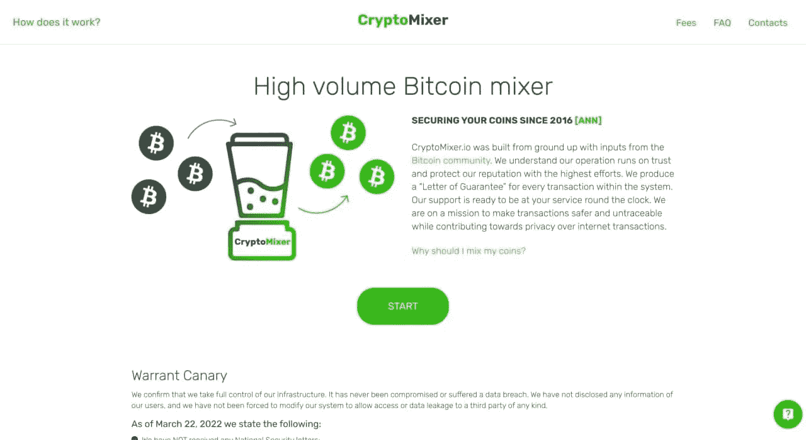

# 2022 年 13 款最佳比特币搅拌机和酒杯

> 原文：<https://medium.com/coinmonks/top-12-best-bitcoin-mixers-73e3e4f2d1df?source=collection_archive---------4----------------------->

比特币混合器是一种服务，可以让你的交易在加密网络中无法追踪。一个网站或应用程序接受客户的硬币，将其分成小部分，并与其他用户混合。结果，用户收到了所需的金额，但包括了以前属于其他客户的份额。

以前，混合器主要用于非法金融交易。现在，它们经常被用来提供安全性或隐藏拥有加密货币的事实。

所有这些服务都要收费。通常，它的大小取决于交易的数量和混合的数量。理想情况下，结果总和中没有一个粒子应该与原始用户相关联。

## **如何选择最好的比特币搅拌机？**

选择混频器时，有几个参数需要特别注意。

1.  这项服务必须有一个*大储备*。如果交易大于硬币池，那么混合后，新的资金将被分期分配。
2.  *名声*。希望找到尽可能多的服务信息。
3.  *区块链分析识别*。一些比特币混合器有独特的标签，允许分析师连接用户的钱包。在这种情况下，可以追踪客户。要查看服务是否被标记，请访问[钱包浏览器。](https://www.walletexplorer.com/)

## 1.芥末钱包

 [## Wasabi 钱包——内置 coinjoin 的比特币隐私钱包

### Wasabi 是一款开源、非托管、注重隐私的桌面比特币钱包，它实现了无信任…

wasabiwallet.io](https://wasabiwallet.io/) 

这是一个桌面比特币钱包。它是开源的，并且具有高度的保密性。有针对 Windows、OSX 和 Linux 的版本。该混频器使用 BIP84 输出方案，仅产生其 bech32 地址。它使用独特的比特币混合技术，提供商无法窃取资金。钱包可以让你获得 100 倍的匿名性:要完成交易，客户需要等到 100 个其他参与者的硬币合在一起。费用为所选匿名度的 0.003%。比如是 70，用户就要支付 0.003*70=0.21%。

## **2。** [**UniJoin**](https://coincodecap.com/go/unijoin)

 [## 最可靠的比特币混合器- UniJoin - Home

### UniJoin——市场上最好的比特币混合器——保护比特币隐私。混合比特币交易以保持匿名…

coincodecap.com](https://coincodecap.com/go/unijoin) 

UniJoin.io 是一个评级很高的比特币混合器，提供了一种可靠而安全的方法来保护您在进行交易时的隐私。作为一项加密混合器服务，UniJoin 使用先进的 CoinJoin 技术来匿名化您的加密货币交易，使其无法连接回您。UniJoin 的混合过程快速、高效、经济，确保最大限度的匿名性。UniJoin 提供了一个用户友好的界面，使任何人都可以轻松导航和使用。该网站可通过 Tor 浏览器访问。其出色的客户评价证明了其服务在保持用户匿名性方面的质量和有效性。最终，UniJoin 是一个顶级的比特币混合器，任何试图保持加密货币交易秘密和安全的人都应该考虑到这一点。

## 3.辛巴达

最值得信赖的比特币混合器叫做[辛巴达](https://sinbad.io/en)。它有一个无日志策略，在混合完成后，所有关于你的交易的信息都会被销毁。如果您有任何问题，您可以使用 Sinbad Mixer 给您的担保函联系客户服务部，表明您是比特币的合法所有者，并解决问题。

[辛巴达](https://sinbad.io/en)有一个简单易用的用户界面。此外，该平台不保留日志，一旦会话完成，将在一小时内删除所有信息。此外，用户还可以通过调整设置来定制隐私级别。用户还可以快速混合 BTC，因为有大量的预混合比特币可供使用。

## **4。MixBTC**

 [## MixBTC

### 金额应大于 0.005 BTC。只有第一笔交易才计算在内。下一次付款将是…

mixbtc.online](https://mixbtc.online/) 

MixBTC 是一个完全匿名的比特币混合器，费用很低。这种自动化的加密货币混合服务可以让你发送比特币，并在另一个地址接收新的比特币。开始混合需要三次确认。该服务不存储有关已执行交易的信息。最低交易金额为 0.005 BTC。更少的金额将被视为对该服务的捐赠。该系统支持 SegWit 地址。

## 5. [Mixero](https://mixero.io/) (新服务——从小额开始)

Mixero 是比特币混合器和翻滚器之一，允许用户将自己的比特币与其他用户的比特币混合，以掩盖资金的来源和目的地。

通过将你的密码与其他匿名支持者组合在一起，并通过 CoinJoin 技术给你不可追踪的硬币，Mixero 有助于你恢复和保持匿名。

需要注意的是，虽然比特币混合器和酒杯可以增加交易的隐私和匿名性，但它们并不是完全安全的，可能无法保护用户免受各种形式的监控或跟踪。

此外，Mixero 是市场上相对较新的搅拌机，因此我们建议从 10 美元到 20 美元这样的小额开始。

## **6。共名化**

 [## Coinomize.biz - #1 最佳比特币搅拌机|比特币搅拌机|比特币不倒翁

### 1.输入最多五个 BTC 地址，并将您想要混合的硬币发送到新生成的地址。只有一个…

共名化. biz](https://coinomize.biz/) 

这款混音器被认为是所有同类产品中预算最低的。它有两个备份域:https://coinomize.co/的[和 https://coinomize.is/的](https://coinomize.co/)[和](https://coinomize.is/)。这项服务有一个用户友好的界面，并进行快速交易。该系统提供完全匿名，让你发送比特币到几个地址(最多 5 个)。费用从 1%到 5% + 0.0003 BTC 不等。最小混合量为 0.0015 BTC。为了增加隐私，客户可以调整程序延迟时间。混合器不存储 IP 地址、日志或其他数据。

## 7.萨莫赖

 [## 漩涡

### 通过任何平台上可用的内置 CoinJoin 打破您的硬币留下的链接

samouraiwallet.com](https://samouraiwallet.com/whirlpool) 

这个搅拌器使用漩涡技术来打破客户和他们的硬币之间的联系。根据该计划，不同用户的比特币进入总体流动性流，并从那里被分配到许多新的出口。这个过程通常需要几分钟。Samourai 主要针对移动设备，但 Whirpool 也可以用作桌面应用程序。使用该系统的费用不取决于交易的金额。

## **8。盲混合器**

 [## 盲混钱包

### 编辑描述

mixer.blindmixer.com](https://mixer.blindmixer.com/) 

根据创作者的说法，Blindmixer 是市场上最封闭的混合系统之一。你只能通过创建一个保管钱包来使用这项服务。这意味着，要存储比特币，需要委托给系统。使用所谓的 Schnorr 系统来实现保密性。与此同时，Blindmixer 有一个缺点:混合过程是“盲目”进行的，因此存在客户收回部分资金的风险。

## **9。密码混合器**

 [## 比特币搅拌机-比特币不倒翁-比特币搅拌机-加密搅拌机

### 自数字时代开始以来，数百万用户转向了区块链，据称这将改变……

cryptomixer.io](https://cryptomixer.io/) 

该服务具有独特的混合算法。它也适用于移动设备。费用为 0.5% + 0.005 BTC。最低交易金额为 0.001 BTC。可以调整程序延迟和硬币的百分比分配。2000 BTC 的储备使得混合更大量成为可能。

## 10。木片混合器

 [## 筹码混合器-比特币不倒翁

### 筹码混合器比特币混合器比特币不倒翁

chipmixer.com](https://chipmixer.com/) 

您不需要创建帐户来使用该混音器。该系统具有可定制的费率。对于 20 BTC 的交易，需要一次确认，其余的需要 6 次确认。服务特色是每周等待存款。日志保存 7 天。Bitcointalk 上有个帖子。混合器的工作原理是基于所谓的*芯片*，即由一定金额(0.001 BTC，0.002 BTC，0.004 BTC 等)资助的比特币地址。，高达 4.096 BTC)。存入密码的客户收到的是芯片金额。筹码是匿名的。它们可以用于任何目的，但只有在秘密密钥的帮助下才能使用。

## **11。搅拌机**

 [## Blender.io |比特币混合服务，安全匿名的比特币混合器

### 有了这项服务，你将能够在不使用 VPN 的情况下进行完全匿名的交易。这个比特币搅拌机…

blender.io](https://blender.io/) 

Blender 服务有大量储备，因此客户的操作不会重叠。发送资金需要三次确认。用户收到一个特殊的混合码。这是他们拿不回比特币的保证。混合器不存储动作日志。每个目的地地址的费用从 0.5%到 2.5% + 0.0003 BTC 不等。最低交易金额为 0.001 BTC。存款地址 24 小时内有效。该服务支持 SegWit 和 bech32 地址。

## 12。MixTum

 [## MixTum.io |比特币混合器|比特币不倒翁-现在就混合您的硬币！

### 首先，我们把你的硬币放入预混合器，在那里它们与其他硬币混合。然后，我们将这种加密货币发送到…

mixtum.io](https://mixtum.io/) 

比特币混合器的一个特点是使用 Jambler.io 平台。当混合硬币时，系统不会洗牌其账户上的免费硬币，而是使用在加密货币交易所(币安、ryptonex、OKEx、DigiFinex)购买的资金。由于它们的高周转率，保证了交易的纯粹性。钱混着混着也没啥用。在随机顺序中，设置时间延迟，确定中间钱包和输出交易的数量，然后选择比特币将返回指定钱包的比例。默认下单时，可以设置两个地址。但是，如果需要，可以进行单独设置。该服务在 BitcoinTalk 上有一个线程。

## **13。FoxMixer**

 [## 扣押通知

### 编辑描述

www.foxmixer.com](https://www.foxmixer.com/) 

FoxMixer 使用复杂的混合方案，既有经典的也有动态的 CoinJoin。客户可以输入利息金额，并找出他们在每个地址将收到的付款部分。每个出口地址的费用为 1% + 0.0007 BTC。要完成一项交易，需要 6 次确认。在一个特殊的页面上，人们可以实时监控混合资金的过程。无缝多服务器冗余确保无故障运行。可以通过 Tor 使用该系统。

**记住！**

通常，混合速度取决于加密货币的类型和运算量。作为一个规则，这么多的钱包，硬币被转移到那里，这么多的交易。所以，从时间上来说，你需要指望 5–6 次比特币转账。

大多数混合器存储信息不超过三天。

在交易期间，客户接收各种数据。比如确认资金归属的代码，保函，加密货币钱包地址。不要意外关闭包含该信息的浏览器选项卡，这一点很重要。以后退回寄去的钱会有用的。

同样值得注意的是，许多混音器设置了最小传输大小。如果一个人发送的金额较小，那么比特币可以作为捐赠给这项服务。

最后，让我们提醒你，互联网上有很多著名调音师的“克隆”，所以要小心他们。

使用服务时，您需要小心谨慎，彻底权衡利弊。

> 加入 Coinmonks [电报频道](https://t.me/coincodecap)和 [Youtube 频道](https://www.youtube.com/c/coinmonks/videos)了解加密交易和投资

# 另外，阅读

*   [3 商业评论](/coinmonks/3commas-review-an-excellent-crypto-trading-bot-2020-1313a58bec92) | [Pionex 评论](https://coincodecap.com/pionex-review-exchange-with-crypto-trading-bot) | [Coinrule 评论](/coinmonks/coinrule-review-2021-a-beginner-friendly-crypto-trading-bot-daf0504848ba)
*   [莱杰 vs n rave](/coinmonks/ledger-vs-ngrave-zero-7e40f0c1d694)|[莱杰 nano s vs x](/coinmonks/ledger-nano-s-vs-x-battery-hardware-price-storage-59a6663fe3b0) | [币安评论](/coinmonks/binance-review-ee10d3bf3b6e)
*   [Bybit Exchange 审查](/coinmonks/bybit-exchange-review-dbd570019b71) | [Bityard 审查](https://coincodecap.com/bityard-reivew) | [Jet-Bot 审查](https://coincodecap.com/jet-bot-review)
*   [3 commas vs Cryptohopper](/coinmonks/3commas-vs-pionex-vs-cryptohopper-best-crypto-bot-6a98d2baa203)|[赚取加密利息](/coinmonks/earn-crypto-interest-b10b810fdda3)
*   最好的比特币[硬件钱包](/coinmonks/hardware-wallets-dfa1211730c6) | [BitBox02 回顾](/coinmonks/bitbox02-review-your-swiss-bitcoin-hardware-wallet-c36c88fff29)