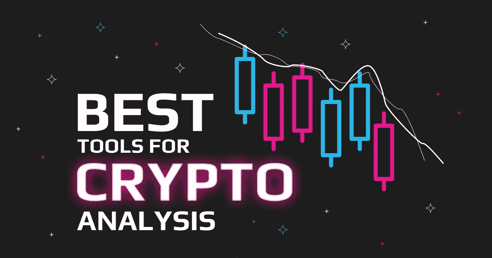
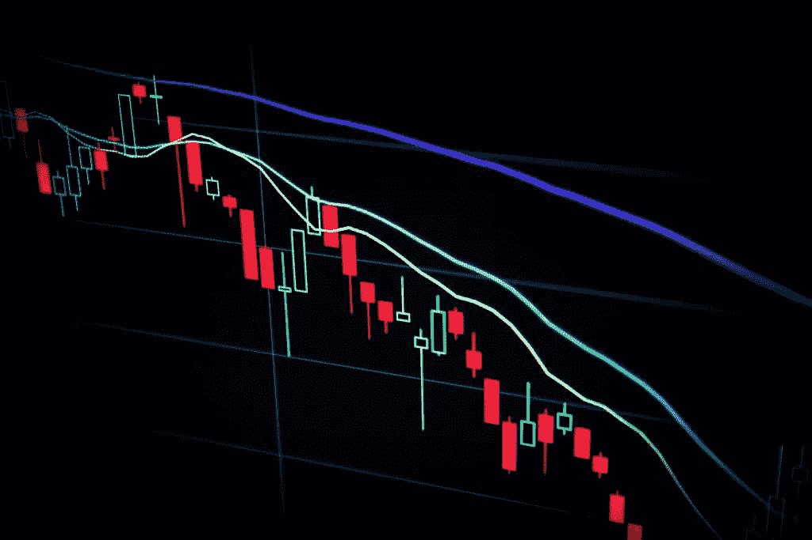
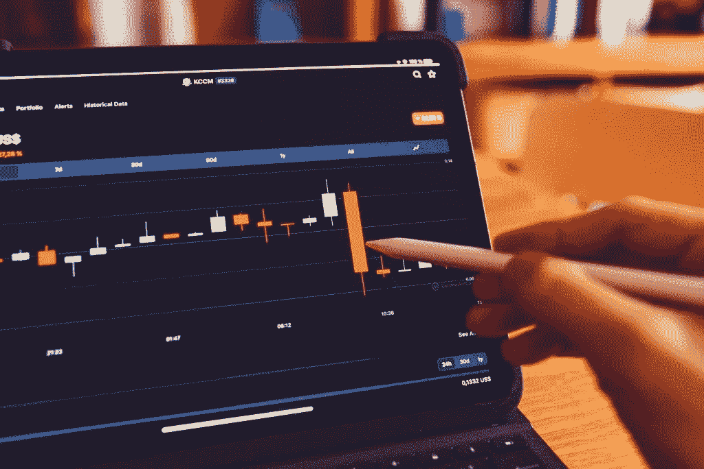

# 16 大加密交易工具和分析资源

> 原文：<https://medium.com/coinmonks/top-16-crypto-trading-tools-and-resources-for-analysis-53fbf09f8c1d?source=collection_archive---------5----------------------->

密码分析工具和加密分析工具听起来可能相似，但它们是完全不同的。区块链开发人员使用密码分析工具来测试区块链加密的完整性，交易员使用密码分析工具来获得对盈利交易有意义的见解。这篇文章将探讨不同的加密交易工具及其各种用途。

# 加密交易工具

一些交易者在加密市场上持续成功交易，而另一些则失败了。这两类交易者的区别在于他们对不同加密交易工具的理解。

一个熟练的密码交易者在不断波动的市场中采取行动之前会使用各种工具进行分析。这些加密交易工具属于不同的类别，包括:

*   市场数据
*   数据分析工具
*   图表工具
*   投资组合管理工具
*   社交网络和新闻聚合器

成为成功交易者的关键是掌握这些交易工具。这些工具提供实时数据，帮助交易者迅速做出市场决策。让我们详细探讨一下每一个类别。

# 市场数据

## 硬币壁虎

[Coingecko](https://www.coingecko.com/) 是一个投射数千种加密货币实时市场数据的工具。您可以使用类别部分过滤硬币，并探索其他功能，如投资组合跟踪和加密学习平台。

## 共同市场资本

[CoinMarketCap](https://coinmarketcap.com/) 可以说是最可靠的准确市场数据来源。该网站跟踪数千种加密货币的价格，并根据市值对其进行排名。CoinMarketCap 还整合了 ICO 和事件日历、免费空投部分、就业委员会和亚历山大加密学习平台。

# 加密交易分析工具

## 交易视图

交易最重要的一个方面是使用图表工具来可视化市场。交易者使用像 [TradingView](https://www.tradingview.com/) 这样的图表工具来识别价格趋势，帮助他们找出市场的位置，为做出明智的交易决策提供坚实的基础。

TradingView 提供股票和加密货币的交易图表，是技术分析的最佳图表工具。这也是一个平台，爱好者、交易者、投资者和教育工作者可以联系起来，分享关于金融市场的想法。

# 投资组合管理工具

作为投资者，投资组合管理工具可以帮助你管理你的投资，尤其是当你的资产分散在不同的钱包和交易所时。有时很难跟踪各种投资的表现，但当你可以在一个地方查看它们时，就变得容易多了。这就是投资组合管理工具所提供的，轻松跟踪你的投资。让我们来看看一些。

## 组合证券

[BlockFolio](https://blockfolio.com/) 是最大的移动投资组合追踪器，覆盖超过 500 家交易所和 10，000 枚硬币和代币。它的功能包括新闻提要、价格提醒和在一个光滑的用户界面上对你的投资组合的概述。

## 硬币追踪器

像 Blockfolio 一样， [CoinTracker](https://www.cointracker.io/) 提供关于市场和你的投资表现的信息。它支持 300 多个交易所和 7，000 多种加密货币，并允许您轻松下载您的税务报告。

## 密码比较

[CryptoCompare](https://www.cryptocompare.com/) 提供市场数据和查看其他用户创建的公开投资组合的独特功能。它支持 150 多个交易所，并允许用户实时跟踪他们的投资组合。

# 数据分析工具

在分析区块链数据时，各种数据分析工具都派上了用场。这些工具提供了智能交易和投资决策所需的数据、研究、链上指标和指标。让我们探索一下这些数据分析工具。

## 密码量子

[CryptoQuant](https://cryptoquant.com/asset/btc/summary) 是一款分析工具，提供实时市场数据、交易流量、链上指标和情绪分析。其功能还包括采矿和衍生品指标和价格统计。

## 沙丘分析

[Dune Analytics](https://dune.com/browse/dashboards) 是一款流行的 DeFi 工具，用于查询以太坊、乐观主义、BNB 链和灵知链。这是一个开放的平台，允许任何人发布和访问各种用于跟踪区块链数据的加密仪表板。分析师使用 SQL 查询来分析基于受支持的区块链构建的任何智能合约的数据。

## 孙祖实验室

[SUN ZU Lab](https://sunzulab.com/) 是总部位于巴黎的领先数据解决方案提供商，致力于通过独立的定量分析为全球加密生态系统带来透明度。

该平台从主要流动性场所收集最精细的市场数据，对其进行分析，并通过实时仪表板和 API 流或定制报告提供解决方案。

您可以访问 100 多种不同格式的指示器:

*   一个全面的仪表板，用于评估和衡量流动性、优化执行和了解市场动向
*   直接访问扩充数据的 API
*   按需报告

## Dappquery

[Dappquery](https://dappquery.com/) 包含几个用于从区块链中提取数据的特性。它支持构建在以太坊、多边形、xDAi 和 Fantom 链上的智能合约。您可以使用 SQL 查询这些区块链，并在各种直观的仪表板上可视化您的分析。

## 南森

[Nansen](https://www.nansen.ai/) 是一款区块链分析工具，提供对精确加密和 NFT 洞察的访问。它支持以太坊、BSC、Arbitrum、Celo、Fantom 和多边形。该网站定期发布深入的研究文章和博客文章。您可以访问重要的令牌流和功能，并使用直接 SQL 查询创建控制面板。

## 硬币度量

[Coin metrics](https://coinmetrics.io/) 是一家可信的数据聚合公司，提供关于加密货币主题的原创研究。该网站还包括加密市场的时事通讯，包括网络时事通讯。Coin metrics 还为链上数据、期货、稳定 Coin 和 NFT 提供了特殊见解。

## IntoTheBlock

IntoTheBlock 是一家著名的数据科学公司，为密码爱好者提供四种主要服务:使用各种指标分析数百种资产，预测几个硬币未来位置的价格预测，DeFi insights 和资本市场洞察。

## APY 视觉

[APY 视觉](https://apy.vision/)是一个 DeFi 工具，用于跟踪不同协议和网络的流动性池表现。它支持不同的区块链，包括以太坊，雪崩，多边形，和谐，和 Fantom。您可以使用 APY 视觉计算潜在的农业奖励，监控您的金库，并跟踪您的收益。

# 其他著名的加密分析工具

## 月见草

[LunarCrush](https://lunarcrush.com/) 是一款社交分析工具，它使用人工智能和机器学习从数百个来源中提取数据，为制定数据驱动的交易决策提供见解。它提供了一个由价格变动和社会趋势组成的仪表板，让你一眼就能看到市场和社交媒体的反应。

## 梅萨里

Messari 提供了一种分析加密数据的综合方法。它有一个跟踪加密资产的资产筛选程序，一个探索数百个图表的图表浏览器，一个在一个地方跟踪所有你喜欢的资产的观察列表，以及一个关于 web3、NFTs 和 DeFi 的研究库。您可以通过内置的英特尔跟踪密码行业的重大事件，并跟踪各种 Dao 的治理活动。

# 社交网络和新闻聚合器

信息驱动着各种硬币和代币的价格。一个杰出的社交媒体影响者的一条推特可以让一枚硬币落下或飞得很高。关于特定国家加密货币合法性的消息可以改变当天的交易方向。

及时了解世界上发生的事情对做出正确的交易决定至关重要。更重要的是，成为第一批获得相关信息的人中的一员，可以让你在成功的交易或投资中占得先机。

Reddit、Twitter、Discord、Telegram 等社交媒体平台和 BitcoinTalk 等论坛通常会围绕加密货币传播信息和一般市场观点。当然，并非社交媒体上的一切都是正确的，但你可以利用市场情绪进行交易分析。

您可以从新闻聚合器中获得深入的信息，这些新闻聚合器整理有关密码行业相关事件的博客帖子和文章。一些最受欢迎的加密新闻聚合器包括 [Cryptopanic](https://cryptopanic.com/) 、 [Coinspectator](https://coinspectator.com/) 、 [Coinhills](https://www.coinhills.com/) 、 [Coinjoy](https://coinjoy.io/) 等。

# 加密分析工具的不同用途

**加密技术分析**通过几个**加密技术分析软件**提供的不同功能成为可能。它们包括:

# 技术指标

加密分析工具包含用于图表分析的各种技术指标。这些指标帮助交易者分析和理解图表。从分析中，交易者可以了解市场的位置，以及是否是购买或出售加密货币的好时机。

技术指标的例子是相对强弱指数(RSI)，用来衡量当前价格变化的幅度。移动平均线收敛背离(MACD)帮助交易者知道市场是看涨还是看跌。现金流指数(MFI)是一个通过价格和数量变化来衡量加密资产的购买或出售压力的指标。

# 韵律学

加密分析工具使交易者更容易与加密市场中不断增长的数据进行交互。这些工具在图表上提供基于 10 年以上历史数据的指标，因此交易者可以很容易地与之互动。提供的一些指标包括市值、外汇流量、恐惧和贪婪指数、市场支配地位等。

# 链上数据

一些加密分析工具还使用某些资源来跟踪来自不同区块链的链上数据，从而提供深入的信息。链上数据代表记录在区块链上的交易信息，对公众是公开透明的。分析师可以跟踪有关公共钱包地址、交易和相应金额、矿工费用等数据。

# 社会分析

许多加密分析软件提供商也开始采用算法来分析社交媒体帖子，使用社交指标，如社交优势、趋势和不同加密社区的参与度。

# 为什么市场数据很重要？

使用不同的分析工具查看市场数据，使您能够准确地分析信息，做出更明智的交易和投资决策。

区块链包含大量的数据，这些数据可以用来预测市场走势，并在被准确解读后通过交易或长期投资获利。

# 分析工具和交流

在您订阅任何列出的加密分析工具之前，请使用最佳的加密交换平台。原因如下！

*   作为一名交易者，有时，你需要以闪电般的速度下达交易指令，但如果你的交易所不能提供足够的流动性，你的交易将会很慢，你可能会错过一笔有利可图的交易，或者更糟的是，赔钱。
*   一些交易所有被黑的历史记录。确保您选择了一个安全的交换，没有任何安全危害的消息。
*   关于交易，交易费会比你想象的更多的削减你的利润。选择交易费用较低的交易所总是好的，因为这对你来说意味着更多的利润。

一般来说，您的交换应该与这些加密分析工具兼容。

# 最佳加密交易工具——结论

当您探索不同的加密分析工具时，请查看用户对平台准确性和性能的评价。其中一些工具是高级的；在订阅之前，确保用户评论的准确性、透明度和良好表现的记录。

虽然有些平台界面对您来说可能看起来很复杂，但是经过不断的练习，它会变得更容易使用。你可以通过观看相关的 YouTube 视频和阅读有关该主题的丰富信息的书籍来复习加密技术分析的知识。

# 享受 Swapzone 上的加密交易

既然你已经了解了所有的加密分析工具，你就可以享受在 Swapzone 这样的交易所进行交易了。

[Swapzone](https://swapzone.io/) 是一个分散的交易所，提供更高的流动性、零被黑事件发生率以及尽可能低的交易费用。

在社交网站上分享

# 相关帖子:

1.  [**加密货币如何在危机中发挥作用？**](https://swapzone.io/blog/help-with-crypto)
2.  不是你的钥匙，也不是你的密码。什么是监护权？
3.  [**加密可以避税吗？**](https://swapzone.io/blog/can-you-avoid-paying-taxes-crypto)

> 加入 Coinmonks [电报频道](https://t.me/coincodecap)和 [Youtube 频道](https://www.youtube.com/c/coinmonks/videos)了解加密交易和投资

# 另外，阅读

*   [3 商业评论](/coinmonks/3commas-review-an-excellent-crypto-trading-bot-2020-1313a58bec92) | [Pionex 评论](https://coincodecap.com/pionex-review-exchange-with-crypto-trading-bot) | [Coinrule 评论](/coinmonks/coinrule-review-2021-a-beginner-friendly-crypto-trading-bot-daf0504848ba)
*   [莱杰 vs n rave](/coinmonks/ledger-vs-ngrave-zero-7e40f0c1d694)|[莱杰 nano s vs x](/coinmonks/ledger-nano-s-vs-x-battery-hardware-price-storage-59a6663fe3b0) | [币安评论](/coinmonks/binance-review-ee10d3bf3b6e)
*   [Bybit Exchange 审查](/coinmonks/bybit-exchange-review-dbd570019b71) | [Bityard 审查](https://coincodecap.com/bityard-reivew) | [Jet-Bot 审查](https://coincodecap.com/jet-bot-review)
*   [3 commas vs crypto hopper](/coinmonks/3commas-vs-pionex-vs-cryptohopper-best-crypto-bot-6a98d2baa203)|[赚取加密利息](/coinmonks/earn-crypto-interest-b10b810fdda3)
*   最好的比特币[硬件钱包](/coinmonks/hardware-wallets-dfa1211730c6) | [BitBox02 回顾](/coinmonks/bitbox02-review-your-swiss-bitcoin-hardware-wallet-c36c88fff29)
*   [BlockFi vs Celsius](/coinmonks/blockfi-vs-celsius-vs-hodlnaut-8a1cc8c26630)|[Hodlnaut 点评](/coinmonks/hodlnaut-review-best-way-to-hodl-is-to-earn-interest-on-your-bitcoin-6658a8c19edf) | [KuCoin 点评](https://coincodecap.com/kucoin-review)