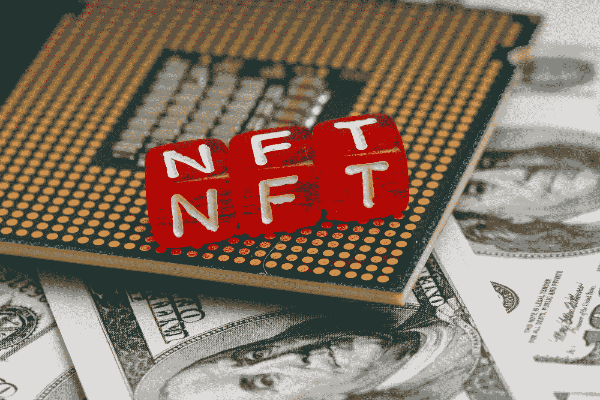

# 元宇宙采用 NFT 将产生积极影响的三大领域

> 原文：<https://medium.com/coinmonks/top-3-areas-where-nft-adoption-in-the-metaverse-will-have-a-positive-impact-471d4b25997d?source=collection_archive---------19----------------------->

Source photo Unsplash.com

元宇宙 NFT 是一个特殊的细分市场，在 NFT 社区越来越受欢迎。根据 NonFungible.com 和法国巴黎银行的一项研究，元宇宙的非功能性金融交易占全球 NFT 市场价值 5.13 亿美元的 3%左右。

随着越来越多的企业创建自己的公司，元宇宙 NFTs 的价值将大幅上升