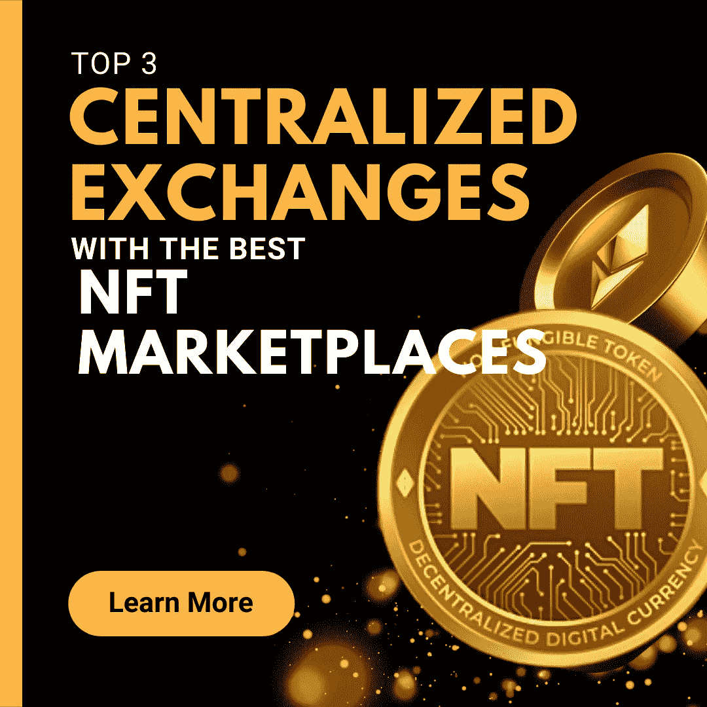
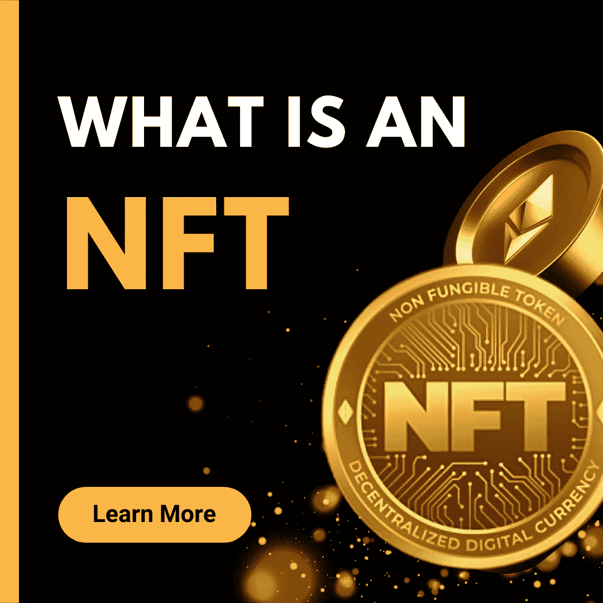

# NFT 市场排名前三的集中交易所

> 原文：<https://medium.com/coinmonks/top-3-centralized-exchanges-with-the-best-nft-marketplaces-60663b984adf?source=collection_archive---------18----------------------->

CENTRALIZED EXCHAGES WITH THE BEST NFT MARKETPLACES

# 介绍

随着近年来数字货币的广泛传播和 NFTs 的采用，毫无疑问，看似普通的艺术品或收藏品获得了巨大的赞誉，需要一个简洁而发达的市场结构。考虑到非母语教学社区不同部门中熟练艺术家的比例，有必要使产品易于获取。正如我们有各种各样的 NFT 市场一样，一些集中交易所已经采取措施，通过直接在他们的交易所上创建 NFT 市场，使 NFTs 更容易进入，因此，我们将讨论 NFT 最好的市场的前 3 个集中交易所。然而，我们不能开始谈论 NFT 市场，而不先讨论什么是非功能性金融交易。所以，在我们深入调查的时候坐好。

## 什么是 NFT？

不可替代代币(NFT)是数字资产，代表现实生活中的物品，如艺术、音乐和游戏中的物品，经常使用加密货币在线买卖。然而，它们不是密码。点击此[链接](/@michaelsihuoma/understanding-nfts-in-laymans-language-6eda30197400)用通俗的语言了解更多关于 NFTs 的知识。那么，什么是 NFT 市场？

# 什么是 NFTMARKETPLACE？

WHAT IS AN NFT MARKETPLACE

在 NFT 市场，你可以很容易地买卖 Nft。他们可以在集中或分散的交易所，而其他一些项目可以在他们的网站上有他们的市场。现在，让我们来看看一些顶级 Nft 市场的集中交易。

# NFT 市场排名前三的集中交易所

NFT 市场有很多更集中的交易所，但是为了本文的目的，我们只考虑其中的几个，因此:

1.  **币安**

币安显然是一个加密交易所，拥有许多不同的加密货币。然而，他们最近刚刚推出了他们的 NFT 市场。这个市场以所有形式的数字艺术品和收藏品为特色，由币安区块链和社区提供支持。

币安·NFT 市场让每个人，包括来自世界各地的艺术家、创作者和加密爱好者，在一个平台上铸造、购买和出售他们的艺术作品。他们还有一个惊人的功能，叫做“神秘盒子”。这些神秘盒子有一个保证随机的 NFTs，它可能以不同的形式出现，例如:

*   n 代表正常
*   r 代表半熟
*   超级罕见的 SR 或
*   超级罕见的 SSR

但是，关于这些神秘盒子，有一些事情需要注意，其中包括:

*   你只能交易未开封的神秘盒子
*   你不能在购买后退回神秘盒子

2.**大门。IO**

Gate.io 是另一家大型加密交易所，多年来一直名列前十。他们最近推出的 NFT 市场被称为 NFT 魔盒。

NFT 魔盒为 NFT 拍卖以及艺术品和收藏品的固定价格提供了空间。在一段时间内，你可以选择购买或出价购买 NFT。

3.**库科恩风向标**

Kucoin 是另一家大型加密交易所，最近刚刚宣布推出名为 Windvane 的 NFT 市场。风向标是一个分散的 NFT 市场，为用户提供 NFT 发射台、造币厂、交易、管理和许多其他服务。

与其他 NFT 市场不同，风向标确保他们的平台上有一个高质量的项目，他们还旨在解决目前一些严重的问题，如高费用，高用户参与度等。

# 结论

集中式交易所做得非常好，使得在交易所交易时，可以在一个地方进行 NFT 交易。而且他们在帮我们减少往返不同平台的麻烦。那么，你对这些交易所和它们的市场有什么看法？

# 关于作者

Igwe Ihuoma Patience 是一名自学成才的创意和特定行业内容作家，也是一名加密货币爱好者，拥有 2 年多的经验和不断发展的区块链空间的知识。

我擅长内容创作、文案撰写、字幕管理、视频编辑和手机图形设计，我教其他人如何在加密货币和区块链领域起步，我的目标是让区块链的学习和更新易于任何人理解。

> 加入 Coinmonks [电报频道](https://t.me/coincodecap)和 [Youtube 频道](https://www.youtube.com/c/coinmonks/videos)了解加密交易和投资

# 另外，阅读

*   [最好的卡达诺钱包](https://coincodecap.com/best-cardano-wallets) | [Bingbon 副本交易](https://coincodecap.com/bingbon-copy-trading)
*   [印度最佳 P2P 加密交易所](https://coincodecap.com/p2p-crypto-exchanges-in-india) | [柴犬钱包](https://coincodecap.com/baby-shiba-inu-wallets)
*   [8 大加密附属计划](https://coincodecap.com/crypto-affiliate-programs) | [eToro vs 比特币基地](https://coincodecap.com/etoro-vs-coinbase)
*   [最佳以太坊钱包](https://coincodecap.com/best-ethereum-wallets) | [电报上的加密货币机器人](https://coincodecap.com/telegram-crypto-bots)
*   [交易杠杆代币的最佳交易所](https://coincodecap.com/leveraged-token-exchanges) | [购买弗洛基](https://coincodecap.com/buy-floki-inu-token)
*   [3 commas vs Pionex vs Cryptohopper](https://coincodecap.com/3commas-vs-pionex-vs-cryptohopper)|[Bingbon Review](https://coincodecap.com/bingbon-review)
*   [加密复制交易平台](/coinmonks/top-10-crypto-copy-trading-platforms-for-beginners-d0c37c7d698c) | [如何在 WazirX 上购买比特币](/coinmonks/buy-bitcoin-on-wazirx-2d12b7989af1)