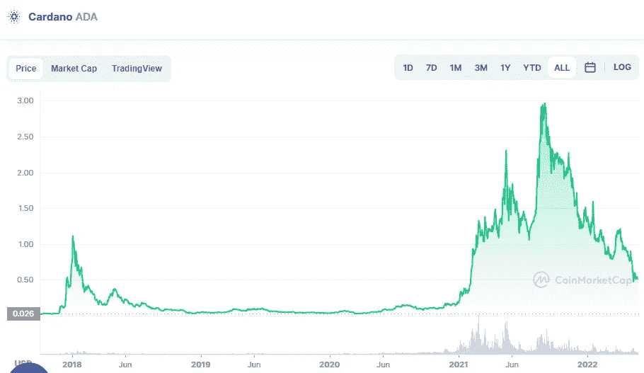

# 长期购买的三大加密货币

> 原文：<https://medium.com/coinmonks/top-3-cryptocurrencies-for-long-term-74a26575d467?source=collection_archive---------32----------------------->

# 卡尔达诺

Source photo [Cardano price today, ADA to USD live, marketcap and chart | CoinMarketCap](https://coinmarketcap.com/currencies/cardano/)

Cardano (ADA)是未来几年最有前途的区块链网络。它拥有业内最引人注目的增长计划，最终目标是成为一个完全自给自足的网络。

去年，这个加密巨兽达到了一个重要的里程碑，它允许开发者通过使用…