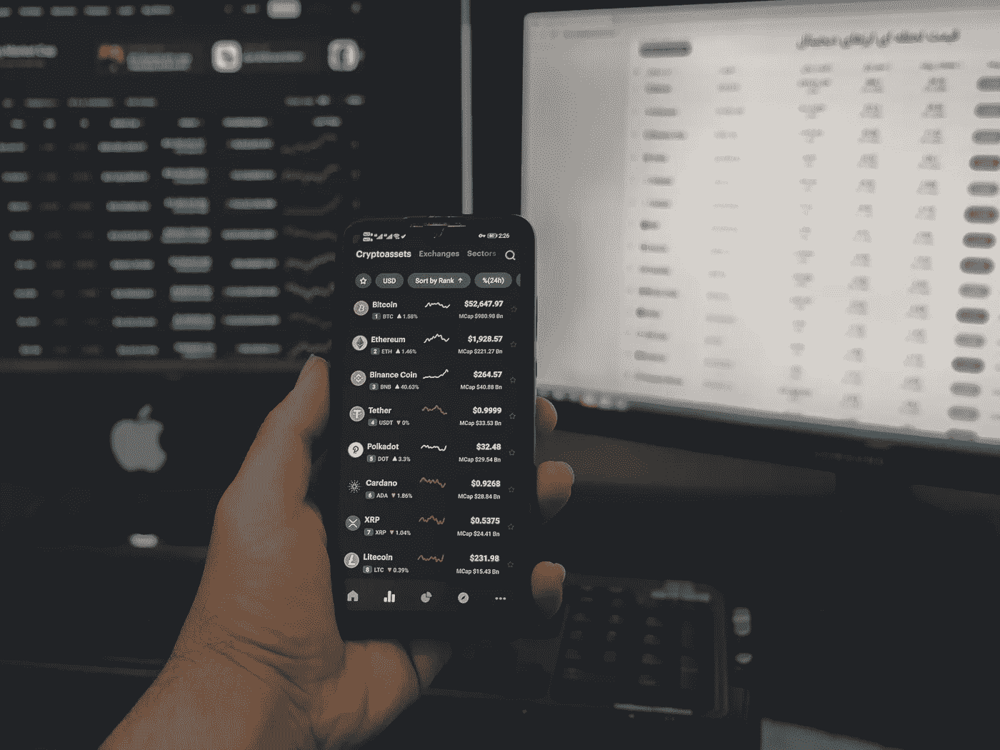

# 我的投资组合中排名前三的加密货币

> 原文：<https://medium.com/coinmonks/top-3-cryptocurrencies-from-my-portfolio-a3f8658dbafd?source=collection_archive---------57----------------------->

Source photo Unsplash.com

# 美元硬币(USDC)

美元(USD)与美国货币(USD Coin) 1:1 挂钩因此，流通中的每一张 1 美元钞票都由 1 美元储备(美国短期国债和现金的组合)支持。据该中心联合会称，USDC 是“由有执照的金融机构发行的”