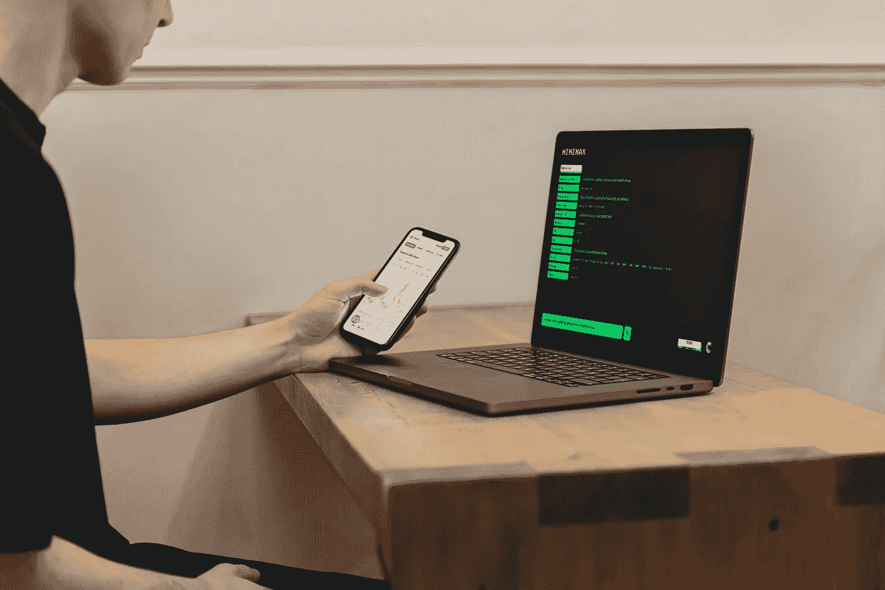

# 6 月份最值得购买的三种加密货币

> 原文：<https://medium.com/coinmonks/top-3-cryptocurrencies-to-buy-in-june-bffb8307ce75?source=collection_archive---------21----------------------->

Source photo Unsplash.com

# 以太坊

继比特币之后，以太坊是第二大加密货币。它目前依赖工作证明来验证交易，但这种情况即将改变。

以太坊的联合创始人 Vitalik Buterin 说“合并”将在八月进行。那时，以前的工作证明(挖掘)平台将与当前的利益证明相结合…