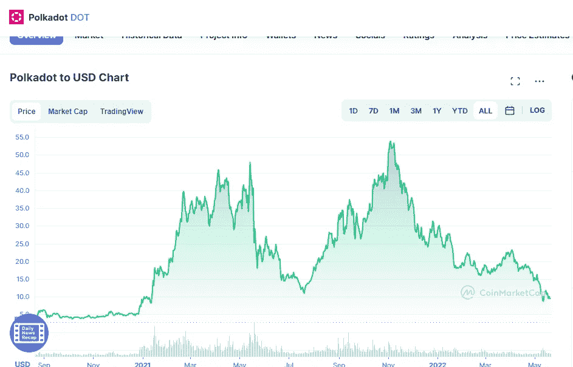

# 5 月份长期购买的三大加密货币

> 原文：<https://medium.com/coinmonks/top-3-cryptocurrencies-to-buy-in-may-for-long-term-74dc05b0af5?source=collection_archive---------34----------------------->

# 波尔卡多(点)

Source photo [Polkadot price today, DOT to USD live, marketcap and chart | CoinMarketCap](https://coinmarketcap.com/currencies/polkadot-new/)

如果 Dogecoin 和 Polkadot 互换位置，Dogecoin 似乎将成为第十大加密货币。自今年年初以来，DOT 的价值已从年底的 28.58 美元下跌 64.9%，至每点令牌略高于 10 美元。最重要的是，它还没有达到 2021 年 11 月 3 日达到的 2021 年高点 53.88 美元。