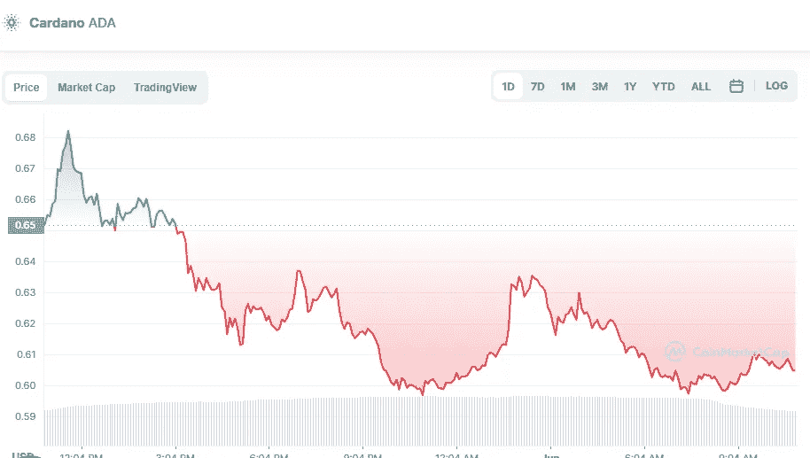

# 6 月 1 日购买的三大加密货币

> 原文：<https://medium.com/coinmonks/top-3-cryptocurrencies-to-buy-on-1st-of-june-c3ac9174ba28?source=collection_archive---------10----------------------->

# 1.卡尔达诺

[Cardano price today, ADA to USD live, marketcap and chart | CoinMarketCap](https://coinmarketcap.com/currencies/cardano/)

卡尔达诺(ADA)目前的价格为 0.60 美元，市值为 204 亿美元。

Cardano 利用利益证明技术来确保分散式应用程序(dApps)的长期可行性。该平台由查尔斯·霍金森(Charles Hoskinson)于 2017 年创立。“阿隆佐”是 2021 年的一个硬分叉，它为平台添加了智能合约支持。