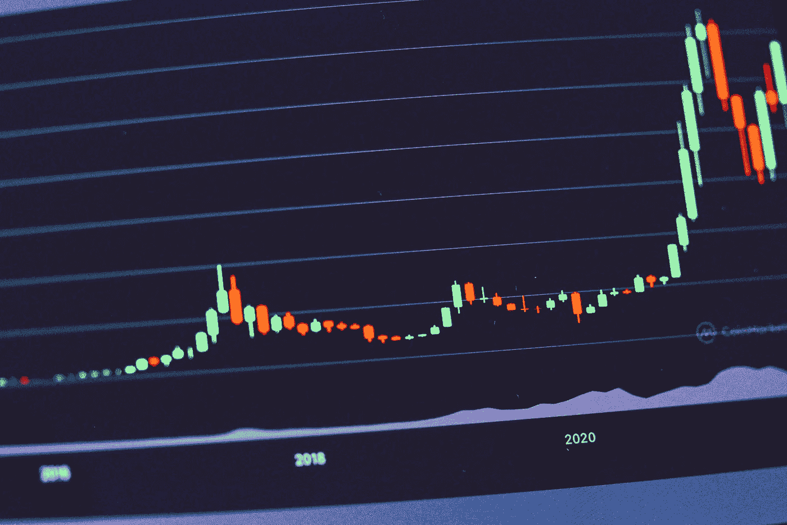

# 此次危机后将增加的三大加密货币

> 原文：<https://medium.com/coinmonks/top-3-cryptocurrencies-which-will-increase-after-this-crash-cbe5110ce5e4?source=collection_archive---------26----------------------->

Source photo Unsplash.com

# 涟漪(XRP)

Ripple 是一家总部位于区块链的支付机制，旨在促进国际现金转账。XRP 是金融机构和银行首选的跨境支付方式，因为其交易费用低廉，成本低，能耗低，处理时间快如闪电。结果，超过 55 个国家的价值…