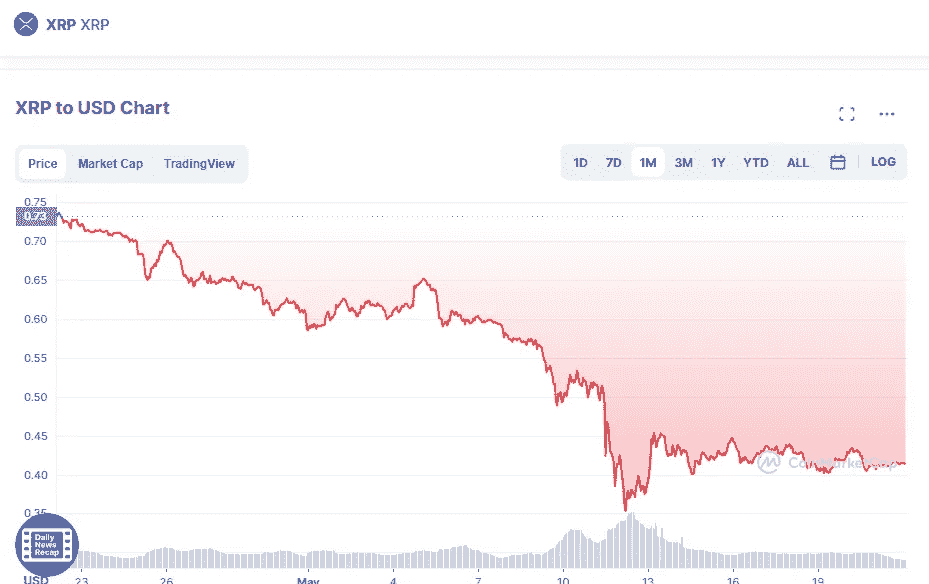

# 未来几个月将增加的前三种加密货币

> 原文：<https://medium.com/coinmonks/top-3-cryptocurrencies-which-will-increase-in-next-months-fb022ed4852b?source=collection_archive---------14----------------------->

# 涟漪(XRP)

XRP 在最后一天上涨了 7%，达到了 0.4311 美元。上周损失了 4%,在之前的 30 天里下降了 44%。

Source photo [XRP price today, XRP to USD live, marketcap and chart | CoinMarketCap](https://coinmarketcap.com/currencies/xrp/)

## 涟漪的价格(XRP)

从 XRP 最近的上涨可以看出，指标正在改善，表明势头正在改善…