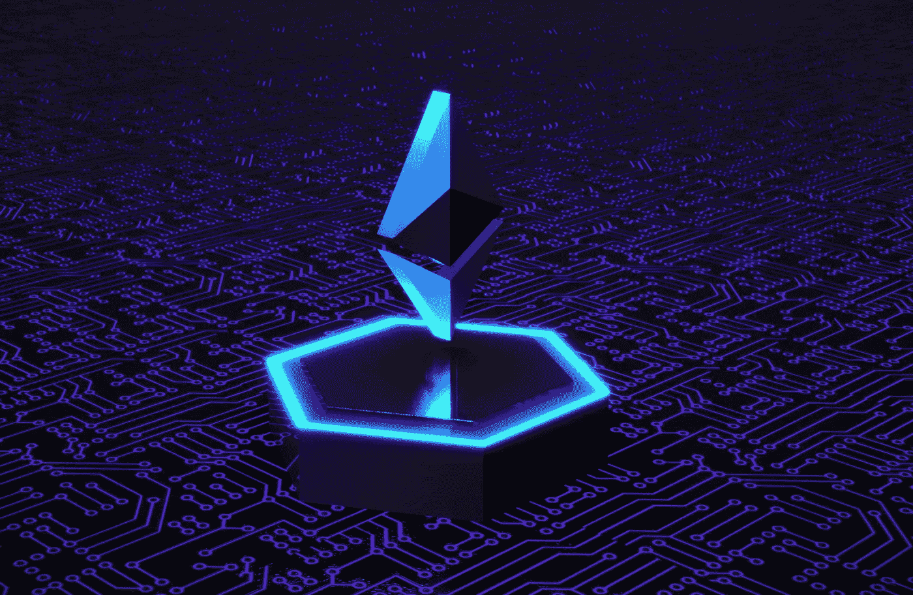

# 比以太坊更有潜力的前三大加密货币

> 原文：<https://medium.com/coinmonks/top-3-cryptocurrency-with-high-potential-than-ethereum-bee06e9e1ea0?source=collection_archive---------47----------------------->

Source photo Unsplash.com

# 索拉纳

分散化是区块链技术的一个关键组成部分，通过对分散化的妥协，更快、更安全的交易成为可能。网络中的核心节点充当整个网络的约定时间决定因素，这被称为历史证明(PoH)。