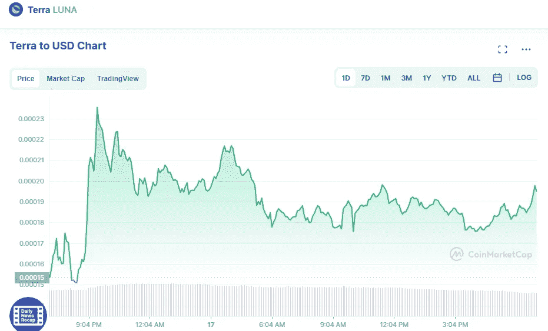

# 5 月 17 日今天购买的前 3 种加密货币

> 原文：<https://medium.com/coinmonks/top-3-crytocurrency-to-buy-today-17th-of-may-b7117b5ca99e?source=collection_archive---------18----------------------->

# 地球(月球)

如果你是一个冒险者，LUNA 是一个巨大回报的遥远潜力。在过去的七天里，它的价值暴跌至 0.00019353 美元，几乎下跌了 99%。从 5 月 13 日该硬币的历史低点 0.000000999967 美元上涨了 18，000%多一点。

月神价格图表为土地(月神)。

Source photo [Terra price today, LUNA to USD live, marketcap and chart | CoinMarketCap](https://coinmarketcap.com/currencies/terra-luna/)