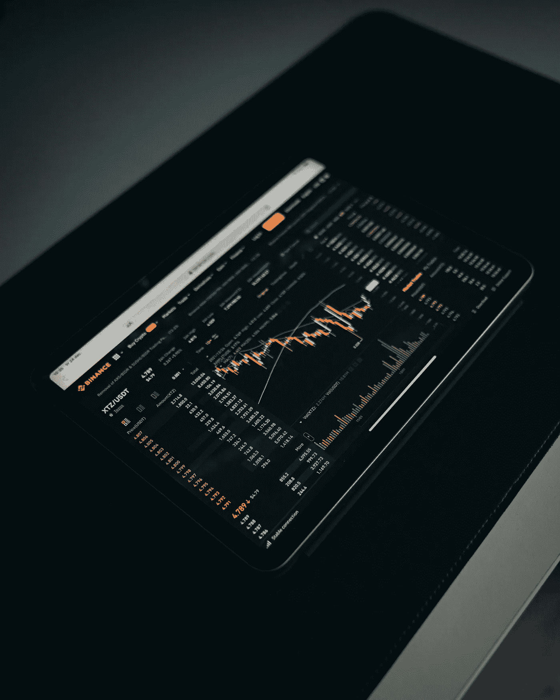

# 现在应该买入的三大成长股

> 原文：<https://medium.com/coinmonks/top-3-growth-stocks-to-buy-right-now-991117d1a61?source=collection_archive---------23----------------------->

Source photo Unsplash.com

# 贝宝控股公司。

作为全球领先的企业和消费者在线支付服务提供商，PayPal Holdings，Inc .当 Ken Fisher 的 Fisher Asset Management 在 2022 年第一季度披露 PayPal Holdings，Inc .(纳斯达克股票代码:PYPL)的大量股份时，其股票价值约为 19.4 亿美元。