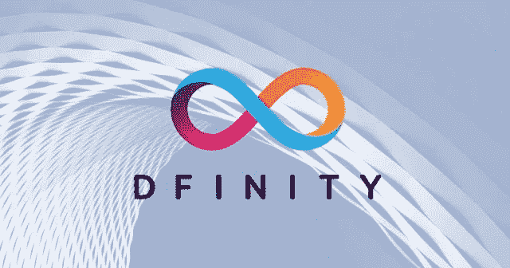
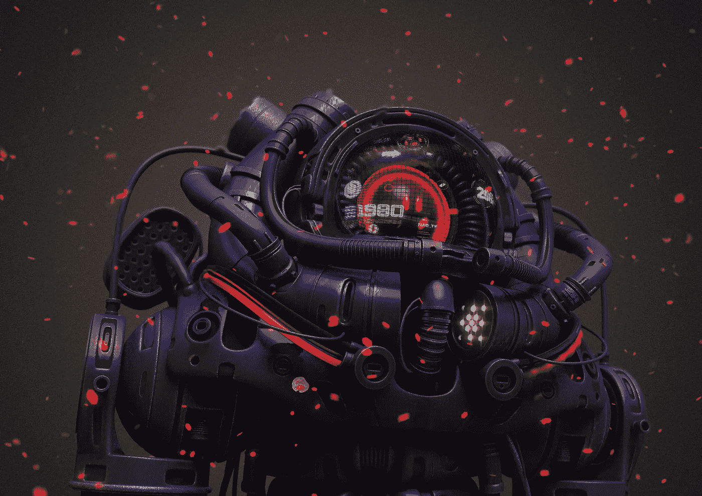
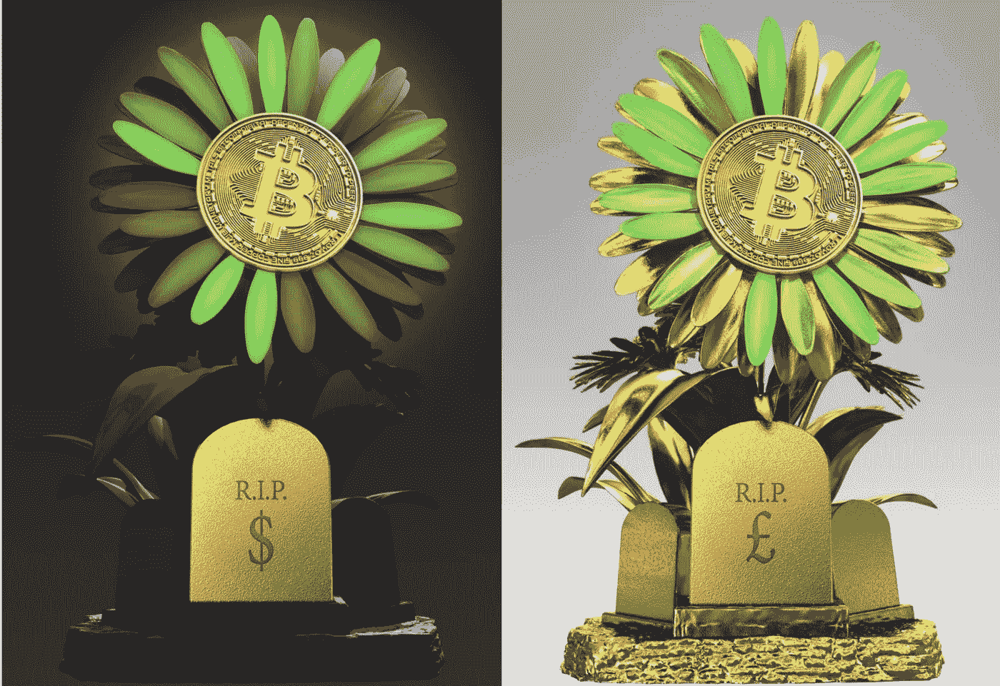
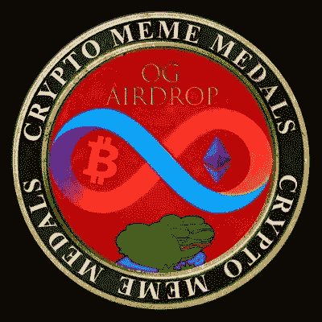

# 前三名比较方案 NFT 项目

> 原文：<https://medium.com/coinmonks/top-3-icp-nft-projects-c54093b6b6d2?source=collection_archive---------6----------------------->

互联网计算机是一个颇具争议的项目，尽管它无疑是一个极其强大的协议，但对 ICP 的创始人无限期地有些蔑视。这在很大程度上是由于国际比较方案令牌自在比特币基地发布以来价格不断上涨。有人认为，早期风险投资者在项目启动后抛售了他们的硬币，牺牲了散户投资者的利益，散户投资者参与了这个被大肆宣传的项目。结果，人们得到了绝对的回报，这可能会在你的嘴里留下苦涩的味道，这是我的经验之谈。

然而，如果你专注于技术，ICP 是一个绝对不可思议的项目，有一个一流的团队。在撰写本文时，ICP 令牌的价值不到 21 美元，这是一个便宜，我认为一旦赌注奖励的销售压力被燃烧 ICP 的罐费所平衡，我们将看到一个巨大的反弹。我认为这种对 Dfinity 暂时的负面看法为那些能够欣赏项目背后突破性技术的人创造了一个购买机会。

**ICP 怎么样，在哪里？**

ICP NFT 市场被称为[转口港](https://entrepot.app/marketplace)，它就像开放海洋(除了它实际上是工作的)。为了与市场互动，你需要一个 ICP 钱包，斯多葛派钱包是一个不错的选择。只需在比特币基地或币安这样的集中交易所购买 ICP，然后把它转移到你坚忍的钱包里。不要担心任何延迟或滞后，ICP 的速度与互联网的速度相当，因此传输只需几分之一秒即可完成。一旦你完成了转账，你就可以把你的钱包连接到转口港，把你所有的钱都花在 NFTs 上。

使用互联网电脑真的让你体会到 ETH 有多可怕。它超级便宜，速度快如闪电，我认为到明年这个时候，国际比较方案 NFT 项目将真正起飞。以下是一些最好的 ICP 项目。

[**戳僵尸程序**](https://pokedstudio.com/)

黄邦贤·鲍尔的创作，插画师，动画师和戳工作室的创始人。戳机器人由 1 万个高清机器人 NFT 组成。这些机器人在搅拌机的熔炉中锻造而成，令人敬畏，完全独一无二，具有一系列奇妙的特性和属性。Ball 在加的夫威尔士工作，他与 Dfinity 的创始人 Dominic Williams 密切合作，两人一起开发了“与我的怪物战斗”在线游戏。

该项目的象征经济学非常有趣，某些所有者可以选择烧掉他们的 NFT。某些第一代机器人可以被烧毁，以锻造 502 代 3D 机器人，这些机器人将有资格在游戏、动画和元宇宙环境中使用。

在撰写本文时，被戳机器人的最低值为 17 ICP。我相信这个项目在 ICP 网络上有最大的优势。除了令人难以置信的艺术之外，燃烧机制给第一代机器人增加了一个通货紧缩的方面。在 17 ICP，他们仍然非常便宜，有这个团队在后面，毫无疑问，这个项目将是一个蓝筹 NFT 收藏。它目前的交易量位居第二，应该很快就会超过 BTC 花卉。

[**BTC 鲜花**](https://twitter.com/btcflower?ref_src=twsrc%5Egoogle%7Ctwcamp%5Eserp%7Ctwgr%5Eauthor)

目前交易量最大的 ICP 项目比特币之花可能是 ICP 网络的加密朋克，从先发优势中受益匪浅。该项目具有非常独特的艺术风格和鲜明的调色板。这是巴黎街头艺术家“Ludo”的创作，2009 年的比特币花朵被插在墓碑上，墓碑上有世界货币的符号。正如你可能猜到的，这象征着旧的中央集权金融体系的死亡。2009 年当然是中本聪发明比特币的一年。

有趣的是，这些花朵的花瓣通过 oracle API 随着比特币的价格波动而摆动。由于互联网计算机的强大功能，这一切都可以在线完成。该项目刚刚向所有比特币鲜花持有者发布了 2015 ETH 鲜花。计划在今后进一步推出第三轮比较方案花卉。

该项目计划有史以来第一个互联网计算机道称为花的力量，花的持有者将能够投票决定项目的方向。在撰写本文时，比特币花卉的底价为 200 ICP，约合 4400 美元。虽然它们并不便宜，但在几年后，当 ICP 开始获得更多的牵引力并开拓更大的市场份额时，这些收藏可能仍有巨大的上升空间。

[**OG 奖牌**](https://twitter.com/DKLORD89?ref_src=twsrc%5Egoogle%7Ctwcamp%5Eserp%7Ctwgr%5Eauthor)

这 1000 枚奖牌被空投给了在 ICP 上运行的完全去中心化的社交内容平台 DSCVR 的早期用户。OG 奖牌庆祝 2022 整合年。ICP 即将与 BTC 整合，这表明这个区块链不像其他连锁店那样是一个蒸汽器皿。如果有什么不同的话，ICP 是一致的，他们像时钟一样执行，不像其他项目的升级似乎总是要几年后…**咳*……*以太坊*。*在 DSCVR 上的第一个 NFT 门控社区中，奥林匹克运动会奖牌作为治理标志，持有奖牌的人将获得额外津贴和奖励。在撰写本文时，该系列的底价为 61 ICP。

**总结**

如果你在 2013 年错过了比特币，在 2017 年错过了以太坊，那么你现在可以提前开始区块链进化过程中的下一个里程碑式的项目。考虑到索拉纳的市值是 ICP 的 10 倍，ICP 被低估了！不可避免的是，ICP 应用和 NFTs 将在明年开始起飞，所以现在可能是一个早期进入和收购一些资产的好时机。ICP 令牌的跌势似乎在 2 月份触底，为 14 美元，此后一直在上升。当然，这些都不是财务建议，我建议每个人都做自己的研究。

> 加入 Coinmonks [电报频道](https://t.me/coincodecap)和 [Youtube 频道](https://www.youtube.com/c/coinmonks/videos)了解加密交易和投资

# 另外，阅读

*   [印度最佳 P2P 加密交易所](https://coincodecap.com/p2p-crypto-exchanges-in-india) | [柴犬钱包](https://coincodecap.com/baby-shiba-inu-wallets)
*   [8 大加密附属计划](https://coincodecap.com/crypto-affiliate-programs) | [eToro vs 比特币基地](https://coincodecap.com/etoro-vs-coinbase)
*   [最佳以太坊钱包](https://coincodecap.com/best-ethereum-wallets) | [电报上的加密货币机器人](https://coincodecap.com/telegram-crypto-bots)
*   [交易杠杆代币的最佳交易所](https://coincodecap.com/leveraged-token-exchanges)
*   [最佳加密分析或链上数据](https://coincodecap.com/blockchain-analytics) | [Bexplus 评论](https://coincodecap.com/bexplus-review)