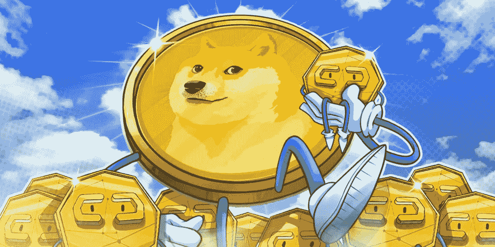

# 2022 年 6 月最值得购买的 3 种 MemeCoin

> 原文：<https://medium.com/coinmonks/top-3-memecoin-to-buy-in-june-2022-a940da660703?source=collection_archive---------32----------------------->

Source photo [memecoin logo — Bing images](https://www.bing.com/images/search?view=detailV2&ccid=RGBNLKK8&id=DE9BD6C6D74FA656529B32ED2D0D72CBF5E4B81A&thid=OIP.RGBNLKK8I3OSRmdHrbfMRQHaDt&mediaurl=https%3a%2f%2fpalbitcoin.com%2fwp-content%2fuploads%2f2021%2f06%2fMemecoin-DOGE-set-for-listing-on-Coinbase-Pro-1140x570.jpg&cdnurl=https%3a%2f%2fth.bing.com%2fth%2fid%2fR.44604d2ca2bc237392466747adb7cc45%3frik%3dGrjk9ctyDS3tMg%26pid%3dImgRaw%26r%3d0&exph=570&expw=1140&q=memecoin+logo&simid=608043859087622008&FORM=IRPRST&ck=B34A1F8CEA8D9219FBE2BF62EC9F8D81&selectedIndex=3&ajaxhist=0&ajaxserp=0)

# Dogecoin

Dogecoin 是一种 P2P 开源加密货币，于 2013 年作为点对点网络开发。起初，它是对比特币和以太坊等老牌加密巨头的轻松制衡。

为了有资格成为另类硬币/迷因货币，Dogecoin 的名字和徽章的灵感来自于一种被称为“Dogecoin”(柴犬)的互联网现象…