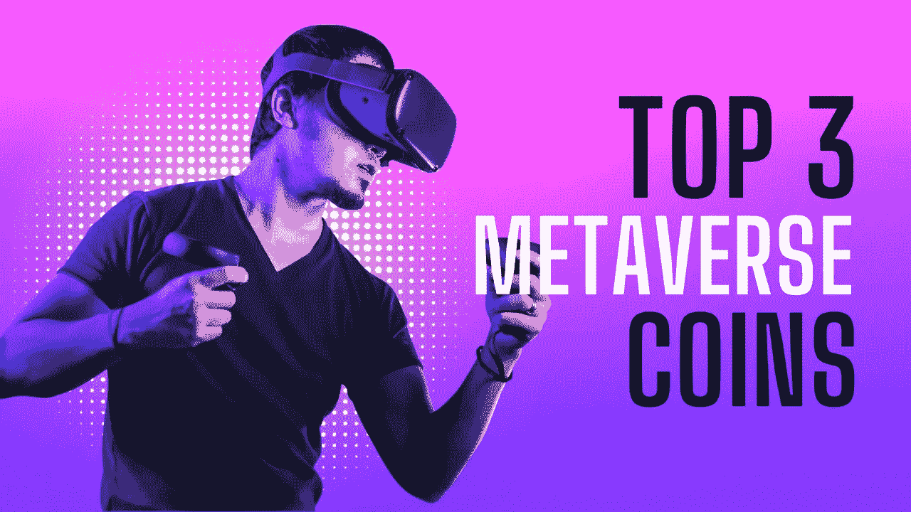

# 现在购买前三名元宇宙硬币

> 原文：<https://medium.com/coinmonks/top-3-metaverse-coins-to-buy-now-accb33398e6e?source=collection_archive---------43----------------------->

随着我们进入 3 月份，元宇宙加密货币仍然是市场的领导者。随着越来越多的项目扩大其生态系统，现在是收购被低估的元宇宙代币的大好时机。这可以很好地反映项目的绩效和社区支持。

以下是我们的前三种硬币，你可能想进一步研究并自己挑选:-

**# 3θ网络(θ)**

*   **单价:** $3.21
*   **24 小时交易量:**:3.92 亿美元

Theta Network 是一个领先的完全认证和许可的 NFTs 平台，于 2018 年推出。Theta 的一些最著名的合作伙伴是经典电视节目，如《价格是对的》和超级明星演员凯蒂·佩里等。它也有像谷歌和索尼这样的大公司

Theta Network 不仅仅是一个买卖 NFT 产品的地方。TFUEL tokens 也可以通过流媒体平台参与经济获得。

THETA 是该平台的原生令牌，让用户可以访问各种 drops，并能够在该平台的市场上购买 NFT。

2022 年 3 月，THETA 是一个必须观看的节目，因为它拥有增长最快的生态系统之一，市值超过 32 亿美元。

THETA 可以在一些著名的交易所购买，包括 Crypto.com 的币安、库科恩和其他交易所..并存放在卓越钱包、Exodus 和冷藏 Trezor 中

**#2 分散地(法力)**

*   **单价:** $2.78
*   **24 小时交易量:**9.75 亿美元

元宇宙最有价值的加密硬币，分散式(MANA)于 2020 年 2 月推出，目前市值超过 50 亿美元。

Unity 游戏引擎支持分散式的 3D 浏览器体验，让用户沉浸在真实的虚拟世界中。任何一个拥有 MetaMask 钱包和 Chrome 浏览器的人都可以尽情探索分散的土地

分散之地的元宇宙还包括虚拟赌场分散游戏，在短短三个月内赚取了 750 万美元的利润后，该游戏被称为“元宇宙黑仔应用程序”。

OpenSea 最受欢迎的虚拟房地产收藏之一，分散土地，也包括在内。最便宜的一块土地目前的价格为 4.5 ETH(在撰写本文时约为 1.3 万美元)。分散之地的经济规模巨大，其 8.14 亿美元的虚拟房地产销售额就是明证。

MANA 是该平台的原生公用事业资产，使用户能够购买令人惊叹的可穿戴 NFT。在分散的土地上，用户可以炫耀他们的 NFT 并参加各种活动。

法力可以在各种交易所买到，包括 Crypto.com 币安和其他交易所。

**#1 沙箱(沙子)**

*   单价: $3.27
*   **24 小时交易量:**13.98 亿美元

沙盒(SAND)目前价值 36.8 亿美元，是市场上第二大最有价值的元宇宙加密硬币。在过去的 24 小时内，沙子的交易量超过了 13 亿美元，成为最受欢迎的元宇宙加密硬币。

和《分散之地》一样，沙盒也有一个用 Unity 游戏引擎构建的 3D 元宇宙。为了获得更好的质量和更加身临其境的游戏体验，沙盒可以作为桌面客户端使用。

在 OpenSea 上，分散土地和沙盒都有一个蓬勃发展的虚拟房地产市场。沙盒中土地的底价目前为 3.23ETH(目前约为 9500 美元)。分散土地一半的交易量已经在沙盒的虚拟财产上售出。

沙盒仍在建设中，测试版尚未推出。考虑到沙盒尚未向公众开放，人们对这个项目的兴趣程度令人震惊。

SAND 是该平台的原生效用资产，允许用户购买游戏中的物品并参与 VIP 专属活动。

Uniswap、KuCoin、Crypto.com 和币安是几个可以买到沙子的主要交易所。

请注意，这些都不是财务建议，你必须为购买这里提到的任何资产做自己的研究。