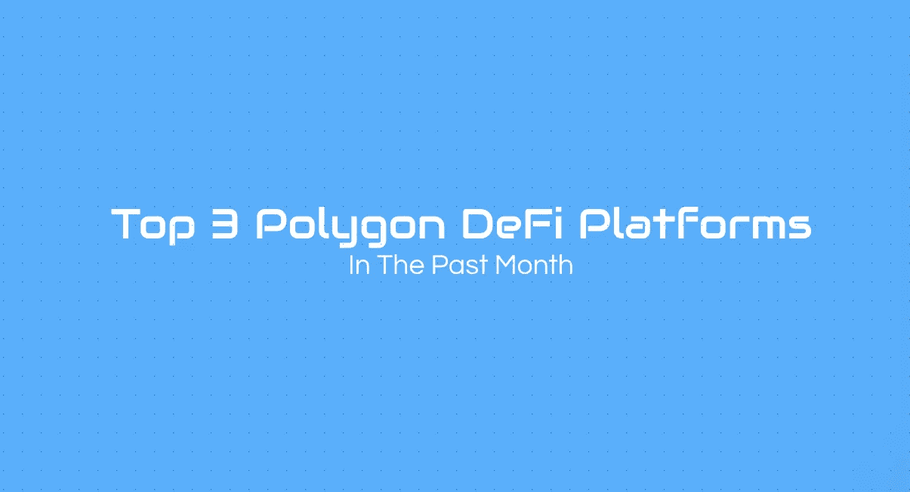
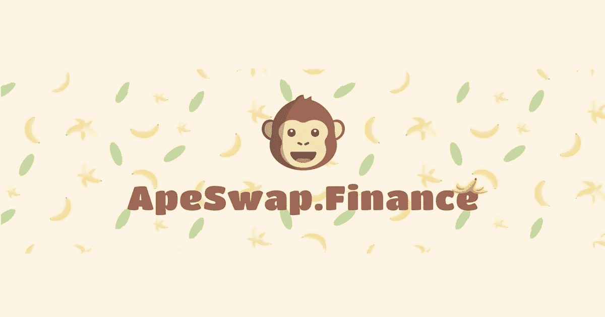
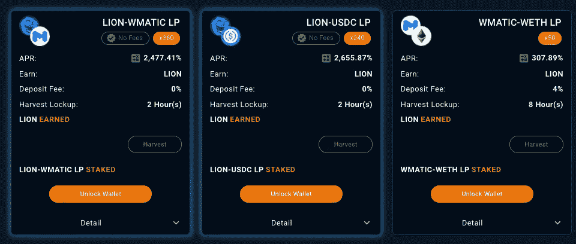

# 前 3 名多边形定义平台！

> 原文：<https://medium.com/coinmonks/top-3-polygon-defi-platforms-d55c16fc4b7?source=collection_archive---------14----------------------->

今天我们来看看过去一个月在 DeFi 行业表现最好的多边形区块链公司！

# 什么是 DeFi？

分散金融(DeFi)是一种新兴的金融技术，它基于类似于加密货币所使用的安全分布式分类账。该系统取消了银行和机构对货币、金融产品和金融服务的控制。

# 排名第三的 ApeSwap

ApeSwap 是一个基于 BSC 的自动化做市商和去中心化交易所。该平台本身允许用户在 BSC 和 Polygon 网络上交换、持有、种植和购买加密货币。

**ApeSwap 网站:**【https://apeswap.finance/ 

**支持区块链:** BSC，PolyLion

# 排名第二的聚离子

PolyLion 是第一代下一代自动流动性(类似 Safemoon 的机制)收购收益农场和 AMM 分散交易所，在 Polygon 网络上运行，具有许多独特和创造性的功能，让您长期盈利。

**PolyLion 网址:**[https://poly lion . exchange](https://polylion.exchange)

**支持区块链:**多边形

# 第一寿司

与 Uniswap 和 Balancer 等平台类似，SushiSwap 使用一系列流动性池来实现这一目标。用户首先将资产锁定在智能合约中，然后交易者从这些资金池中买卖加密货币，用一个代币交换另一个代币。

**寿司网站:**[https://app.sushi.com](https://app.sushi.com/)

**支持的区块链:**以太坊，多边形，阿尔比特鲁姆，雪崩，月光，月亮河，凡托姆，BSC，灵知，和谐，泰勒斯 EVM，塞洛，熔丝，奥克克斯，赫科和棕榈

**加入我们的社区**

推特:[https://twitter.com/S1mpleFinance](https://twitter.com/S1mpleFinance)

不和:[https://discord.gg/a7HKqFAh8F](https://discord.gg/a7HKqFAh8F)