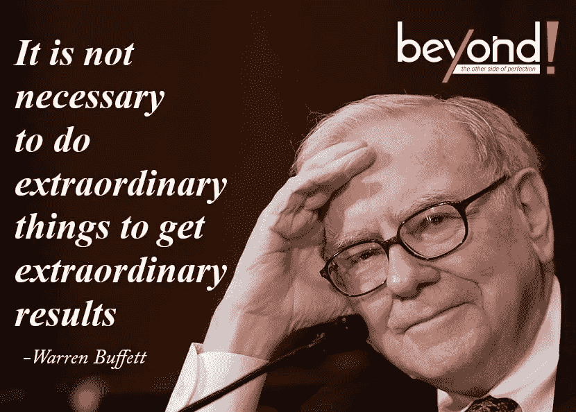

# 如果你想像沃伦·巴菲特那样投资，你需要具备的三大品质

> 原文：<https://medium.com/coinmonks/top-3-qualities-youll-need-if-you-want-to-invest-like-warren-buffett-617579c513f0?source=collection_archive---------5----------------------->

Source photo [warren buffett quotes — Bing images](https://www.bing.com/images/search?view=detailV2&ccid=zrEq2a1e&id=A5DCDC9DC911D87B76892B3885CF526A4900478D&thid=OIP.zrEq2a1efkIVIp3f1FKY1AHaFT&mediaurl=https%3a%2f%2fbeyondexclamation.com%2fwp-content%2fuploads%2f2020%2f01%2fWarren-Buffett-2.jpg&cdnurl=https%3a%2f%2fth.bing.com%2fth%2fid%2fR.ceb12ad9ad5e7e4215229ddfd45298d4%3frik%3djUcASWpSz4U4Kw%26pid%3dImgRaw%26r%3d0&exph=594&expw=830&q=warren+buffett+quotes&simid=608031571131765861&FORM=IRPRST&ck=EE974E4E8035AFBBCBB21D7276750A38&selectedIndex=13&qpvt=warren+buffett+quotes&ajaxhist=0&ajaxserp=0)

巴菲特，伯克希尔哈撒韦公司(纽约证券交易所代码:BRK)的首席执行官。纽约证券交易所代码:BRK。b)，1941 年开始投资，时年 11 岁。他随后发展成为有史以来最伟大的投资者之一。

无论你是否喜欢巴菲特，你都有可能钦佩其他投资者。成人和儿童都想模仿他们的榜样，以便…