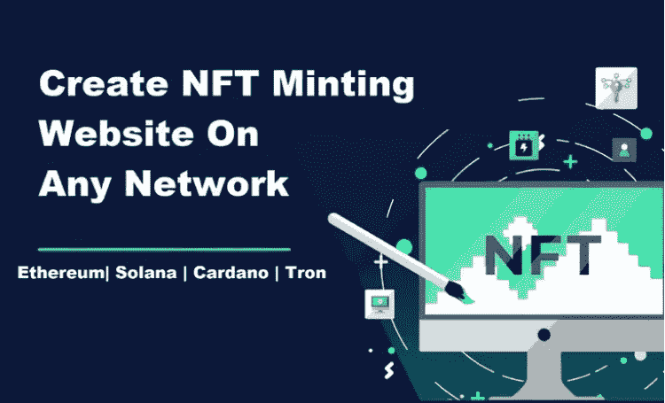

# 美国、英国、菲律宾和印度排名前 35 的 NFT 造币网站开发公司和开发商

> 原文：<https://medium.com/coinmonks/top-35-nft-minting-website-development-companies-developers-in-usa-uk-philippines-india-9dc2a0e2b835?source=collection_archive---------31----------------------->

尽管 NFT 自 2018 年以来就已存在，但其使用在过去几年中激增。投资者正在支付数百万美元来获得这些代表现实世界物体的数字资产，从艺术到音乐到 NBA 片段。

NFT 的售价高达 6900 万美元，是 NFT 有史以来最贵的作品。每天都有价值数千美元的 NFT 交易。NFT 的销售额在 2020 年达到了 2.5 亿美元的新高。

我们已经创建了美国 [NFT 市场发展公司的名单](https://makeanapplike.com/top-nft-token-marketplace-development-companies/)

# NFT 敏婷网站开发哪家公司最好？

以下是 NFT 最大的 6 家网站开发公司

1.  [创新集团](https://innowise-group.com/?utm_source=makeanapplike&utm_source=makeanapplike)
2.  [Suffescom](https://www.suffescom.com/product/react-nft-marketplace-template/?utm_source=makeanapplike)
3.  [代码零点](https://www.codezeros.com/?utm_source=makeanapplike)
4.  战略
5.  马蒂茨
6.  Osiz 技术公司

# 以下是 2022 年英国、美国、德国和美国领先的 NFT 造币网站开发公司名单

# NFT 的受欢迎程度突然上升

许多密码专家预测 NFTs 是资产所有权的未来。根据 NFT 支持者的说法，财产所有权的数字标记化预计将用于广泛的资产。

*   数字艺术品可以通过 NFTs 提供的数字分类账进行购买、估价和交易。
*   也有新平台定期上线。币安 NFT 市场和以币安为特色的市场是两个最新的非功能性交易市场。
*   NFT 下跌是市场上经常发生的事情，它们是人们兴趣高涨的原因。当一个新的艺术收藏被添加到一个市场，它被称为 NFT 下降。
*   比加密货币更好的表演者是 NFT。对于普通人来说，这是一种探索加密货币世界的有趣方式。

# NFT 铸造的是什么？

金属制成的硬币被用作货币已经有很长时间了。另一方面，NFT 造币指的是制作非功能性食品的过程。您必须先铸造 NFT，然后您的数字作品才能被纳入以太坊区块链。

例如，NFTs 可以用来表示数字艺术品。在市场上，这将允许它被出售和交换。此外，如果将来出售，它可以被数字化跟踪。

[加密货币可以被黑吗？](https://makeanapplike.com/can-cryptocurrency-crypto-wallet-be-hacked/)

# NFT 铸造作为一种投资选择

在加密领域，具有高价值的独特数字令牌被称为 NFT。许多投资者被迫使用 NFTs 作为营销工具，因为它们在全球越来越受欢迎。

以太坊引入 [NFT 标准是其迅速崛起的主要因素。因此，其他区块链网络开始采用和开发他们的 NFT 标准。随着 NFTs 的发展，铸造过程变得越来越困难。新的企业正在加入 NFT 的行列，以提升自己的形象。](https://ethereum.org/en/developers/docs/standards/tokens/erc-721)

今天，NFT 在拍卖会上和互联网上可以卖到天文数字的价格。毫无疑问，铸造 NFTs 具有显著的经济效益。只要你保持它们的流动性，你就可以用它们作为法定货币的抵押品。

[美国排名前 25 的 NFT 游戏开发公司](https://makeanapplike.com/best-nft-game-development-companies/)

任何支持的区块链，如以太坊，创，索拉纳和币安智能链，使创建一个 NFT 变得简单。你所需要的只是一个集成的[加密钱包](https://makeanapplike.com/best-multi-cryptocurrency-coin-wallets-android-ios/)来支持 NFTs 和一个 NFT 市场账户。元掩码、信任钱包和比特币基地钱包都支持 NFT。在这个博客里，我们分享了一份 NFT 20 大造币网站开发公司的名单。

# 全球 20 大 NFT 造币网站开发公司名单

# 1.[成功](https://www.suffescom.com/product/react-nft-marketplace-template/) — NFT 民庭门户网站高端发展

Suffescom 是一家领先的 NFT Minting 网站开发公司，可以帮助您设计、构建和推出最佳 NFT 市场。

由于 RisingMax 以帮助企业适应现代技术而闻名，因此它在各种利基市场开展工作并支持独特市场的发展也就不足为奇了。

客户的 NFT 市场是用尖端技术和框架构建的。正如我们的技术评测人员发现的那样，该公司 75%的现有客户都被保留了下来。

# 2.[普拉卡什软件](https://prakashinfotech.com/) — NFT 网站开发者|在美国|英国|印度运营

十多年来，Prakash Software 一直在为世界各地的公司开发 NFT 市场。该公司开发了安全、高效且有利可图的区块链解决方案。

对于广泛的利基市场，他们的开发商创造了完全定制的 NFT 市场。在他们客户中，NFT 解决方案包括:

*   高级令牌搜索。
*   一体式钱包。
*   灵活的投标选项。
*   用户仪表板

# 3.[code zeros](https://www.codezeros.com/)—NFT 解决方案的行业领导者

NFT 是一个你不应该错过的机会，Codezeros 是你将 NFT 整合到你的业务中的合适的合作伙伴。他们拥有一支优秀的专业团队，能够为包括音乐、游戏、艺术品、运动配件、软件和数字艺术/收藏品在内的各个垂直业务领域提供标记化解决方案。

他们的 NFT 开发服务范围包括 3D 角色设计、NFT 开发平台、NFT 令牌开发、 [NFT 游戏开发](https://makeanapplike.com/best-nft-game-development-companies/)、NFT 网站开发、NFT 市场开发、NFT Launchpad 开发、 [NFT 智能合约开发](https://makeanapplike.com/nft-smart-contract-development-companies/)。他们是建立网站的专家，在那里你可以丢弃、铸造和出售你的 NFT。他们用来创建你的 NFT 造币平台的流行的区块链网络有 EOS，以太坊，Solana，BSC，Polygon 等。

# 4.[创新集团](https://innowise-group.com/?utm_source=makeanapplike) — NFT 敏亭网站发展公司

凭借在区块链技术方面的全面专业知识，Innowise Group 开发并实施了具有高级功能集的网站和平台，让用户铸造和交易不可替代的代币并推动利润。该公司创建直观的用户界面/UX，确保安全性和透明度，帮助将 NFTs 集成到现有的解决方案中，并提供 NFT minting 应用程序支持服务。Innowise Group 维护令牌标准，包括 ERC-721、ERC-1155、ERC-998 和 TRC-721。

# 5.[区块链发展](https://www.blockchaindevelopments.io/?utm_source=makeanapplike) — NFT 平台发展公司

与领先的 NFT 令牌开发公司“区块链开发”合作他们可以为您未来的业务增长提供专家解决方案，满足您所有与 NFT 相关的需求。他们拥有丰富的区块链技术知识以及在以太坊、BSC、EOS、Tron 等各种区块链平台上建造 NFT 采矿平台的经验。

凭借完全的透明度和成本效益，区块链开发公司提供了一整套 NFT 网站开发服务。如果你有兴趣开始自己的 NFT 造币平台，那么区块链开发是你正确的合作伙伴。他们具有前瞻性思维的专业人员提供具有先进功能的突破性 NFT 铸造软件开发解决方案，帮助用户铸造他们的数字资产，并在加密领域具有竞争优势。

# 6.[Maticz](https://maticz.com/)—NFT 明廷平台开发

作为一家领先的 NFT 造币网站开发公司，Maticz 帮助用户铸造他们的数字资产，包括艺术，音乐，视频，游戏中的项目和 NFT 文章，以各种方式将他们的工作货币化。如果你正在寻找一个定制的白色标签 NFT 铸造平台，可以量身定制，以满足贵公司的需求，他们的开发商有你涵盖。

# 7.[开发硬币](https://www.developcoins.com/)——NFT 造币平台开发

我们是一家领先的 NFT 开发公司，提供最好的 NFT 铸造平台开发解决方案和服务。这种类型的 NFT 铸造平台需要高技能和经验丰富的团队的专业知识。多年来，他们不得不与各种国际合作伙伴一起研究区块链技术。他们接受按需任务，并将其转化为易于实施的解决方案。企业家、爱好者、投资者和初创企业都可以使用我们的 NFT 解决方案。

[全球 25 大 NFT 智能合同开发公司](https://makeanapplike.com/nft-smart-contract-development-companies/)

# 8.[区块链 App 工厂](https://www.blockchainappfactory.com/?utm_source=makeanapplike)—NFT 明廷平台开发

区块链应用工厂的天才程序员为加密生态系统提供尖端服务。着眼于最大限度地提高您企业的竞争优势，他们使用多种区块链技术精心设计您的铸造平台。

# 9.[奥兹科技](https://www.osiztechnologies.com/) —美国 NFT 敏婷网站发展公司

NFT 平台开发公司 Osiz 的员工拥有最新的非功能性测试知识。您可以依靠他们的专家来实现您的目标并开发创造性的解决方案。达到或超过您期望的世界级产品将是他们不懈努力帮助您实现业务目标的结果。

# 10.[理念引领](https://ideausher.com/)—NFT 民亭平台的发展

Idea Usher 可以以各种方式帮助您，包括创建 NFT 市场以提供独特的 NFT 平台体验，以及列出独特的收藏品和数字资产。他们可以帮助您创建 NFT，并利用他们的专业知识释放您的加密之旅的全部潜力。

# 11. [GamesDApp](https://www.gamesd.app/?utm_source=makeanapplike)

已经在以太坊、[币安智能链](https://www.binance.com/en/support/announcement/854415cf3d214371a7b60cf01ead0918?utm_source=makeanapplike)、Tron、EOS 和 WAX 上建立了 NFT 采矿平台，GamesDApp 是 NFT 最好的平台开发公司。

# 12.[半点通](https://semidotinfotech.com/)——NFT 造币平台开发

SemiDot Infotech 可以帮你搭建一个不可替代的代币平台。NFT 市场被认为是一家声誉卓著的领先开发公司。可以使用 NFT 代币开发服务来创建代币，其中为售出的每一个代币支付版税。通过选择他们，你可以在世界上任何平台上开发和销售你的 NFT 代币，而不需要中间人。他们提供的服务包括为艺术品、音乐、视频、域名和游戏资产以及投资和土地收购等广泛的数字和物理资产创建不可替代的令牌(NFT)。

# 13. [AppDupe](https://www.appdupe.com/) —印度 NFT 明廷网站开发公司

迄今为止，AppDupe 一直是 NFT 市场领先的影响者、品牌和投资者使用该服务的最突出的倡导者。由于他们的尖端技术以及对区块链和加密货币的广泛了解，许多雄心勃勃的企业家和投资者都有兴趣加入他们。

# 14.[GenNFTs](https://gennfts.com/)-英国 NFT minting 网站开发商

在几分钟之内，他们的团队就可以把你的想法变成真正的艺术作品，让广大观众能够购买。开发一个 NFT 项目无疑是一项艰巨的任务。您的项目将在他们的帮助下飙升至新的高度，包括从创造 10，000+独特的艺术变化到观看它飙升至星星的一切。

# 15.[LeewayHertz](https://www.leewayhertz.com/)——NFT 敏婷网站开发者

LeewayHertz 可以帮助您推出自己的 NFT 市场，为您的客户提供无缝的购买体验。他们的 NFT 平台的开发者已经建立了一个包罗万象的 NFT 平台，可以将任何类型的资产令牌化——无论是艺术品、游戏卡、软件许可证、数字收藏品还是现实世界的资产。

# 16.[实验室](https://labrys.io/?utm_source=makeanapplike)

Labrys 为个人、初创企业、企业甚至政府客户提供端到端服务，使用区块链技术设计、构建和发布软件。他们的设计师、分析师和工程师团队以使用最新技术和框架交付高性能 web、移动和桌面应用程序而自豪。

# 17. [Codezeros](https://www.codezeros.com/) — NFT 明廷网站服务

迄今为止，还没有其他初创公司像尖端的区块链咨询公司 Codezeros 那样开创了完整的区块链解决方案。区块链解决方案和服务提供商专注于客户的想法，以及如何更好地实施区块链技术、[、人工智能](https://www.coindesk.com/business/2021/10/25/the-coming-convergence-of-nfts-and-artificial-intelligence/)、虚拟现实和物联网。他们在这些领域为客户提供解决方案和服务。

# 18. [Ekoios 科技](https://ekoios.vn/) — NFT 明廷网站服务，

Ekoios Technology 是一家人工智能和软件开发公司，是区块链和分布式账本技术的全球领导者。云服务、移动应用和区块链等现代技术使他们能够不断吸引客户，并建议他们通过领域专业知识和技术能力转变业务。Ekoios 是一家率先广泛采用区块链的科技公司。初创企业和成熟企业都可以从他们的技术专家构建的分散式生态系统中受益，这些技术专家精通各种编程语言和工具。

# 19. [Thinkwik](https://www.thinkwik.com/) —美国 NFT 明廷网站发展公司

为了帮助初创企业和企业展示自己，Thinkwik 提供网络和移动服务解决方案。Thinkwik 是一个拥有多年经验的网络和移动开发团队，可以帮助公司管理在线业务，减少线下交易的数量。定制网站设计和企业级网络应用是他们的两大专长。他们的核心竞争力是通过将行业知识与成熟的技术技能和工作方法相结合，提供出色的结果，最大限度地提高您的竞争优势和生产力。他们在美国(英国)、英国(欧盟)、澳大利亚(印度尼西亚)、印度尼西亚(土耳其)和印度工作已经十年了。

# 20.[BlockchainsAppsDeveloper](https://www.blockchainappsdeveloper.com/?utm_source=makeanapplike)—NFT Minting 平台开发

世界各地的客户依赖他们，因为他们是顶级的 NFT 铸币网站开发公司，已经开发和发布了更成功的 NFT 解决方案。多才多艺的专家可以识别您的目标，并为您开发突破性的解决方案。由于他们的不懈努力，他们将通过生产满足或超过您期望的世界级产品来帮助您实现您的业务目标。所以，与他们联手，建立一个无障碍的 NFT 铸造平台，并在这个过程中发财。

# 21.[功能上](https://www.nftically.com/)——NFT 造币平台的开发

因此，你可以根据自己公司的需求在 NFT 建一个商店。您的不可替代令牌将使用他们高度可靠且全面的专业业务方法快速独立地生成。购买或出售 NFT 代币是一件轻而易举的事。

# 22.[战略机构](https://strategency.com/nft-website-development/) — NFT 明廷网站开发服务

作为领先的 NFT 铸币开发团队，Strategency 开发了广泛的丰富功能，包括 NFT 开发、智能合同开发，最重要的是，为您的 NFT 项目提供建议以确保其成功。他们希望帮助您在最适合您项目需求的区块链上建立和管理您的 NFT 网站。由于使用了尖端技术，Strategency 已经帮助许多公司在短短几周内建立了新网站。

# 23.[mere head](https://merehead.com/)—NFT 造币平台开发

Merehead 正在开发分散化和基于区块链的财务解决方案。Merehead 为体育、视频游戏、营销、电子商务、金融、保险和医疗保健领域的 NFT 解决方案提供技术支持，从简单、智能的合同开始，到主要的分散交易结束。

[20 大加密货币交易软件开发公司](https://makeanapplike.com/top-cryptocurrency-exchange-software-development-companies/)

# 总结 NFT 造币网站开发公司全球

只要存在对数字商品和服务的需求，无论平台面临何种困难，NFTs 和数字经济都将继续增长。NFT 明廷网站的开发对任何公司来说都是一个试验新技术以探索数字交易市场的大好机会。

利用这个博客上的信息，你可能已经发现了 NFT 明廷网站开发的最佳公司。当你在这里的时候，你可以用这个博客来决定你在 NFT 创业的商业结构。

*原载于 2022 年 2 月 26 日*[*【https://makeanapplike.com】*](https://makeanapplike.com/nft-minting-website-development-companies-worldwide/)*。*

> 加入 Coinmonks [电报频道](https://t.me/coincodecap)和 [Youtube 频道](https://www.youtube.com/c/coinmonks/videos)了解加密交易和投资

# 另外，阅读

*   [最佳以太坊钱包](https://coincodecap.com/best-ethereum-wallets) | [电报上的加密货币机器人](https://coincodecap.com/telegram-crypto-bots)
*   [交易杠杆代币的最佳交易所](https://coincodecap.com/leveraged-token-exchanges) | [购买 Floki](https://coincodecap.com/buy-floki-inu-token)
*   [3Commas 对 Pionex 对 Cryptohopper](https://coincodecap.com/3commas-vs-pionex-vs-cryptohopper) | [Bingbon 评论](https://coincodecap.com/bingbon-review)
*   [加密复制交易平台](/coinmonks/top-10-crypto-copy-trading-platforms-for-beginners-d0c37c7d698c) | [如何在 WazirX 上购买比特币](/coinmonks/buy-bitcoin-on-wazirx-2d12b7989af1)
*   [硬币评论](https://coincodecap.com/coinloan-review)|[Crypto.com 评论](/coinmonks/crypto-com-review-f143dca1f74c)
*   [如何在加拿大购买加密货币？](https://coincodecap.com/how-to-buy-cryptocurrency-in-canada)