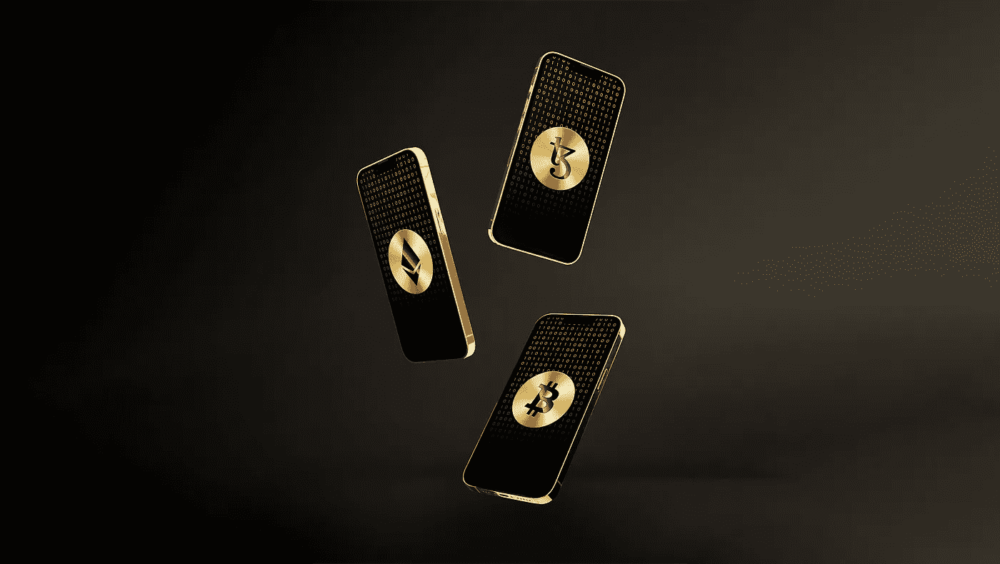
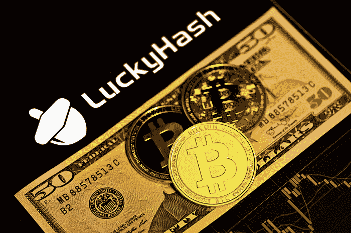
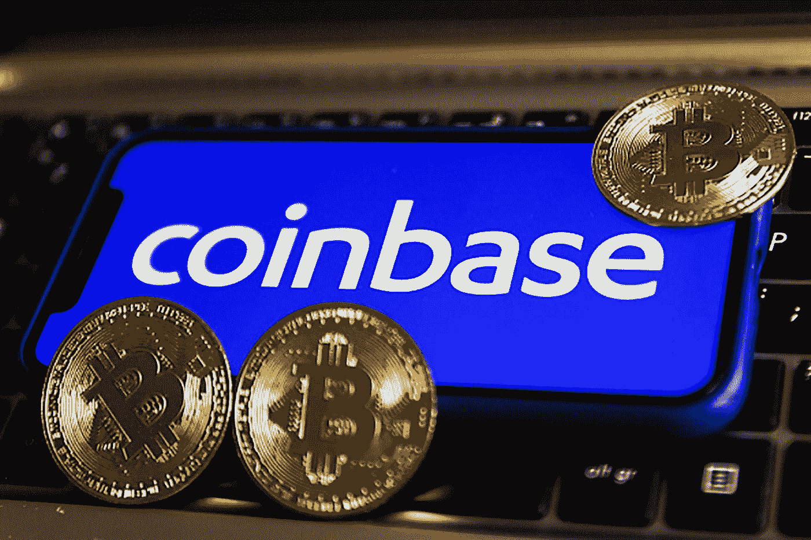
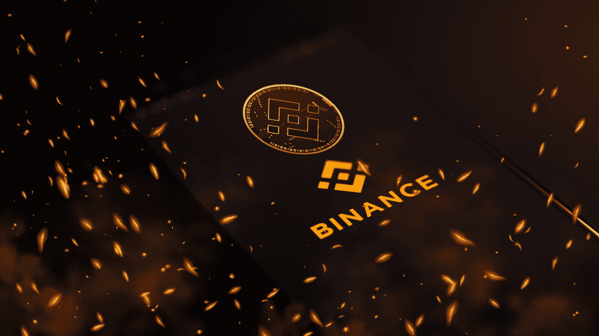
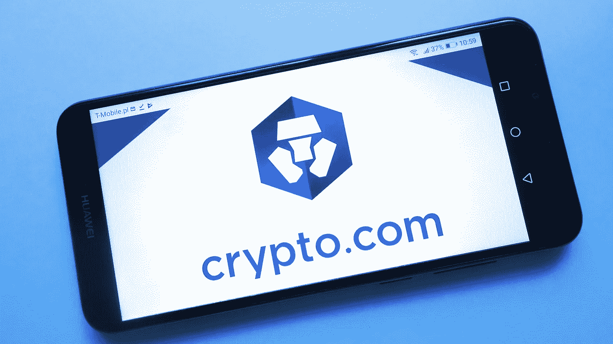

# 2022 年四大加密货币投资平台

> 原文：<https://medium.com/coinmonks/top-4-cryptocurrency-investment-platforms-in-2022-5d67212aed46?source=collection_archive---------44----------------------->

Y 你可能在想把自己闲置的密码投资到哪个平台，正在努力寻找操作难度和回报率之间的平衡。在这里，我列出了四大可靠的加密货币投资平台，每个平台都因其独特的功能而脱颖而出。

# **01。LuckyHash —最适合赚取利息**

**为什么**[**lucky hash**](https://m.luckyhash.com?utm_source=english&utm_medium=official)**上榜:** LuckyHash 是最好的赚取利息的加密理财平台——其理财产品 stablecoin (USDT)收益率在各大平台中最高。

LuckyHash 是一个位于新加坡的专用加密货币资产管理平台。与同行相比，其资产管理产品的 APY 最高。

值得一提的是，尽管他们的回报率很高，但他们支持的代币大多是主流代币。例如， **USDT 储蓄 APY 高达 65%** (针对新用户，所有用户高达 19.5%)，Filecoin 储蓄 APY 高达 90% (针对新用户)。因此，LuckyHash 是 USDT 和 Filcoin 投资者的最佳选择。

除了高回报率，LuckyHash 还是一个积极的活动主持人——它经常举办活动，在获得利息的基础上给投资者额外的奖金。比如，他们现在正在举办[五月投资大赛](https://m.luckyhash.com/activity/savingsrank?utm_source=english&utm_medium=official)。

# 02。比特币基地——最适合初学者

**为什么** [**比特币基地**](https://www.coinbase.com/?__cf_chl_f_tk=.uPH4CjJxbCIWvHPMhL4ht8VgvuKn6_R5v47fEXPHnE-1653296907-0-gaNycGzNCCU) **上榜:**比特币基地之所以脱颖而出，不仅仅是因为其简单易用的界面，区块链的教材，安全等。还因为它是美国最大、最知名的加密交易所**许多人将其 IPO 视为加密货币市场的合法化。**

****

**比特币基地在降低注册门槛方面做得很好，它有一个简单的注册流程，允许每个人轻松交易密码。比特币基地也有全面和易于获取的教育材料供初学者学习。它鼓励用户使用比特币基地币进行密码交易。**

**比特币基地安全性高— **所有版本的比特币基地客户端都采用两步验证**；其客户 98%的密码都是离线存储的；以及保护最高 250，000 美元的托管账户的保险单(受每个存款人 FDIC 保险限额的限制)。尽管比特币基地的收费相对较高，但其简单性和安全性仍使其具有竞争力。**

# ****03。币安。美国——最低费用****

****为什么** [**币安。美国**](https://www.binance.us/en/home) **榜上有名:**币安。美国是最好的低费用加密货币交易所，它拥有**我们考虑过的所有交易平台中最慷慨的费用结构**之一。**

****

**就交易量而言，币安是世界上最大的加密交易所。它在美国的子公司，币安。美国，继承了它的大部分优点。其中最吸引眼球的是 0.1%的交易费。费用本来就很低，随着用户交易量的增加，费用会变得更低。**

**币安。美国还为使用本国代币 BNB 购买其他代币提供折扣。**

**大多数加密货币可以直接在币安上购买。美国使用美元，这为它的用户节省了很多钱。对于那些想直接购买密码/经常交易密码的人，币安。美国绝对是最好的选择。币安。US 还提供便利的交易功能，包括保证金交易和各种订单类型，包括限价单、市价单和限价止损单。**

# ****04。Crypto.com——最安全的加密交易****

****为什么**[**Crypto.com**](http://Crypto.com)**上榜:**Crypto.com 最适合加密交换——它有多种措施来对抗加密诈骗和网络攻击。**

****

**大多数著名的加密货币交易所都有坚实的网络安全基础设施，但这正是 Crypto.com 真正脱颖而出的地方。在网络安全排名和认证平台的网络安全评级中，该交易所在 100 家交易所中排名第一。**

**Crypto.com 一直在采取各种技术来确保其用户的资产安全。包括所有加密货币的离线冷藏、受监管的传统货币保管银行账户以及定期的同行软件审查。它还使用密码、生物特征、电子邮件、电话和验证者验证的多因素识别。**

**此外，它还成功完成了多次渗透测试，这些测试是模拟网络攻击来评估系统安全性。**

## ****结论:****

**我们正处于波动风暴的中心——通过投机，你可能赚得很多，也可能赔得很多。但如果你希望你的加密投资组合以稳定的方式增长，USDT(美元支持的稳定货币，不像 UST)资产管理无疑是最佳选择之一。一方面，USDT 与美元挂钩，所以价格波动很小，另一方面，USDT 储蓄的回报率仍然远远高于银行存款。你更喜欢在哪个平台上投资你的密码？**

## **放弃**

**我有一些硬币，ETH，DOT，ShiB。内容仅供参考，并非投资建议。投资前的 DYOR。**

> **加入 Coinmonks [电报频道](https://t.me/coincodecap)和 [Youtube 频道](https://www.youtube.com/c/coinmonks/videos)了解加密交易和投资**

# **另外，阅读**

*   **[3 商业评论](/coinmonks/3commas-review-an-excellent-crypto-trading-bot-2020-1313a58bec92) | [Pionex 评论](https://coincodecap.com/pionex-review-exchange-with-crypto-trading-bot) | [Coinrule 评论](/coinmonks/coinrule-review-2021-a-beginner-friendly-crypto-trading-bot-daf0504848ba)**
*   **[莱杰 vs n rave](/coinmonks/ledger-vs-ngrave-zero-7e40f0c1d694)|[莱杰 nano s vs x](/coinmonks/ledger-nano-s-vs-x-battery-hardware-price-storage-59a6663fe3b0) | [币安评论](/coinmonks/binance-review-ee10d3bf3b6e)**
*   **[Bybit Exchange 审查](/coinmonks/bybit-exchange-review-dbd570019b71) | [Bityard 审查](https://coincodecap.com/bityard-reivew) | [Jet-Bot 审查](https://coincodecap.com/jet-bot-review)**
*   **[3 commas vs crypto hopper](/coinmonks/3commas-vs-pionex-vs-cryptohopper-best-crypto-bot-6a98d2baa203)|[赚取加密利息](/coinmonks/earn-crypto-interest-b10b810fdda3)**
*   **最好的比特币[硬件钱包](/coinmonks/hardware-wallets-dfa1211730c6) | [BitBox02 回顾](/coinmonks/bitbox02-review-your-swiss-bitcoin-hardware-wallet-c36c88fff29)**
*   **[BlockFi vs Celsius](/coinmonks/blockfi-vs-celsius-vs-hodlnaut-8a1cc8c26630)|[Hodlnaut 点评](/coinmonks/hodlnaut-review-best-way-to-hodl-is-to-earn-interest-on-your-bitcoin-6658a8c19edf) | [KuCoin 点评](https://coincodecap.com/kucoin-review)**