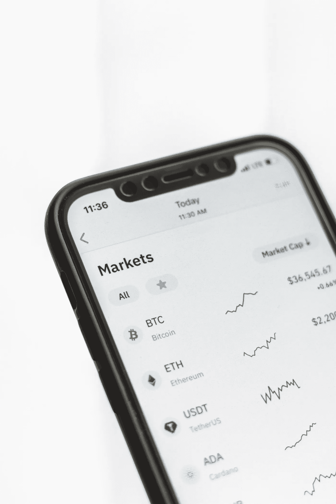

# 2022 年 4 月购买的五种最便宜的加密货币

> 原文：<https://medium.com/coinmonks/top-5-best-cheap-cryptocurrency-to-buy-april-2022-27281074da6a?source=collection_archive---------15----------------------->

Source photo Unsplash.com

比特币领域正继续变得越来越受欢迎。它的总市值为 2.24 万亿美元，在过去 24 小时内增长了 1.7%，上周增长了约 15%。大多数主要货币纷纷跟进，比特币(BTC)和以太坊(ETH)在 7 天内分别上涨 15%和 17%。尽管最近有所下降，但如此大规模的加密货币仍然相当…