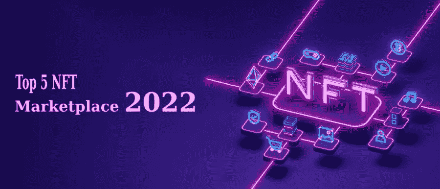
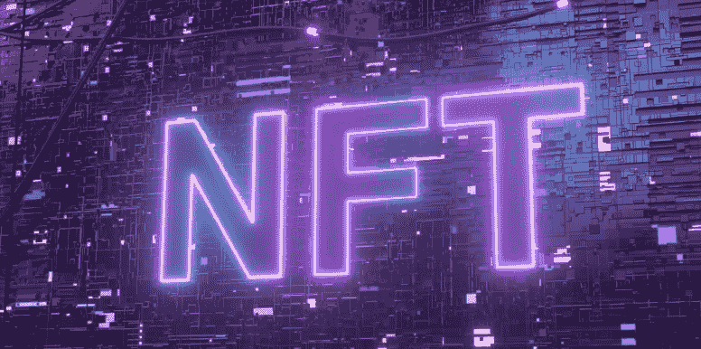

# 2022 年 NFT 最佳交易市场前五名

> 原文：<https://medium.com/coinmonks/top-5-best-nft-marketplace-2022-for-getting-your-hands-on-trade-ab8abc3851c3?source=collection_archive---------39----------------------->

N **FTs** 已经成为人人都在念叨的口头禅。世界各地的每个人都愿意用他们认为是美国国债的每样东西来开始他们自己的 NFT 收藏。人们认为它们是价值数百万的不可思议的艺术品。这些类型的非正统基督教信徒在他们被视为信徒的地区广泛分布。然而，他们需要一个枢纽来进行停留和交易。这就是 NFT 市场发展的时候。世界级 NFT 的中心被称为 NFT 市场。然而，有许多 NFT 市场从利基可用。你需要将他们视为榜样，选择合适的利基市场，建立一个完全平衡的 **NFT 市场**，它就在你的口袋里。

> 在本文中，我们将了解什么是 NFT，什么是 NFT 市场，以及在建立 NFT 市场时要考虑的前 5 个 NFT 市场。

## **什么是不可替换令牌？**

你想知道一个三个字母的单词会对这个世界产生什么影响吗？不可替换令牌只是存储在区块链上的一个数据单元。这个消息已经传开了，许多人渴望获得他们认为有价值的资产的所有权。现在，你可能已经明白什么是 NFT 了。换句话说，任何一件艺术品都可以被数字化成一个代币，所有者可以很容易地获得这个代币的权利。NFT 是这种数字化资产的名称。

现在，你对他们的藏身之处有了一个快速的了解？让我们看看哪里可以买到 NFT，哪里可以存放 NFT。

## **NFT 市场——最稀有艺术品的藏身之处**

NFT 市场被认为是数字化代币的中心。你可以铸造你的 NFT，把它们放在钱包里，甚至在这里进行交易。是的，你没听错，NFT 市场是我们一直在谈论的，也是每个人都想染指的业务类型。

听到这个消息，你会愿意得到你的手一样，但不知道如何成为 NFT 竞技场的一部分。是这样吗？如果有，那也不过是个简单的过程。为了获得帮助，雇佣一家专门从事 [**NFT 市场开发**](https://bit.ly/3HluwyO) 的公司。从构思开始，他们将指导你完成整个过程。

然而，我们将为您提供最好的 NFT 市场的名称，以便您了解情况。让我们来看看排名前五的 NFT 平台。

# **五大不可替代代币市场**

## [**OpenSea**](https://opensea.io/)

OpenSea 是有史以来最大的 NFT 市场。每当有人想到建立一个 NFT 市场时，Opensea 将会是最终的例子。它是由最稀有的 NFT 组成的。但是，它持有的事务数量最多。OpenSea 致力于通过改变公众对数字所有权的看法来增强创造者和企业家的能力，并帮助发展未来的开放数字经济。OpenSea 领导团队包括**谷歌、Palantir、Lyft、优步、斯坦福和伯克利。**

## [**跳跃。贸易**](https://bit.ly/3MEh0XQ)

跳。贸易是一个专为玩赚取 NFT 游戏的市场。这个市场保持着在 9 分钟内销售大量 NFT 的记录。它有游戏内的资产收集。这个 NFT 市场是传奇 NFTs 的中心。这是第一场“玩即赚”板球比赛的头号市场。

## [**稀有**](https://rarible.com/)

Rarible 是另一个自 NFT 时代就存在的 NFT 市场。在这个基于俄罗斯的市场上，有许多有趣的艺术品被铸造成 NFT 出售。这是一个专门收藏独家艺术收藏品的地方，如果你对艺术收藏品感兴趣，Rarible 就是你要去的地方。然而，随着超过 400，000 NFT 的铸造，NFT 市场支持三个区块链。

## [**超稀有**](https://superrare.com/)

SuperRare 是流行的社交媒体平台 Instagram 和历史悠久的艺术品拍卖行佳士得的混合体。这是一种在数字平台上与艺术、文化和收藏互动的新方式。在一个超级稀有的 NFT 市场，你可能是一个交易超级稀有的非交易品的人。超级罕见的 NFT 市场最初是一个中央平台，通过其核心团队审查艺术家。尽管如此，它在 2021 年推出了罕见的治理令牌，标志着它开始转变为一个由艺术家和收藏家社区领导的 [**【道】**](https://bit.ly/3myIuDU) 分权自治组织。

## [**俏皮网关**](https://niftygateway.com/)

Nifty Gateway 是一个数字 NFT 市场，用户可以在这里购买和交易独特的数字艺术收藏品。它成立于 2018 年。每一件艺术品都保证是独一无二的，并可在**以太坊区块链**追溯。Nifties 一词是 Nifty Gateway 创造的，用来描述这些数字制品。此外，漂亮的网关监管监管方法提醒人们，并非所有的企业都需要分散化才能从区块链技术中受益，各种组织可以根据自己的需求以不同的方式使用区块链。

NFT 市场无处不在，当你 [**建立自己的**](https://bit.ly/3MKSpkc)NFT 市场时，你可能会成为这个行业的领跑者。NFT 市场在每个领域都很广泛，发展一个市场对未来是最好的。上述提到的非功能性交易据说是 NFT 市场的完美范例。

## **结论**

NFT 市场，这是一个收藏稀有的非专利物品的地方，即使是从最简单到最稀有的物品。据说这里是所有 NFT 收藏卡片的中心。在 NFT 市场，你可以成为 NFT 销售的领导者。现在就开始你的生意，成为 NFT 王国的国王，并拥有所有稀有形式的非功能性食物。然而，如果你能得到 NFT 市场发展公司的帮助，这将有助于你发展这样一个不可思议的 NFT 市场。成为你自己的 NFT 镇的超级英雄，成为 NFT 市场的榜样。

> *加入 Coinmonks* [*电报频道*](https://t.me/coincodecap) *和* [*Youtube 频道*](https://www.youtube.com/c/coinmonks/videos) *了解加密交易和投资*

# 另外，阅读

*   [有哪些交易信号？](https://coincodecap.com/trading-signal) | [Bitstamp vs 比特币基地](https://coincodecap.com/bitstamp-coinbase) | [买索拉纳](https://coincodecap.com/buy-solana)
*   [ProfitFarmers 回顾](https://coincodecap.com/profitfarmers-review) | [如何使用 Cornix Trading Bot](https://coincodecap.com/cornix-trading-bot)
*   [西班牙 5 大最佳文案交易平台](https://coincodecap.com/copy-trading-spain)
*   [Pionex 双投](https://coincodecap.com/pionex-dual-investment) | [AdvCash 审核](https://coincodecap.com/advcash-review) | [坚持审核](https://coincodecap.com/uphold-review)
*   [面向开发者的 8 个最佳加密货币 APIs】](https://coincodecap.com/best-cryptocurrency-apis)