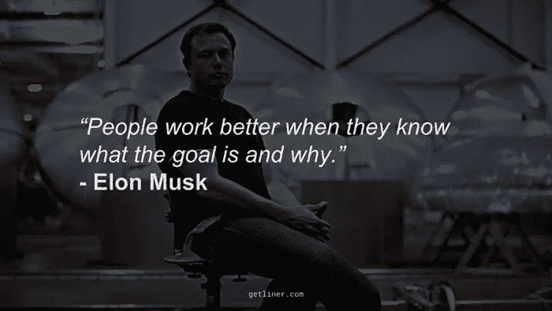

# 埃隆·马斯克的 5 条最佳建议

> 原文：<https://medium.com/coinmonks/top-5-best-pieces-of-advice-from-elon-musk-de0248e7df6a?source=collection_archive---------65----------------------->

Source photo [elon musk citate — Bing images](https://www.bing.com/images/search?view=detailV2&ccid=tOn7Crfc&id=DA5B0FA8DAD1A65938C5FAC8413BCA8D78FD81C5&thid=OIP.tOn7CrfcW9K0u1t6f0vv0QHaEK&mediaurl=https%3a%2f%2fth.bing.com%2fth%2fid%2fR.b4e9fb0ab7dc5bd2b4bb5b7a7f4befd1%3frik%3dxYH9eI3KO0HI%252bg%26riu%3dhttp%253a%252f%252fwww.awesomeinventions.com%252fwp-content%252fuploads%252f2016%252f10%252felon-musk-quotes-work-to-goal.jpg%26ehk%3dPqHJ40DSoYoaIiSClYT7mGWEbDzhRnu6Ubtz33FSyR8%253d%26risl%3d%26pid%3dImgRaw%26r%3d0&exph=394&expw=700&q=elon+musk+citate&simid=608036621981909771&FORM=IRPRST&ck=61E14E3213657B3212F203ABC3CDCB80&selectedIndex=3&ajaxhist=0&ajaxserp=0)

埃隆·马斯克是一位未来学家。他是南非的创新者、企业家、投资者和梦想家，已经成长为一名非常成功的商人和领导者。看着他，你永远猜不到他在学校饱受折磨，是个离异家庭的孩子，在离全球商业中心数百英里的地方长大。

另一方面，他在计算机方面的天赋和兴趣使他去了加拿大上大学，并…