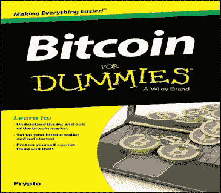
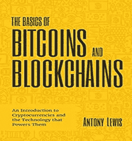
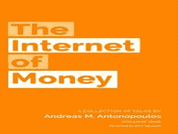
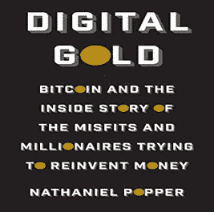
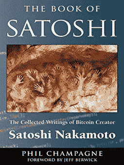

# 你应该考虑阅读的 5 本比特币和区块链书籍。

> 原文：<https://medium.com/coinmonks/top-5-bitcoin-and-blockchain-books-you-should-consider-reading-1e0ad100b306?source=collection_archive---------69----------------------->

自从 2008 年*中本聪*发明了比特币这种开源的转账软件以来，金融市场开始看到数字货币的好处，因为它减少了政府对交易的控制，加快了跨境交易，也简化了拥有第三方中介的整个过程。

根据 coinmarketcap.com[的统计，作为第一种加密货币，比特币目前价值略高于 12000 美元，市值为 2264.2 亿美元，流通硬币超过 1800 万枚。](https://coinmarketcap.com/)

尽管比特币很受欢迎，但只有少数人了解它是什么，它是如何工作的，以及它背后的技术。这篇文章使用了 Amazon.com 和 goodreads.com 的评分，排名不分先后，推荐了一些学习比特币和区块链技术的最佳书籍。

1.  **虚拟货币比特币**

Bitcoin for Dummies

由以“保持加密简单”而闻名的品牌作家 *Prypto* 撰写的*虚拟比特币*提供了快速、清晰、简单的比特币入门指南。互联网上有大量的信息，知道什么是对的什么是错的可能是一项繁重的任务，但通过这本书，你将了解这项迷人技术的历史，并探索比特币作为一种概念和产品。本书的其他要点包括:

了解如何设置比特币钱包。

保护自己免受盗窃和欺诈。

开始将比特币作为数字货币进行交易。

由于比特币市场巨大且增长迅速，必然会有一些相关的风险，因此有必要采取措施明智地管理这些风险，其中之一就是在充分知情的情况下进入。

**2。比特币和区块链的基础知识**

Basics of Bitcoins and Blockchains

由比特币和区块链的传播者 Anthony Lewis 撰写的《比特币和区块链的基础知识》一书对加密货币和加密货币的技术进行了简明扼要的介绍，以该领域新手可以理解的方式为加密货币提供了非常详细的内容。还包括供读者学习的:

比特币和其他加密货币。

区块链技术及其工作原理。

加密货币市场的运作。

比特币和区块链技术的发展及其对全球商业的潜在影响。

**3。货币互联网**

The Internet of Money

有很多书解释比特币的*如何*，这本书特别关注比特币的*为什么*。安德烈亚斯·m·安东诺普洛斯(Andreas M. Antonopoulos)通过一系列涵盖数字货币随着时间的推移而成熟的文章，研究了比特币的意义，解释了为什么比特币是一种金融和技术进化，其潜力远远超过“数字货币”的标签。

安德烈亚斯通过阐明比特币的社会、哲学和历史意义，超越了探索比特币网络的技术功能。

这绝对是新手和专业投资者的必读之作，因为它提供了比特币及其去中心化技术的深刻知识。

**4。数字黄金:比特币和试图重新创造财富的异类和百万富翁的内幕**

Digital Gold

> 被其中一篇评论描述为“对比特币和数字货币世界最引人注目和最深入的调查”，*纳撒尼尔·波普*生动地描绘了比特币的经济和技术以及背后的人们。

这本 416 页的书曾被英国《金融时报》和麦肯锡(Mckinsey)评为年度商业书籍，它为喜欢技术和历史的读者提供了一个有趣的阅读方式，因为它通过比特币运动中一些最引人注目的人物的眼睛讲述了比特币的故事。

**5。SATOSHI 之书:比特币创造者中本聪文集**

Book of Satoshi

菲尔·香槟(Phil Champagne)的新书以一种易于阅读的格式将我们这个时代最重要的技术创新之一的创造性步骤汇集在一起。它为不熟悉比特币的读者提供了一个关于其技术和哲学基础及其运作方式的概述。

它按照时间顺序详尽汇编了比特币的人为创造者在网上发布的所有出版物。

对于那些希望了解更多中本聪比特币的过去，了解其现状的人来说，这是一本好书。

> 加入 Coinmonks [电报频道](https://t.me/coincodecap)和 [Youtube 频道](https://www.youtube.com/c/coinmonks/videos)了解加密交易和投资

# 另外，阅读

*   [如何在 FTX 交易所交易期货](https://coincodecap.com/ftx-futures-trading) | [OKEx vs 币安](https://coincodecap.com/okex-vs-binance)
*   [CoinLoan 评论](https://coincodecap.com/coinloan-review) | [YouHodler 评论](/coinmonks/youhodler-4-easy-ways-to-make-money-98969b9689f2) | [BlockFi 评论](https://coincodecap.com/blockfi-review)
*   [XT.COM 评论](https://coincodecap.com/profittradingapp-for-binance) | [币安评论](https://coincodecap.com/xt-com-review)
*   [SmithBot 评论](https://coincodecap.com/smithbot-review) | [4 款最佳免费开源交易机器人](https://coincodecap.com/free-open-source-trading-bots)
*   [比特币基地僵尸工具](/coinmonks/coinbase-bots-ac6359e897f3) | [AscendEX 审查](/coinmonks/ascendex-review-53e829cf75fa) | [OKEx 交易僵尸工具](/coinmonks/okex-trading-bots-234920f61e60)