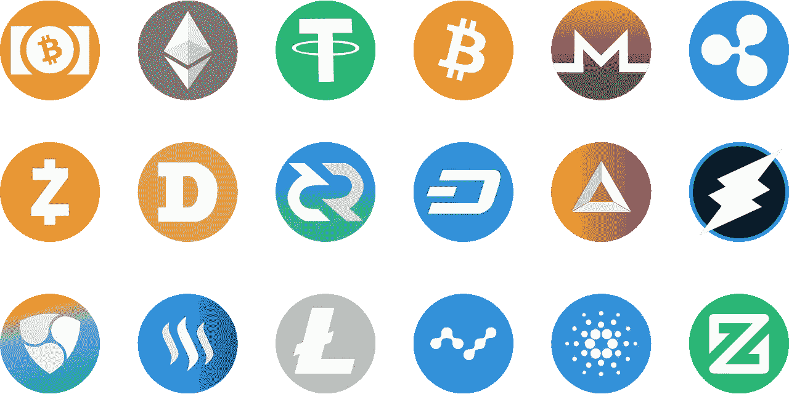

# 了解加密货币需要阅读的 5 本书

> 原文：<https://medium.com/coinmonks/top-5-books-you-need-to-read-to-understand-cryptocurrency-ed7367abdd5d?source=collection_archive---------26----------------------->

Image by [guaxipo](https://pixabay.com/users/guaxipo-8650096/?utm_source=link-attribution&utm_medium=referral&utm_campaign=image&utm_content=3375234) from [Pixabay](https://pixabay.com/?utm_source=link-attribution&utm_medium=referral&utm_campaign=image&utm_content=3375234)

# 介绍

加密货币是一种复杂、令人生畏的动物。这比其他大多数话题更难理解，因为很容易迷失在抽象中。

在深入了解加密货币的本质之前，理解它的历史来源和工作原理是有帮助的。这五本书将帮助你做到这一点。

# 1.货币互联网

《货币的互联网》是安德烈亚斯·安东诺普洛斯(Andreas Antonopoulos)的散文集，他为《掌握比特币》撰写了前言。这是你可以阅读的了解加密货币以及它将如何永远改变我们生活的最佳书籍之一。

这些章节分为五个部分；历史、安全性、可扩展性、去中心化和作为货币的比特币。每一章都用简单的术语解释了什么是加密货币，没有使用任何技术术语——这使得它成为比特币新手和希望了解更多关于其工作原理的人的绝佳资源。

这本书在每章的结尾还包含链接，这样你就可以很容易地找到你最感兴趣的主题的更多信息——例如区块链网络中的分散化或扩展问题。

# 2.比特币和加密货币技术:全面介绍

[比特币和加密货币技术:Andreas M. Antonopoulos 的全面介绍](https://www.amazon.com/Bitcoin-Cryptocurrency-Technologies-Comprehensive-Introduction/dp/0691171696)

这对初学者来说是一个很好的阅读材料，因为它解释了加密货币的技术方面，包括它们如何工作，它们的独特之处，以及它们与其他货币的比较。作者还提供了货币历史的概述，如果你想了解比特币最初为什么被创造出来，这是有帮助的。最后，鉴于这本书是在区块链技术成为主流之前(仅仅几年内)写的，它提供了一个有趣的视角，将加密货币视为一个新兴领域，它可能会去任何地方——但现在看起来它会留在这里！

# 3.数字黄金:比特币和试图重新创造金钱的不适应者和百万富翁的内幕

[数字黄金:比特币和试图重新创造金钱的异类和百万富翁的内幕，纳撒尼尔·波普著](https://www.amazon.com/Digital-Gold-Bitcoin-Millionaires-Reinvent/dp/006236250X)

这本书很好的介绍了比特币。写得很好，对于想了解更多加密货币的人来说，是很好的参考。波普尔讲述了比特币迄今为止是如何发展的，以及其创造者(或至少是他们的在线假名)的一些历史。

例如，我们知道中本聪在 2007 年开始研究最终成为比特币的东西，当时他是一名不知名的计算机工程师，在日本多家公司工作。直到 2008 年，他才开始以“中本聪”的名字匿名贡献代码作者将这个故事作为一个机会，探索互联网如何随着时间的推移改变了我们的生活——无论是积极的还是消极的。

# 4.掌握比特币

这份书单上的这本书是经典之作。安德烈亚斯·m·安东诺普洛斯的《掌握比特币》有 500 多页，但很值得一读。这本书已经被翻译成中文、日文、韩文、俄文、西班牙文和法文(也有其他版本)。你可以花不到 20 美元买到平装本，或者花大约 10-15 美元买到 Kindle 格式的。

如果你想更好地理解比特币，那么这本书应该是你的阅读清单上的第一本书——即使你现在不打算投资加密货币。

# 5.加密货币时代

第五本书是[加密货币时代:比特币和数字货币如何挑战全球经济秩序](https://www.amazon.com/Age-Cryptocurrency-Blockchain-Challenging-Economic/dp/1250081556)。这本书的作者是保罗·维格纳和迈克尔·凯西，他们是来自华尔街日报的著名记者。

他们写了许多关于加密货币的其他书籍，包括一个关于区块链技术的三本书系列，你可以在这里找到。

《加密货币时代》概述了加密货币的历史，重点是比特币在其中的作用。从它作为一项神秘发明的起源到它演变成今天最受欢迎的货币形式，这本书涵盖了加密货币历史的所有方面，并解释了它们如何塑造了今天的世界经济。

# 读这些书会帮助你更好地理解加密货币！

阅读是了解世界的最好方式。

特别是，阅读书籍可以成为更好地了解加密货币和区块链技术的好方法。

我们为想要了解加密货币和/或区块链技术的人创建了这份 5 本必读书籍的列表。

## 我们希望你喜欢我们推荐的书单。

我们包含了所有书籍及其相关页面的链接，因此您可以轻松找到您最感兴趣的内容！如果我们想让你从这篇博文中学到什么，那就是加密货币不仅仅是一种时尚。有一些很棒的书可以帮助解释为什么人们会投资它，以及它对我们未来的重要性。

> 加入 Coinmonks [电报频道](https://t.me/coincodecap)和 [Youtube 频道](https://www.youtube.com/c/coinmonks/videos)了解加密交易和投资

# 另外，阅读

*   [AscendEx Staking](https://coincodecap.com/ascendex-staking)|[Bot Ocean Review](https://coincodecap.com/bot-ocean-review)|[最佳比特币钱包](https://coincodecap.com/bitcoin-wallets-india)
*   [Bitget 回顾](https://coincodecap.com/bitget-review)|[Gemini vs block fi](https://coincodecap.com/gemini-vs-blockfi)|[OKEx 期货交易](https://coincodecap.com/okex-futures-trading)
*   [美国最佳加密交易机器人](https://coincodecap.com/crypto-trading-bots-in-the-us) | [经常性回顾](https://coincodecap.com/changelly-review)
*   [在印度利用加密套利赚取被动收入](https://coincodecap.com/crypto-arbitrage-in-india)
*   [霍比评论](https://coincodecap.com/huobi-review) | [OKEx 保证金交易](https://coincodecap.com/okex-margin-trading) | [期货交易](https://coincodecap.com/futures-trading)
*   [麻雀交换评论](https://coincodecap.com/sparrow-exchange-review) | [纳什交换评论](https://coincodecap.com/nash-exchange-review)