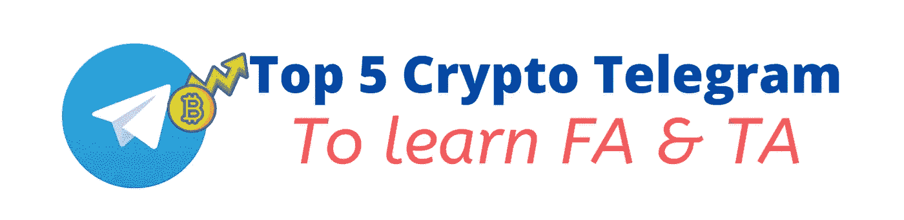
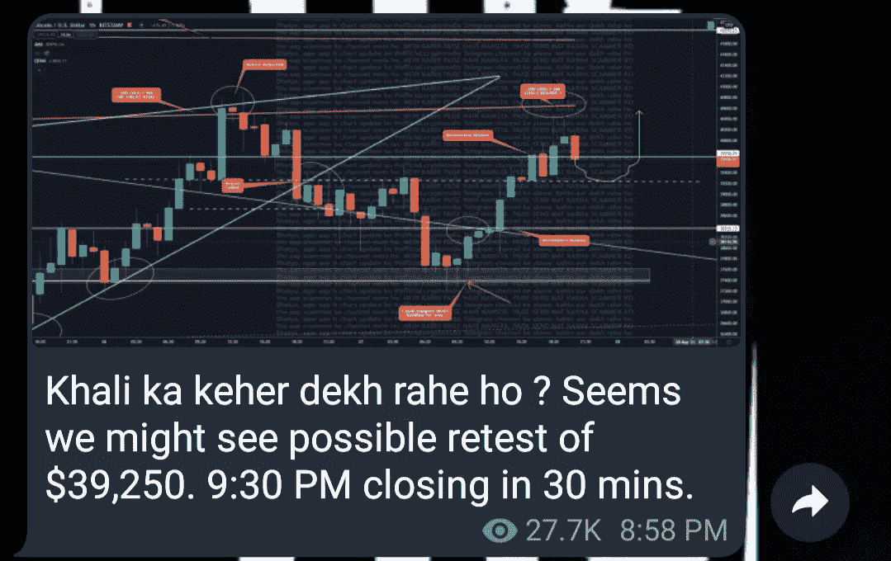
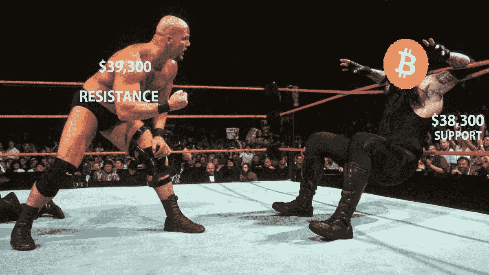
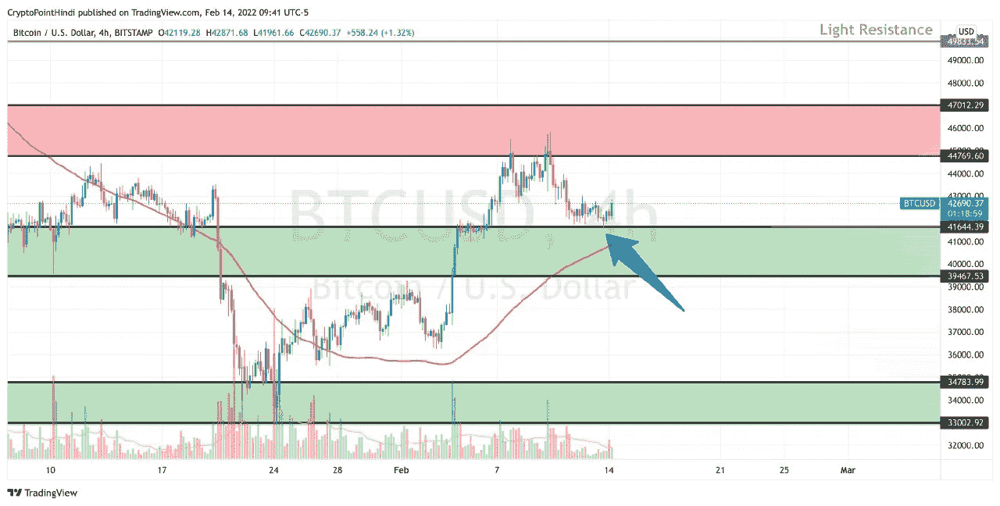
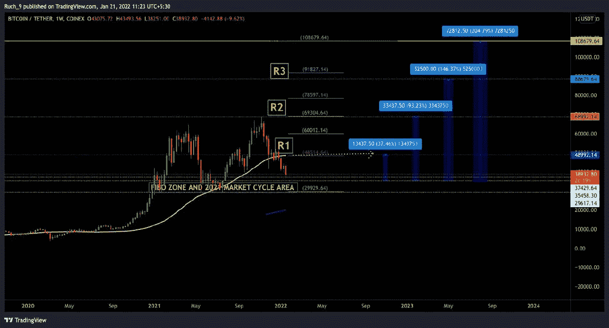
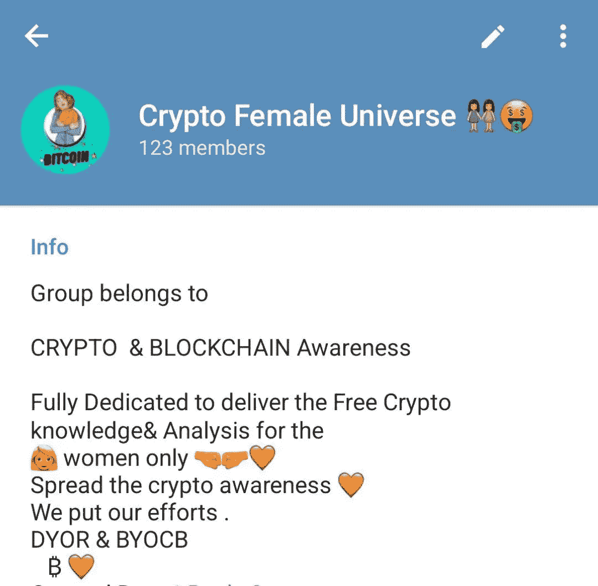

# 免费学习技术分析的五大加密电报渠道:印度

> 原文：<https://medium.com/coinmonks/top-5-crypto-telegram-channels-to-learn-technical-analysis-for-free-india-bcbad0895fa1?source=collection_archive---------6----------------------->

你有兴趣学习密码 TA & FA 吗？还是在找学习 TA 的免费加密通道？如果是的话，你来对地方了。我们去找-

嗨！伙计们，我是中本聪，这是我的第一个媒体帖子。在这里，我将分享印度五大密码电报渠道，以学习技术分析和基本面分析。

# [印度哈维里密码(106k) :](https://t.me/OfficiaLCryptoindia)

*   这个频道由 Aditya Singh 运营，他是印度加密 YouTube 频道的联合创始人，但它不是由他自己运营的，我认为这是由社区 Bcz 运营的正确方式。在做出任何决定之前，他进行了一次投票，所有决定都是基于最高票数。
*   如果你是一个密码新手，并愿意学习 TA，那么它可能是最适合你的地方。
*   优点:这是一个学习 TA 和了解市场的好地方，充满了快乐和乐趣。
*   他用这样搞笑的模因教 TA👇

*   以及语音消息。
*   缺点:在这里，你不要指望得到捷径信号是 Cr pati 或 25 din me Paisa 双😂(我的意思是他不提供任何信号)。

> 请在离开这篇文章之前尝试阅读全文，因为每个频道都有独特的教学风格。

 [## 2022 年密码交易员的三大电报渠道

### 加密信号是来自专业交易者的交易想法，以特定的价格或价格买卖特定的加密货币

medium.com](/coinmonks/top-3-telegram-channels-for-crypto-traders-in-2021-8385f4411ff4) 

# [CPH 更新(57.5k):](https://t.me/CryptoPointHi)

*   这个频道由 Sandeep ( Sandy)运营，他是 Crypto Point Hindi YouTube 频道的创始人，也是政府的全职雇员。
*   他的教学方法和其他人几乎没有什么不同。他相信价格区域，而不是确切价格点。像这样👇

*   优点:他也教槽语音信息，如阿迪蒂亚辛格。
*   缺点:他是一个有点忙的家伙，这就是为什么有时他不能在一天内提供最大更新。你不期待任何信号，但你学到了新的东西。

# [如池纪元(5k):](https://t.me/RuchiEra)

*   RuchiEra 由一位加密女王 Ruchi Pal 经营，他自 2014 年以来一直是一名加密交易员。在社区成员的大量要求下，她于 7 月 29 日开通了她的频道。她的教学方式完全不同于秘密社区的其他人。我个人喜欢她和她的内容。她像指导你妹妹一样指导你。
*   她的助教非常简单，对于像这样的新手来说很容易理解👇

*   优点:她提供简单易懂的密码知识和其他金融知识。像黄金、股票、房地产等。
*   如驰时代最适合忙碌的/没有财务背景的人，他们没有足够的时间做细节 TA & FA，她在帮助他们做简单的 TA。
*   缺点:她没有任何 YouTube 频道，你可以通过直播视频学习，也不像其他加密电报频道那样提供语音更新，但你期望的是细节文本更新而不是语音。

> 她还经营着一个女性秘密组织，名为“秘密女性宇宙”👯😛“自 2021 年 5 月 26 日起。

*   这个密码组完全致力于为女性提供免费的密码知识和分析。我喜欢她帮助印度妇女成长的伟大创举。

# [Pushpendra Singh 官方加密更新(121k) :](https://t.me/pushpendrasinghofficial)

*   这个频道是由 Puspendra 运营的，他是 Smart View Ai 的创始人。在这个频道中，他的团队分享市场相关的新闻和交易信号。
*   优点:你可以从他的敬业团队那里获得每日市场更新。
*   反对意见:你不能指望像印度加密这样的一切都是免费的，因为他有一个付费订阅来维持他的团队销售。

# [比特大陆加密警报游戏(6k):](https://t.me/gameofbitcoins_channel)

*   该频道由匿名格雷运营，他是 YouTube 频道“比特币游戏”的创始人。
*   这是最好的地方，以更新基本强大的区块链游戏(玩赚取游戏)和 NFT(不可替代的令牌)/元宇宙相关项目。
*   优点:格雷不断地试图找出 NFT 世界的每一种可能性，这样你就可以和他保持同步。这是唯一一个专注于游戏和 NFT 的印度频道。
*   缺点:这个频道不是用来学习技术分析或基本面分析的，但是你可以从他的 You Tube 播放列表中学习 TA & FA。

我希望这篇文章能帮助你选择最好的加密电报渠道，开始你的交易/加密投资之旅。如果我错过了你最喜欢的 TC，请不要难过，我分享我自己的经验。

注意:请小心骗子频道，我上面已经提到他们除了 Push Pendra 之外没有任何付费频道

如果您希望开始您的加密之旅，您可以从下面选择您的最佳交换。

(免责声明:如果你使用我的推荐链接，我将从交易所获得一些佣金，你不必支付任何额外的金额)

## 我最喜欢的密码交易所:

[CoinDCX](https://join.coindcx.com/invite/qKJk) (使用代码 DCXMPDHC 获得 100 卢比和费用折扣)

[Wazirx](http://bit.ly/WazirXmapp) ( 30%费用折扣)

国际交流:

**:(使用代码 LIMIT_VLTSVIE9 获得特别优惠和费用折扣)**

****:代号:rJWVKYG(最佳宝石)****

## ****我最喜欢的股票经纪人:****

****[PAYTM MONEY](https://paytmmoney.onelink.me/9L59/d5088ea0) :使用代码 **DILWA，获得 300 卢比返现。******

****在推特上关注我****

> ****加入 Coinmonks [电报频道](https://t.me/coincodecap)和 [Youtube 频道](https://www.youtube.com/c/coinmonks/videos)了解加密交易和投资****

*   ****[比特币基地评论](/coinmonks/coinbase-review-6ef4e0f56064) | [德里比特评论](/coinmonks/deribit-review-options-fees-apis-and-testnet-2ca16c4bbdb2) | [FTX 评论](/coinmonks/ftx-crypto-exchange-review-53664ac1198f)****
*   ****[n 零审核](/coinmonks/ngrave-zero-review-c465cf8307fc) | [Phemex 审核](/coinmonks/phemex-review-4cfba0b49e28) | [PrimeXBT 审核](/coinmonks/primexbt-review-88e0815be858)****
*   ****最佳[区块链分析](https://bitquery.io/blog/best-blockchain-analysis-tools-and-software)工具| [赚比特币](/coinmonks/earn-bitcoin-6e8bd3c592d9)****
*   ****[Cloudbet 赌场评论](https://coincodecap.com/cloudbet-casino-review) | [点火赌场评论](https://coincodecap.com/ignition-casino-review)****
*   ****[加密套利](/coinmonks/crypto-arbitrage-guide-how-to-make-money-as-a-beginner-62bfe5c868f6)指南| [如何做空比特币](/coinmonks/how-to-short-bitcoin-568a2d0b4ae5)****
*   ****[比特币基地 vs 瓦济克斯](https://coincodecap.com/coinbase-vs-wazirx) | [比特鲁点评](https://coincodecap.com/bitrue-review) | [波洛涅克斯 vs 比特鲁](https://coincodecap.com/poloniex-vs-bittrex)****
*   ****[德国最佳加密交易所](https://coincodecap.com/crypto-exchanges-in-germany) | [Arbitrum:第二层解决方案](https://coincodecap.com/arbitrum)****
*   ****[币安交易机器人](/coinmonks/binance-trading-bots-d0d57bb62c4c) | [OKEx 评论](/coinmonks/okex-review-6b369304110f) | [阿塔尼评论](https://coincodecap.com/atani-review)****
*   ****[最佳加密交易信号电报](/coinmonks/best-crypto-signals-telegram-5785cdbc4b2b) | [MoonXBT 评论](/coinmonks/moonxbt-review-6e4ab26d037)****
*   ****[如何在 Bitbns 上购买柴犬(SHIB)币？](https://coincodecap.com/buy-shiba-bitbns) | [购买弗洛基](https://coincodecap.com/buy-floki-inu-token)****
*   ****[CoinFLEX 评论](https://coincodecap.com/coinflex-review) | [AEX 交易所评论](https://coincodecap.com/aex-exchange-review) | [UPbit 评论](https://coincodecap.com/upbit-review)****
*   ****[十大最佳加密货币博客](https://coincodecap.com/best-cryptocurrency-blogs) | [YouHodler 评论](https://coincodecap.com/youhodler-review)****