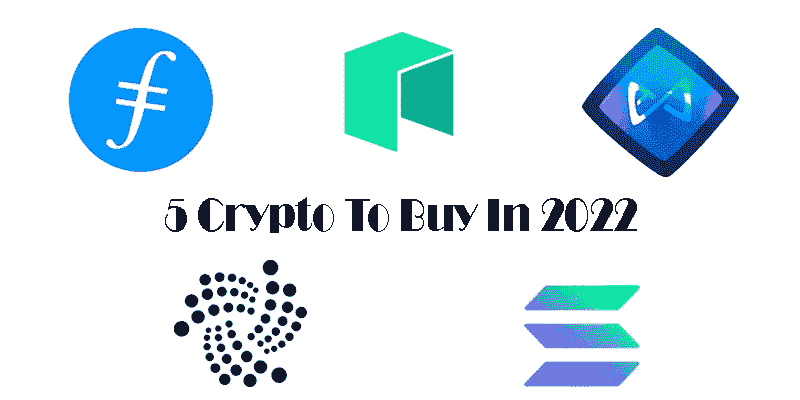
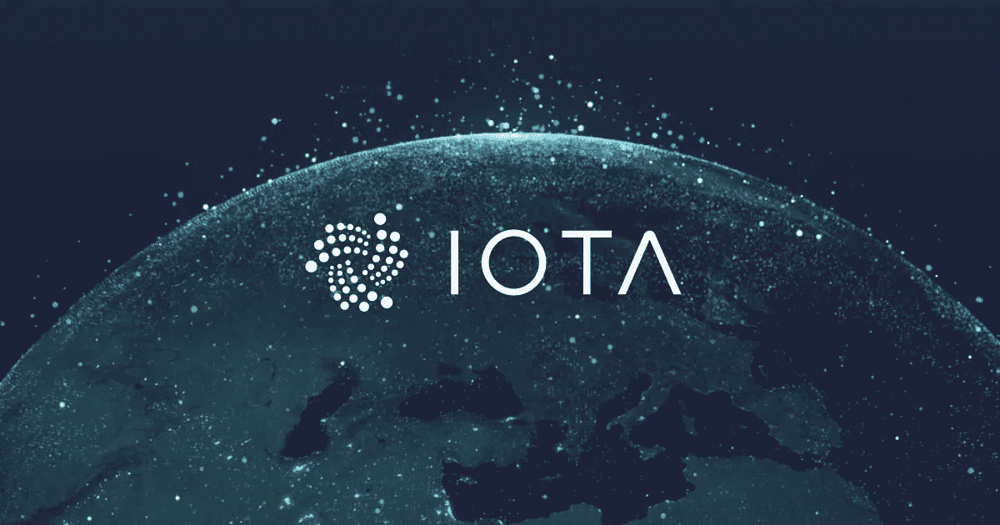
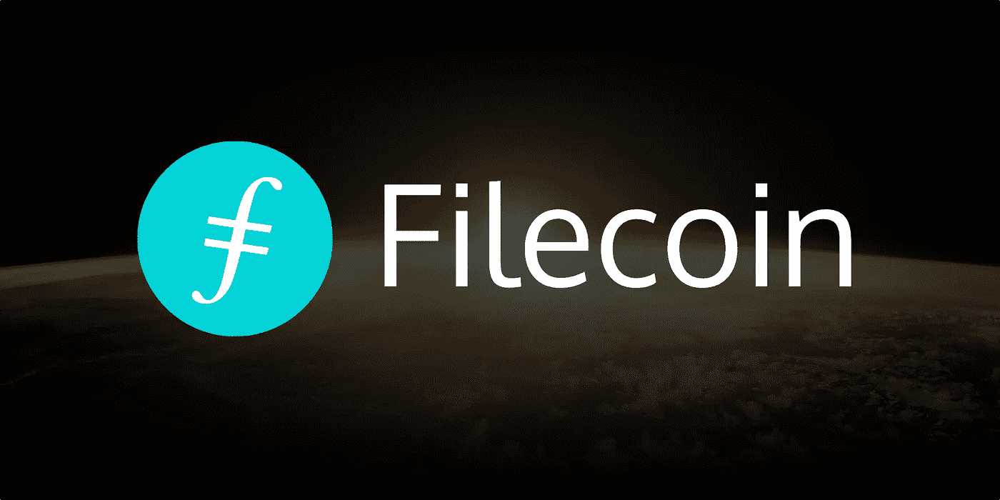
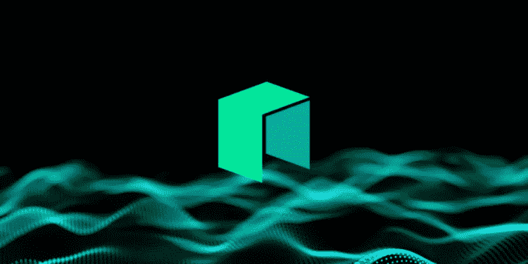

# 2022 年最值得购买的五大加密技术

> 原文：<https://medium.com/coinmonks/top-5-crypto-to-buy-in-2022-aaf493280fd8?source=collection_archive---------6----------------------->

## 介绍 2022 年你应该购买的 5 款最佳加密软件

数字货币的快速发展不仅对普通用户来说是投资的机会，对大公司来说也是。数字货币的这种增长是技术进步的结果，世界正在不断尝试使用分散分配作为支付方式。如果你想做好投资，你需要知道在 2022 年投资什么样的数字货币最适合长期和短期目标。和我们在一起。

1.  **IOTA**

Iota 是一种非常好的长期投资货币。这种货币享有很高的声誉。Iota 于 2014 年作为替代货币之一进入市场，其名称源于物联网。事实上，这种货币用于物联网设备的支付和交易。

这种数字货币和比特币一样，使用中国区块链技术，这是 Iota 的主要优势之一。由于使用了这项技术，Iota 代币被评为长期投资的最佳数字货币。令牌块还使用 Tangel 技术，该技术加快了交易信息的存储。

需要说明的是，Iota 中的自由交易是这种数字货币的优势之一，这决定了它相对于其他数字货币的优越性。然而，Iota 不可提取，但具有长期价格增长的潜力，是长期投资的最佳迹象之一。

**2。无限轴(AXS)**

Axie Infinity 是中庭网络上最受欢迎的区块链游戏之一，根据 Axie Infinity 价格预测和技术分析，AXS 价格预计将在 2022 年超过 200.72 美元的平均价格水平。

这种加密货币也是 2022 年投资游戏和元宇宙领域的未来货币之一。

**3。Filecoin (FIL)**

Filecoin 是一个可靠的分散存储系统，旨在“存储人类最重要的信息”。此外，该资产是一种开源云存储加密货币，旨在实现数字存储和基于区块链的参与式恢复。因此，由于这个项目的巨大潜力，它被认为是 2022 年投资的最佳数字货币之一。

根据交易员和专业专家的数据分析和预测，2022 年 FIL token 的价格可能会达到平均 80 美元。

**4。索拉纳(SOL)**

彭博认为 Solana 是 Atrium 的“潜在长期竞争对手”，世界经济论坛也强调了这一点，Solana 拥有今年(2021 年)最重要的价格图表之一。自 2020 年索拉纳发布以来，它已经增长了 18，000%。

SOL 货币以其交易收取的低费用吸引了加密社区，因此其粉丝群每天都在迅速扩大。

索拉纳货币很受资本家的欢迎，他们正在寻找最佳的数字货币，以进行长期投资并获得高额利润。该网络被认为是中庭的竞争对手，并正在创造一个值得反对的集成项目。它对异质代币市场(NFT)的渗透和巨大的成就帮助证明了它的价值。随着越来越多的用户转向区块链技术，其可扩展性将非常有吸引力。

**5。尼奥**

NEO 是长期投资的最佳数字货币之一，被称为 NEO 商标。这种数字货币是世界上最先进的数字货币之一。Neo 也是第一种开源的中国数字货币。Neo 是第三代数字货币，交易速度非常快，仍然可以用于店内支付。

另一方面，Neo 项目从一开始就基于数字资本和真实资本相结合的思想，因此 Neo 是具有很大增长潜力的数字货币之一，尤其是从长期来看。

近地天体对其区块链技术采用了一种混合方法。Neo 也使用自己的区块链，这种货币代码的资产转移方式是不同的。新数字货币有两个加密货币代码。就像公司股票一样，这个令牌用于创建块、网络更改、网络管理和其他请求。

> 加入 Coinmonks [电报频道](https://t.me/coincodecap)和 [Youtube 频道](https://www.youtube.com/c/coinmonks/videos)了解加密交易和投资

## 另外，阅读

*   [7 大副本交易平台](https://coincodecap.com/copy-trading-platforms) | [买币点评](https://coincodecap.com/buycoins-review)
*   [XT.COM 评论](https://coincodecap.com/profittradingapp-for-binance)币安评论 |
*   [SmithBot 评论](https://coincodecap.com/smithbot-review) | [4 款最佳免费开源交易机器人](https://coincodecap.com/free-open-source-trading-bots)
*   [光宗耀祖 vs 比特币基地](https://coincodecap.com/uphold-vs-coinbase) | [坎加交易所点评](https://coincodecap.com/kanga-exchange-review)
*   [比诺莫评论](https://coincodecap.com/binomo-review) | [斯多葛派 vs 3Commas vs TradeSanta](https://coincodecap.com/stoic-vs-3commas-vs-tradesanta)
*   【Capital.com】|[港加密借贷平台](https://coincodecap.com/crypto-lending-hong-kong)
*   [最佳加密 RSS 源](https://coincodecap.com/crypto-rss-feeds) | [最佳 eToro 替代品](https://coincodecap.com/etoro-alternative)
*   [红狗赌场评论](https://coincodecap.com/red-dog-casino-review) | [Swyftx 评论](https://coincodecap.com/swyftx-review) | [CoinGate 评论](https://coincodecap.com/coingate-review)