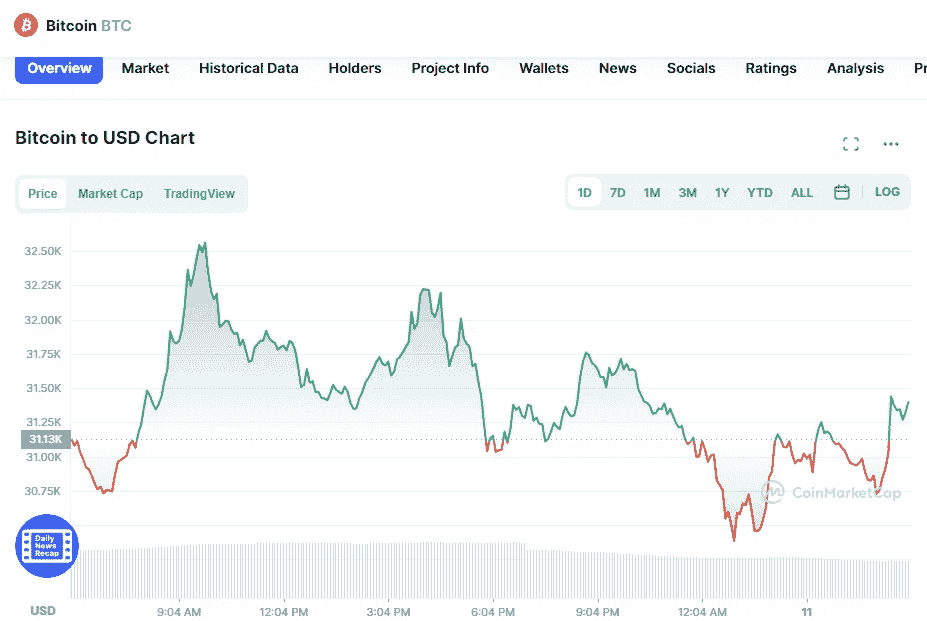

# 5 月 11 日五大加密货币价格分析

> 原文：<https://medium.com/coinmonks/top-5-cryptocurrencies-price-analyse-on-11th-of-may-b9364acaaaa0?source=collection_archive---------69----------------------->

# 1.比特币(+0.80%)

Source photo [Bitcoin price today, BTC to USD live, marketcap and chart | CoinMarketCap](https://coinmarketcap.com/currencies/bitcoin/)

# 市值 5992 亿美元

比特币目前的价格为 31.64669 美元，24 小时交易量为 55.18 亿美元。

在过去的 24 小时里，比特币的使用量增加了 0.80%。