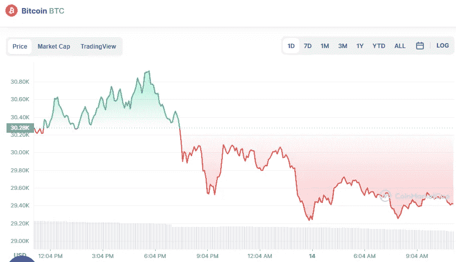

# 5 月 14 日五大加密货币价格分析

> 原文：<https://medium.com/coinmonks/top-5-cryptocurrencies-price-analyse-on-14th-of-may-7382516daf07?source=collection_archive---------36----------------------->

# 1.比特币(-2.60%)

Source photo [Bitcoin price today, BTC to USD live, marketcap and chart | CoinMarketCap](https://coinmarketcap.com/currencies/bitcoin/)

# 市值 5996 亿美元

比特币目前的价格为 29.53685 美元，24 小时交易量为 343.7 亿美元。

在过去的 24 小时里，比特币的使用量下降了 2.6%。