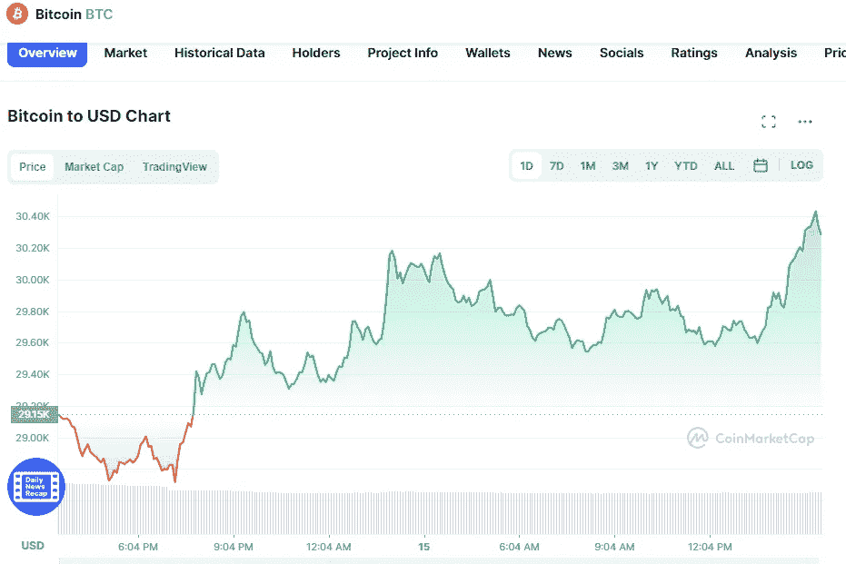

# 5 月 15 日五大加密货币价格分析

> 原文：<https://medium.com/coinmonks/top-5-cryptocurrencies-price-analyse-on-15th-of-may-7e89cc96ba7f?source=collection_archive---------22----------------------->

# 1.比特币(+3.77%)

Source photo [Bitcoin price today, BTC to USD live, marketcap and chart | CoinMarketCap](https://coinmarketcap.com/currencies/bitcoin/)

# 市值 5757 亿美元

比特币目前的价格为 30.38869 美元，24 小时交易量为 28.26 美元。

在过去的 24 小时里，比特币的使用增加了 3.77%