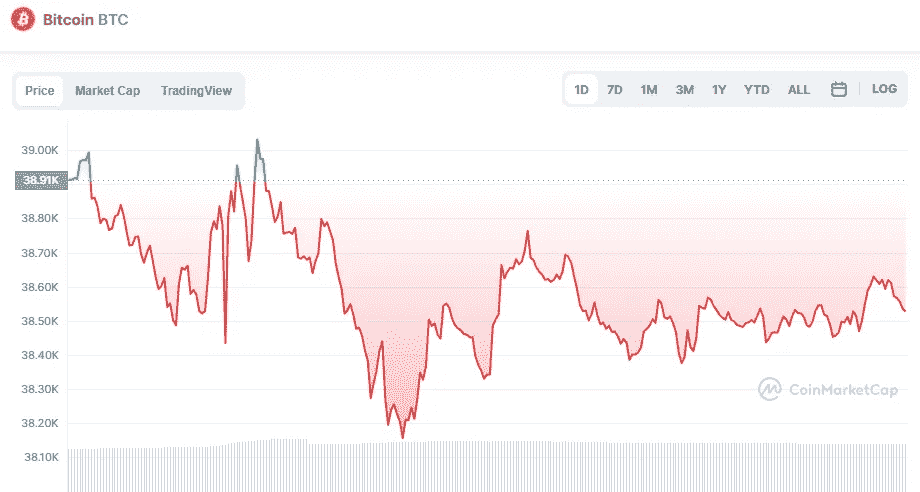

# 5 月 3 日五大加密货币价格分析

> 原文：<https://medium.com/coinmonks/top-5-cryptocurrencies-price-analyse-on-3rd-of-may-324d600678d1?source=collection_archive---------55----------------------->

# 1.比特币(-1.00%)

# 市值 7330 亿美元

比特币目前的价格为 38.723 美元，24 小时交易量为 31.41 亿美元。在过去的 24 小时里，比特币的使用量下降了 1.00%。目前在受欢迎程度上排名第一。

Source photo [Bitcoin price today, BTC to USD live, marketcap and chart | CoinMarketCap](https://coinmarketcap.com/currencies/bitcoin/)

# 2.以太坊(+0.20%)