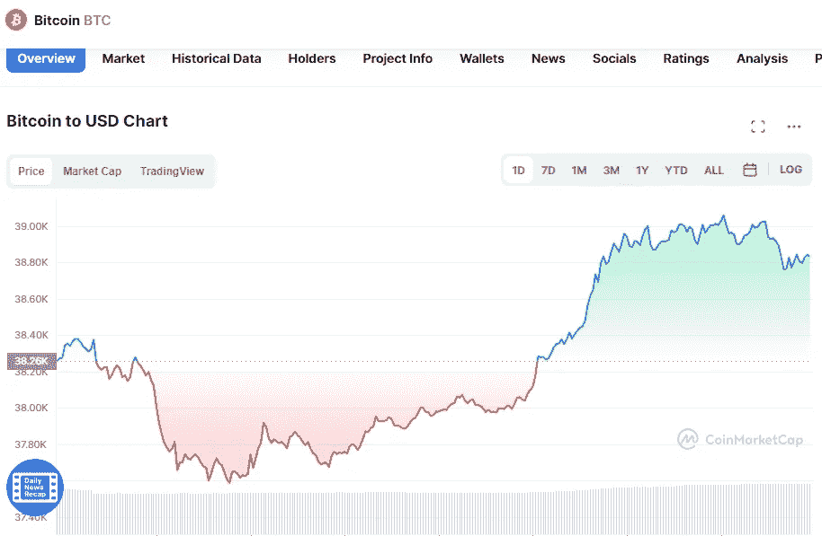

# 5 月 4 日五大加密货币价格分析

> 原文：<https://medium.com/coinmonks/top-5-cryptocurrencies-price-analyse-on-4th-of-may-bff5185bdd5?source=collection_archive---------57----------------------->

# 1.比特币(+1.54%)

# 市值 7390 亿美元

比特币目前的价格为 38.98099 美元，24 小时交易量为 32.88 亿美元。在过去的 24 小时里，比特币的使用增加了 1.54%。目前在受欢迎程度上排名第一。

Source photo [Bitcoin price today, BTC to USD live, marketcap and chart | CoinMarketCap](https://coinmarketcap.com/currencies/bitcoin/)

# 2.以太坊(+0.69%)