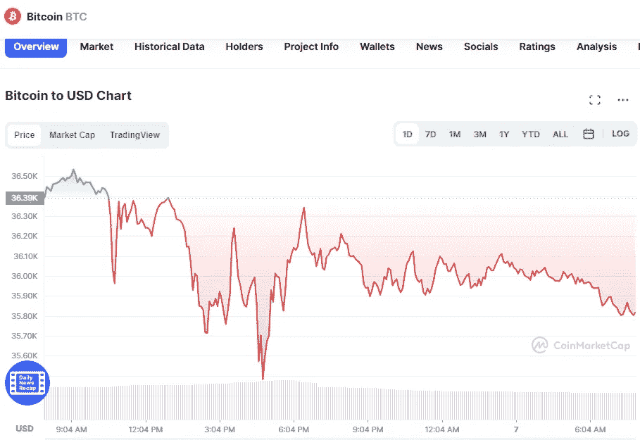

# 5 月 7 日五大加密货币价格分析

> 原文：<https://medium.com/coinmonks/top-5-cryptocurrencies-price-analyse-on-7th-of-may-609e61768f86?source=collection_archive---------36----------------------->

# 1.比特币(-1.61%)

# 市值 6819 亿美元

比特币目前的价格为 35.956 美元，24 小时交易量为 36.35 美元。在过去的 24 小时里，比特币的使用量下降了 1.61%。目前在受欢迎程度上排名第一。

Source photo [Bitcoin price today, BTC to USD live, marketcap and chart | CoinMarketCap](https://coinmarketcap.com/currencies/bitcoin/)

# 2.以太坊(-2.83%)