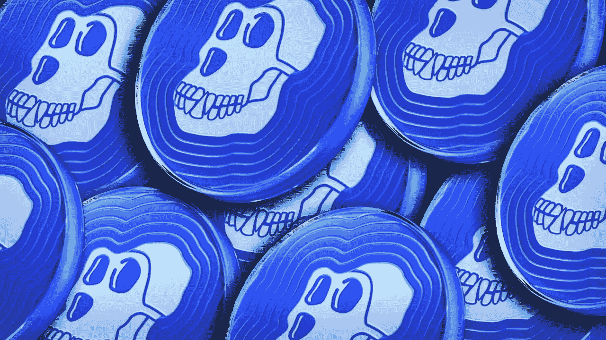

# 2022 年投资的五大加密货币

> 原文：<https://medium.com/coinmonks/top-5-cryptocurrencies-to-invest-in-2022-b4cebd0a169b?source=collection_archive---------18----------------------->

你是否也不知道 2022 年应该选择哪种硬币进行投资？你并不孤单。最近，人们开始改变他们的投资计划。加密货币已经成为新的趋势，加密市场已经有了大量的流动性。

一方面，有无数的案例表明，人们在几天之内通过投资加密技术赚了数百万美元。然后还有其他人想尽快进入这个市场，抓住这个趋势。

Photo by [Hans Eiskonen](https://unsplash.com/@eiskonen?utm_source=medium&utm_medium=referral) on [Unsplash](https://unsplash.com?utm_source=medium&utm_medium=referral)

我将指导你挑选最好的硬币，在未来的时间里，这些硬币可能会给你带来指数回报。请记住，这只是我的建议，你应该在把你辛苦赚来的钱投资到任何地方之前做好自己的研究。

# 我是谁？

我是密码市场的日间交易员，对金融和其他相关领域的知识很有一套。凭借在密码行业 2 年多的经验，我学到了在这个恶性通货膨胀的时代，我和我的读者可以受益无穷的东西。

除了交易生涯，从 2018 年开始，我也是一名博主/文案/内容写手。写作一直是我的激情所在，写一些能给别人的生活带来价值的东西是我唯一的梦想。我不认为你是来了解我的。所以，让我们直奔主题，赚点钱吧。

# 我最想在 2022 年投资的加密硬币

以下硬币是我最喜欢的符合当前市场情况的投资品。如果你认为你可以有更好的建议，那么我很乐意听听他们的意见。联系我的 LinkedIn [个人资料](https://www.linkedin.com/in/pawan123/)，告诉我你的想法。

1.  **比特币(BTC)**

Photo by [Kanchanara](https://unsplash.com/@kanchanara?utm_source=medium&utm_medium=referral) on [Unsplash](https://unsplash.com?utm_source=medium&utm_medium=referral)

嗯，谈论加密投资而忽略这个硬币只能确定你要么是一个天真的人，要么有人告诉你一个将在未来几天爆炸的狗屎硬币。我为什么这么说？

我这么说是因为比特币是几个国家中第一种合法的加密货币。如果你不明白这一点，那么这仅仅意味着最接近可以取代菲亚特的东西是比特币。

比特币被称为所有加密货币之父。谈到它的价格，那么该币从 2022 年初开始就一直处于盘整阶段。在过去的几天里，比特币像任何东西一样在抛售。这枚硬币几乎比 ATH(历史高点)低了 60%。

这是否意味着你应该远离这枚硬币？一点也不。价格波动在市场上是非常常见的，这个垃圾场对你来说是一个千载难逢的机会。

**2。以太坊**

Photo by [Nenad Novaković](https://unsplash.com/@dvlden?utm_source=medium&utm_medium=referral) on [Unsplash](https://unsplash.com?utm_source=medium&utm_medium=referral)

如果比特币是加密之父，那么你可以认为以太坊是它的母亲。好吧，我不是在这里建立一个家庭，但这枚硬币实际上在数字货币的演变中发挥了最重要的作用。

目前上市的大多数硬币都是在以太坊区块链制造的。事实上，大多数迷因硬币或元宇宙项目都是在区块链以太坊形成的。所以，这就是为什么对这个项目的未来下注如此重要。

谈到它的价格，以太坊在 2016 年的定价仅为 10 美元，现在已经达到了 3600 美元的历史最高水平。你知道它在短短四年内的回报率是多少吗？

说真的，你在计算吗？嗯，大概是 32000%。这难道不比你定期存款的回报高吗？所以，不要浪费时间为你的投资获取提示和技巧，开始分析以太坊吧。

**3。硬币**

是的，你没听错。Apecoin 是 2022 年最好的投资选择之一。不，我不是伪君子。我知道我告诉过你们不要相信狗屎硬币，但是这是值得注意的。Apecoin 是几个月前由 Bored Ape 游艇俱乐部推出的。

如果你不熟悉这个名字，那么这个平台包含 10，000 个独特的可收集的无聊猿不可替代令牌(NFT)。它提供许多替代硬币，所有这些都是基于以太坊区块链。

如果你仍然不相信这枚硬币，那么让我告诉你，你可以通过这枚硬币在易贝、沃尔玛、亚马逊和许多其他地方买东西。人们可以使用比特币基地进行交易。

Apecoin 以 6.40 美元的价格推出，在几个小时内，硬币飙升至每枚 40 美元。震惊吧？好吧，不要后悔你不买这枚硬币的决定，因为它目前比 ATH 低了 75%。

然而，这枚硬币有可能在多个领域创造垄断。这就是为什么这枚硬币会出现在巨型加密货币名单上。

**4。卡尔达诺(阿达)**

Photo by [Kanchanara](https://unsplash.com/@kanchanara?utm_source=medium&utm_medium=referral) on [Unsplash](https://unsplash.com?utm_source=medium&utm_medium=referral)

我敢肯定，如果你学过一点关于加密的知识，那么你一定也听说过这个名字。我还记得上一次牛市中大肆宣传的卡达诺。

不，你不是唯一一个对几天内这枚硬币的升值感兴趣的人。但是，卡尔达诺值得这种炒作。你知道为什么吗？

嗯，这是因为 Cardano 是区块链发展最快的技术之一，将权力分配到边缘。Cardano 是第三代区块链技术，可将智能合同与质量控制应用相结合。

卡尔达诺团队正在努力将这项技术转化为一个自我维持的系统。该公司的未来目标包括解决非洲国家没有区块链解决方案的个人的问题。

谈到价格，卡尔达诺的阿达也遭受了熊市的后果。ATH 为 3.13 美元，阿达在各种场合出血，目前交易价格为 0.64 美元。如果你仍然认为这可能是一个糟糕的投资，那么准备在几年后哀悼吧。

**5。币安(BNB)**

Photo by [Kanchanara](https://unsplash.com/@kanchanara?utm_source=medium&utm_medium=referral) on [Unsplash](https://unsplash.com?utm_source=medium&utm_medium=referral)

这太明显了。不是吗？币安无处不在。字面上。就交易量和用户数量而言，这是世界上最大的加密交易所。你没听过那些广告吗？人们说你应该投资那些你觉得有用的产品。

这就是你需要运用这个理论的地方。币安无疑是世界上顶级的加密交易所。BNB 是币安区块链的象征，人们可以很容易地用它来投资、付款，甚至预订旅行。

币安的用户在支付佣金时也能得到很好的折扣，因为它的资产——BNB。熊市对 BNB 来说没有什么不同。这枚硬币比 ATH 低了 50%。如果你打算投资这枚硬币，那么我强烈建议你投资更长的时间，因为它有巨大的增长潜力。

# 结论

至此，我已经完成了 2022 年你可以选择投资的五大加密货币名单。我试图解码密码的基本功能以及它们在市场上的现状。

在互联网上采纳我的或任何人的建议之前，确保做好自己的研究。这个博客完全基于我的研究和预测。希望你觉得它很有用。你还在等什么？

现在就投资你的钱。你也可以在 [Medium](https://pawan11243.medium.com/) 或 [LinkedIn](https://www.linkedin.com/in/pawan123/) 上关注我，获取更多此类更新。

> 加入 Coinmonks [电报频道](https://t.me/coincodecap)和 [Youtube 频道](https://www.youtube.com/c/coinmonks/videos)了解加密交易和投资

## 另外，阅读

*   [百无聊赖的猿游艇俱乐部(BAYC)评论](https://coincodecap.com/bored-ape-yacht-club-bayc-review)
*   [5 款最佳加密交易终端](https://coincodecap.com/crypto-trading-terminals) | [最佳 DeFi 应用](https://coincodecap.com/best-defi-apps)
*   [最佳网上赌场](https://coincodecap.com/best-online-casinos) | [币安评论](/coinmonks/binance-review-ee10d3bf3b6e) | [BitMEX 评论](https://coincodecap.com/bitmex-review)
*   [麻雀交换评论](https://coincodecap.com/sparrow-exchange-review) | [纳什交换评论](https://coincodecap.com/nash-exchange-review)
*   [美国最佳加密交易机器人](https://coincodecap.com/crypto-trading-bots-in-the-us) | [经常性回顾](https://coincodecap.com/changelly-review)
*   [在印度利用加密套利赚取被动收入](https://coincodecap.com/crypto-arbitrage-in-india)
*   [Godex.io 审核](/coinmonks/godex-io-review-7366086519fb) | [邀请审核](/coinmonks/invity-review-70f3030c0502) | [BitForex 审核](https://coincodecap.com/bitforex-review)
*   [5 款最佳免费加密货币制图工具](https://coincodecap.com/crypto-charting-tools)