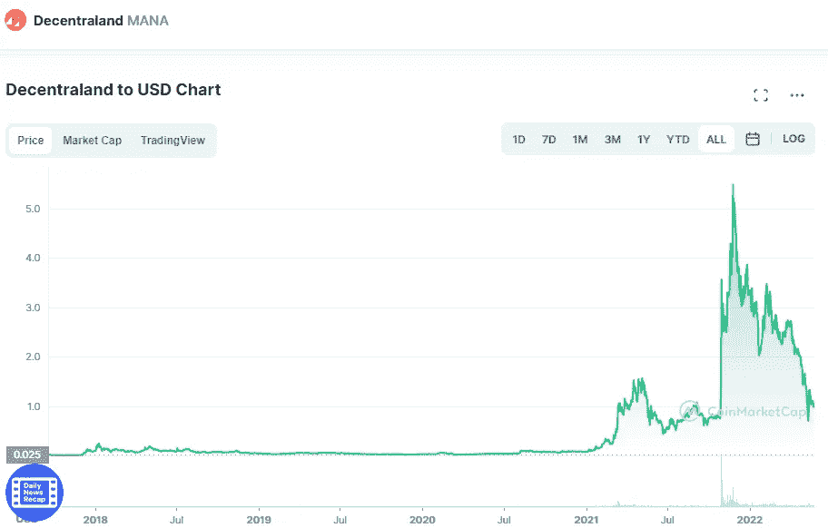

# 2022 年最值得购买的五大加密货币 Web 3.0

> 原文：<https://medium.com/coinmonks/top-5-cryptocurrencies-web-3-0-to-buy-in-2022-4f8cd79be13f?source=collection_archive---------40----------------------->

# 1.分散土地

Source photo [Decentraland price today, MANA to USD live, marketcap and chart | CoinMarketCap](https://coinmarketcap.com/currencies/decentraland/)

所谓“虚拟空间”，我们指的是人们可以使用虚拟角色登录并执行各种任务的地方，从游戏到网上购物。这样一个项目是由分散的土地显示。它通过内置的数字经济提供了完全沉浸式的虚拟现实体验。