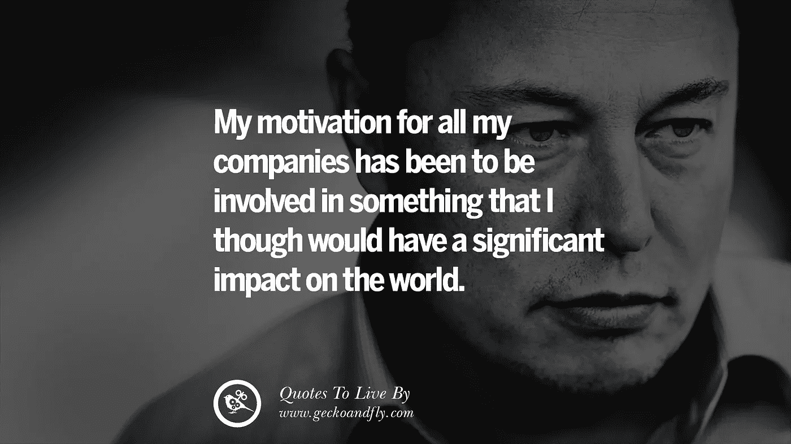

# 埃隆·马斯克最佳投资前五名

> 原文：<https://medium.com/coinmonks/top-5-elon-musk-best-investments-b3ff09a14922?source=collection_archive---------8----------------------->

Source photo [elon musk quotes — Bing images](https://www.bing.com/images/search?view=detailV2&ccid=%2bQub%2ffFh&id=CDFF838738007A2E551E9A0A540865387665CC88&thid=OIP.-Qub_fFhM9NkFINFBUgZOQHaEK&mediaurl=https%3a%2f%2fth.bing.com%2fth%2fid%2fR.f90b9bfdf16133d36414834505481939%3frik%3diMxldjhlCFQKmg%26riu%3dhttp%253a%252f%252fcdn.geckoandfly.com%252fwp-content%252fuploads%252f2016%252f04%252felon-musk-quotes-15.jpg%26ehk%3dK6l8zF%252f%252bjTIO7zkGZShPYR65gWF1ByUtFhRBhLLwUSw%253d%26risl%3d%26pid%3dImgRaw%26r%3d0&exph=1080&expw=1920&q=elon+musk+quotes&simid=608000874977105249&FORM=IRPRST&ck=30D9300B10C44515B303BA8F0CF85153&selectedIndex=5&ajaxhist=0&ajaxserp=0)

根据公司股票价格，世界首富的头衔可能每天都在变化，但埃隆·马斯克最近保持了这一殊荣。马斯克经常被认为是一个天才，因为他的商业头脑、沟通风格和技术远见卓识。

马斯克是电动汽车制造商特斯拉(TSLA)的首席执行官和联合创始人，也是航天公司 SpaceX 的首席执行官和主要设计师…