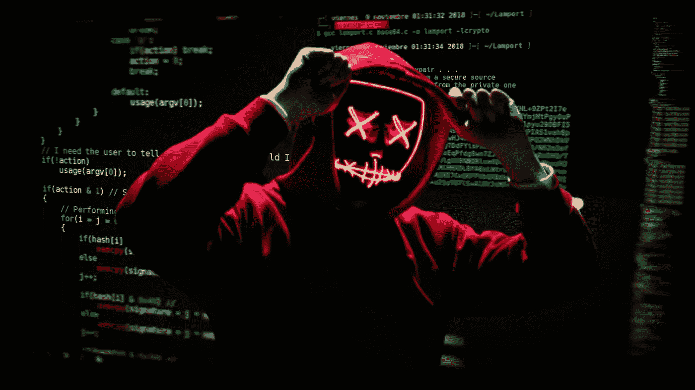

# 有史以来排名前五的交易所黑客——基金不是 SAFU

> 原文：<https://medium.com/coinmonks/top-5-exchange-hacks-funds-are-not-safu-b4135085abd9?source=collection_archive---------27----------------------->

*Unsplash* [*link1*](https://unsplash.com/photos/zvHhKiVuR9M)[*link2*](https://unsplash.com/photos/RChZT-JlI9g)

哪里有钱，哪里就有危险，加密货币交易所黑客将始终是一种威胁，提醒我们当我们将硬币存放在集中式服务中时，**基金不是“safu”**。

臭名昭著的朝鲜黑客团队 Lazarous Group 经常被指控利用 DeFi 合同入侵加密货币交易所，甚至攻击分散的桥梁。